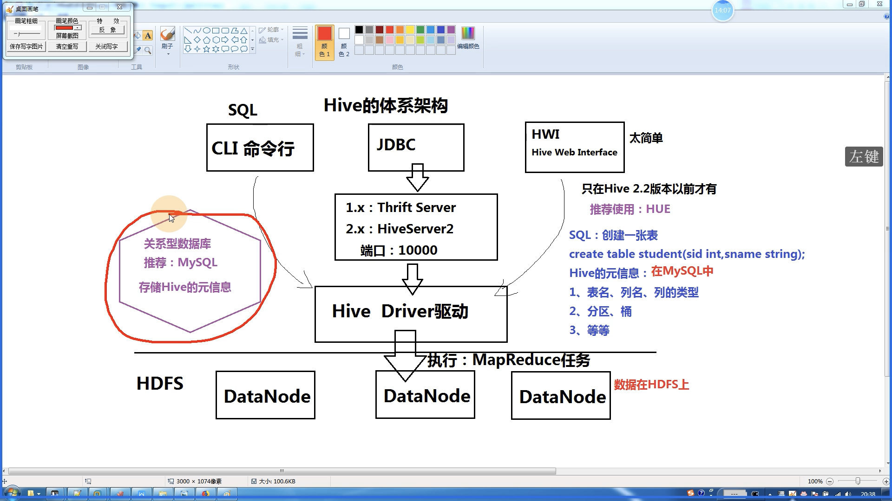

# Hive基础

## 体系架构



### 安装和配置Hive

核心配置文件: `conf/hive-site.xml`

#### 嵌入模式: 不使用MySQL，使用`Derby`数据库存储`Hive`元信息

* 元数据信息存储在内置的`Derby`数据库中
* 只运行建立一个连接
* 设置`Hive`的环境变量
* 设置一下参数

```xml
<?xml version="1.0" encoding="UTF-8" standalone="no"?>
<?xml-stylesheet type="text/xsl" href="configuration.xsl"?>
<configuration>
  <property>
    <name>javax.jdo.option.ConnectionURL</name>
    <value>jdbc:derby:;databaseName=metastore_db;create=true</value>
  </property>
  <property>
    <name>javax.jdo.option.ConnectionDriverName</name>
    <value>org.apache.derby.jdbc.EmbeddedDriver</value>
  </property>
  <property>
    <name>hive.metastore.local</name>
    <value>true</value>
  </property>
  <property>
    <name>hive.metastore.warehouse.dir</name>
    <!-- 必须使用file://开头，否则会配置到HDFS上 -->
    <value>file:///Users/thomas/software/hive/apache-hive-2.3.2-bin/warehouse</value>
  </property>
</configuration>
```

```bash
# 初始化脚本
schematool -dbType derby -initSchema 

# 使用hive
hive

# 使用静默模式启动hive
hive -S
```

<!-- more -->

#### 本地模式|远程模式：使用MySQL

```xml
<?xml version="1.0" encoding="UTF-8" standalone="no"?>
<?xml-stylesheet type="text/xsl" href="configuration.xsl"?>
<configuration>
  <property>
    <name>javax.jdo.option.ConnectionURL</name>
    <value>jdbc:mysql://127.0.0.1:3307/hive?useSSL=false</value>
  </property>
  <property>
    <name>javax.jdo.option.ConnectionDriverName</name>
    <!-- <value>com.mysql.jdbc.Driver</value> -->
    <value>com.mysql.cj.jdbc.Driver</value>
  </property>
  <property>
    <name>javax.jdo.option.ConnectionUserName</name>
    <value>hive</value>
  </property>
  <property>
    <name>javax.jdo.option.ConnectionPassword</name>
    <value>CN6ZRyjYb6bx6ZCq</value>
  </property>
</configuration>
```


```bash
# 新建数据库
# 新建一个hive的数据库，并且保证hive用户有权限访问

# 初始数据库
schematool -dbType mysql -initSchema 

# 需要将mysql驱动程序复制到lib目录下
org.apache.hadoop.hive.metastore.HiveMetaException: Failed to load driver
Underlying cause: java.lang.ClassNotFoundException : org.mysql.jdbc.Driver
Use --verbose for detailed stacktrace.
*** schemaTool failed ***

# 初始化成功
omatically registered via the SPI and manual loading of the driver class is generally unnecessary.
Starting metastore schema initialization to 2.3.0
Initialization script hive-schema-2.3.0.mysql.sql
Initialization script completed
schemaTool completed

```

数据库表的元信息保存在TBLS里面

## 数据模型

### 内部表

```sql
-- 创建数据库表，并指定分隔符 
create table emp
(
  empno int,
  ename string,
  job string,
  mgr int,
  hiredate string,
  sal int,
  comm int,
  deptno int
) 
-- 指定分隔符
row format delimited fields terminated by ',';

-- 删除数据库
drop table emp;

-- 导入HDFS数据（会删除原来的文件）
load data inpath '/scott/emp.csv' into table emp;

-- 导入本地数据
load data local inpath '/Users/thomas/Desktop/emp.csv' into table emp;

```

### 分区表：提高性能

```sql
-- 创建数据库表，指定分区，并指定分隔符
create table emp_part
(
  empno int,
  ename string,
  job string,
  mgr int,
  hiredate string,
  sal int,
  comm int
) 
-- 指定分区
partitioned by (deptno int)
-- 指定分隔符
row format delimited fields terminated by ',';

-- 插入分区数据
insert into table emp_part partition(deptno=10) select empno,ename,job,mgr,hiredate,sal,comm from emp where deptno=10;
insert into table emp_part partition(deptno=20) select empno,ename,job,mgr,hiredate,sal,comm from emp where deptno=20;
insert into table emp_part partition(deptno=30) select empno,ename,job,mgr,hiredate,sal,comm from emp where deptno=30;
```

查看执行计划

```bash
# 没用分区表的查询
hive> explain select * from emp where deptno = 10;
OK
STAGE DEPENDENCIES:
  Stage-0 is a root stage

STAGE PLANS:
  Stage: Stage-0
    Fetch Operator
      limit: -1
      Processor Tree:
        TableScan
          alias: emp
          Statistics: Num rows: 1 Data size: 629 Basic stats: COMPLETE Column stats: NONE
          Filter Operator
            predicate: (deptno = 10) (type: boolean)
            Statistics: Num rows: 1 Data size: 629 Basic stats: COMPLETE Column stats: NONE
            Select Operator
              expressions: empno (type: int), ename (type: string), job (type: string), mgr (type: int), hiredate (type: string), sal (type: int), comm (type: int), 10 (type: int)
              outputColumnNames: _col0, _col1, _col2, _col3, _col4, _col5, _col6, _col7
              Statistics: Num rows: 1 Data size: 629 Basic stats: COMPLETE Column stats: NONE
              ListSink

Time taken: 0.121 seconds, Fetched: 20 row(s)
hive> 

# 使用了分区表的查询
hive> explain select * from emp_part where deptno = 10;
OK
STAGE DEPENDENCIES:
  Stage-0 is a root stage

STAGE PLANS:
  Stage: Stage-0
    Fetch Operator
      limit: -1
      Processor Tree:
        TableScan
          alias: emp_part
          Statistics: Num rows: 3 Data size: 118 Basic stats: COMPLETE Column stats: NONE
          Select Operator
            expressions: empno (type: int), ename (type: string), job (type: string), mgr (type: int), hiredate (type: string), sal (type: int), comm (type: int), 10 (type: int)
            outputColumnNames: _col0, _col1, _col2, _col3, _col4, _col5, _col6, _col7
            Statistics: Num rows: 3 Data size: 118 Basic stats: COMPLETE Column stats: NONE
            ListSink

Time taken: 0.614 seconds, Fetched: 17 row(s)

# 分区表的数据量(Data size)明显少
```

### 外部表

直接使用外部文件，很方便创建表，不需要导入数据

```sql
-- 创建外部表
create external table ext_student
(
  sid int,
  sname string,
  age int
)
row format delimited fields terminated by ','
location '/scott/student.csv';

-- 查询外部表数据
hive> select * from ext_student;
OK
1	Tom	23
2	Mary	26
3	Mike	24
4	小王	28
5	😁🐶	29
Time taken: 0.119 seconds, Fetched: 5 row(s)
hive> 
```

### 桶表：类似Hash分区

```sql

create table emp_bucket
(
  empno int,
  ename string,
  job string,
  mgr int,
  hiredate string,
  sal int,
  comm int,
  deptno int
) clustered by (job) into 4 buckets
row format delimited fields terminated by ',';

-- 插入数据
insert into table emp_bucket select * from emp;
```

### 视图：是一个虚表

简化复杂的查询

```sql
-- 创建视图
create view view_10 as select * from emp where deptno = 10;
```

## Hive查询

```sql
-- 创建部门表
create external table dept
(
  deptno int,
  dname string,
  loc int
)
row format delimited fields terminated by ','
location '/scott/dept.csv';

drop table dept;

-- 查询所有员工信息
select * from emp;

-- 查询员工信息：员工号，姓名，月薪，部门号
select empno, ename, sal, deptno from emp;

-- 多表查询
select dept.dname, emp.ename
from emp, dept
where emp.deptno = dept.deptno;

-- 子查询（只支持比较简单的子查询）
-- 只支持from和where语句中的子查询
-- 查询部门名称是SALES的员工信息
select * 
from emp 
where emp.deptno in (select deptno from dept where dname = 'SALES');

-- 条件函数
-- 按照员工的职位来涨工资：总裁1000，经理800，其他400
select empno, ename, job, sal,
  case job 
    when 'PREISDENT' then sal + 1000
    when 'MANAGER' then sal + 800
    else sal + 400
  end
from emp;
```

## 使用sqoop导入关系型数据库中的数据

```bash
# 将关系型数据库中的表结构复制到hive中
sqoop create-hive-table --connect jdbc://mysql://127.0.0.1:3307/test --username test --password n6zjW3zL --table t1 --hive-table t1

# 从关系型数据库导入文件到hive中
sqoop import --connect jdbc://mysql://127.0.0.1:3307/test --username test --password n6zjW3zL --table t2 --hive-table t2

# 将hive中的表数据导入到mysql中
sqoop export --connect jdbc://mysql://127.0.0.1:3307/test --username test --password n6zjW3zL --table t3 --export-dir /user/hive/warehoser/uv/dt=2011-08-03
```

## 使用JDBC连接Hive

## Hive的自定义函数

参考: [03.使用hive UDF需要的maven依赖](https://blog.csdn.net/sheep8521/article/details/81001893)

### Hive的自定义函数（UDF）：User Defined Function

可以直接应用于select语句，对查询结果做格式化处理后，再输出内容

### Hive自定义函数的实现细节

* 自定义UDF需要继承`org.apache.hadoop.hive.sql.ql.UDF`
* 需要实现`evaluate`函数

```sql
-- 增加自定义jar包
add jar /root/temp/myudf.jar;

-- 创建临时函数
create temporary function myconcat as 'udf.MyConcatString';
create temporary function checksal as 'udf.CheckSalaryGrade';

-- 使用
select myconcat('Hello', 'Word');
select empno, ename, sal, checksal(sal) from emp;

```


