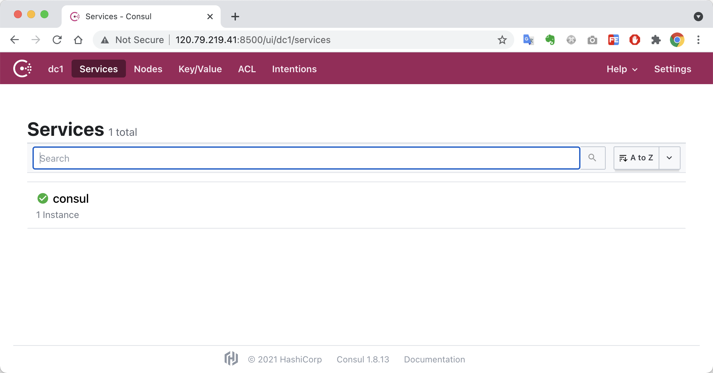
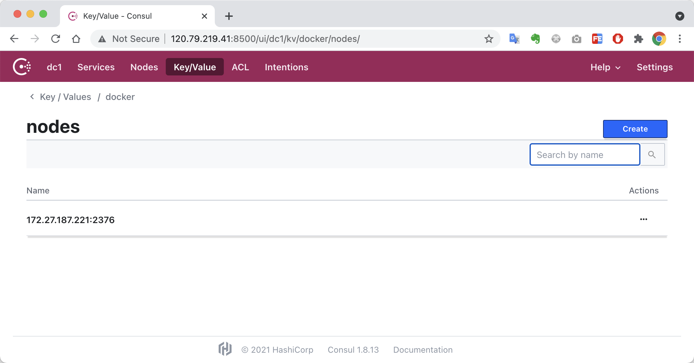
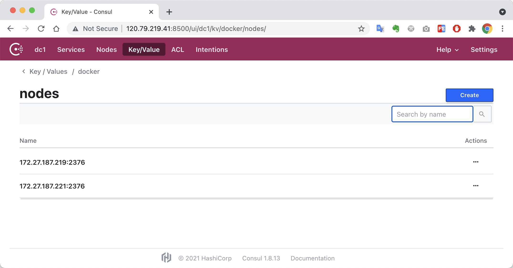

# Docker-跨主机通信

::: warning
不推荐
:::

## docker跨主机通讯

### 简介

使用`overlay` + `consul`方式实现docker跨主机通讯

### 准备工作

两台服务器 `docker01` `docker02`

> docker1

```bash
root@docker01:~# docker network ls 
NETWORK ID     NAME      DRIVER    SCOPE
b3bb18d9f06a   bridge    bridge    local
a83f2855dfa9   host      host      local
50840e792e16   none      null      local
root@docker01:~# 
```

```bash
root@docker01:~# ifconfig 
docker0: flags=4099<UP,BROADCAST,MULTICAST>  mtu 1500
        inet 172.17.0.1  netmask 255.255.0.0  broadcast 172.17.255.255
        ether 02:42:57:a9:88:e4  txqueuelen 0  (Ethernet)
        RX packets 0  bytes 0 (0.0 B)
        RX errors 0  dropped 0  overruns 0  frame 0
        TX packets 0  bytes 0 (0.0 B)
        TX errors 0  dropped 0 overruns 0  carrier 0  collisions 0

eth0: flags=4163<UP,BROADCAST,RUNNING,MULTICAST>  mtu 1500
        inet 172.27.187.221  netmask 255.255.240.0  broadcast 172.27.191.255
        inet6 fe80::216:3eff:fe16:4d92  prefixlen 64  scopeid 0x20<link>
        ether 00:16:3e:16:4d:92  txqueuelen 1000  (Ethernet)
        RX packets 2291944  bytes 1060990719 (1011.8 MiB)
        RX errors 0  dropped 0  overruns 0  frame 0
        TX packets 2044246  bytes 474941958 (452.9 MiB)
        TX errors 0  dropped 0 overruns 0  carrier 0  collisions 0

lo: flags=73<UP,LOOPBACK,RUNNING>  mtu 65536
        inet 127.0.0.1  netmask 255.0.0.0
        inet6 ::1  prefixlen 128  scopeid 0x10<host>
        loop  txqueuelen 1000  (Local Loopback)
        RX packets 2  bytes 100 (100.0 B)
        RX errors 0  dropped 0  overruns 0  frame 0
        TX packets 2  bytes 100 (100.0 B)
        TX errors 0  dropped 0 overruns 0  carrier 0  collisions 0

root@docker01:~# 
```

```bash
root@docker01:~# docker inspect bridge 
[
    {
        "Name": "bridge",
        "Id": "b3bb18d9f06a27e8d19073540a7eb7b89c70ae026473a676b2da615568e85b9c",
        "Created": "2021-07-23T15:41:42.197093822+08:00",
        "Scope": "local",
        "Driver": "bridge",
        "EnableIPv6": false,
        "IPAM": {
            "Driver": "default",
            "Options": null,
            "Config": [
                {
                    "Subnet": "172.17.0.0/16"
                }
            ]
        },
        "Internal": false,
        "Attachable": false,
        "Ingress": false,
        "ConfigFrom": {
            "Network": ""
        },
        "ConfigOnly": false,
        "Containers": {},
        "Options": {
            "com.docker.network.bridge.default_bridge": "true",
            "com.docker.network.bridge.enable_icc": "true",
            "com.docker.network.bridge.enable_ip_masquerade": "true",
            "com.docker.network.bridge.host_binding_ipv4": "0.0.0.0",
            "com.docker.network.bridge.name": "docker0",
            "com.docker.network.driver.mtu": "1500"
        },
        "Labels": {}
    }
]
root@docker01:~# 
```

> docker2

```bash
root@docker02:~# docker network ls 
NETWORK ID     NAME      DRIVER    SCOPE
e34cfe9374e4   bridge    bridge    local
63f727651f24   host      host      local
9911d6d82caf   none      null      local
root@docker02:~# 
```

```bash
root@docker02:~# ifconfig 
docker0: flags=4099<UP,BROADCAST,MULTICAST>  mtu 1500
        inet 172.17.0.1  netmask 255.255.0.0  broadcast 172.17.255.255
        ether 02:42:81:4a:55:15  txqueuelen 0  (Ethernet)
        RX packets 0  bytes 0 (0.0 B)
        RX errors 0  dropped 0  overruns 0  frame 0
        TX packets 0  bytes 0 (0.0 B)
        TX errors 0  dropped 0 overruns 0  carrier 0  collisions 0

eth0: flags=4163<UP,BROADCAST,RUNNING,MULTICAST>  mtu 1500
        inet 172.27.187.219  netmask 255.255.240.0  broadcast 172.27.191.255
        inet6 fe80::216:3eff:fe16:4606  prefixlen 64  scopeid 0x20<link>
        ether 00:16:3e:16:46:06  txqueuelen 1000  (Ethernet)
        RX packets 2222348  bytes 952283918 (908.1 MiB)
        RX errors 0  dropped 0  overruns 0  frame 0
        TX packets 1900059  bytes 379759607 (362.1 MiB)
        TX errors 0  dropped 0 overruns 0  carrier 0  collisions 0

lo: flags=73<UP,LOOPBACK,RUNNING>  mtu 65536
        inet 127.0.0.1  netmask 255.0.0.0
        inet6 ::1  prefixlen 128  scopeid 0x10<host>
        loop  txqueuelen 1000  (Local Loopback)
        RX packets 4  bytes 336 (336.0 B)
        RX errors 0  dropped 0  overruns 0  frame 0
        TX packets 4  bytes 336 (336.0 B)
        TX errors 0  dropped 0 overruns 0  carrier 0  collisions 0

root@docker02:~# 
```

```bash
root@docker02:~# docker inspect bridge 
[
    {
        "Name": "bridge",
        "Id": "e34cfe9374e4cc39a5e0dff87ee05ed63b399d57a30deee47dc88414db9a96f3",
        "Created": "2021-07-23T16:17:35.856895669+08:00",
        "Scope": "local",
        "Driver": "bridge",
        "EnableIPv6": false,
        "IPAM": {
            "Driver": "default",
            "Options": null,
            "Config": [
                {
                    "Subnet": "172.17.0.0/16"
                }
            ]
        },
        "Internal": false,
        "Attachable": false,
        "Ingress": false,
        "ConfigFrom": {
            "Network": ""
        },
        "ConfigOnly": false,
        "Containers": {},
        "Options": {
            "com.docker.network.bridge.default_bridge": "true",
            "com.docker.network.bridge.enable_icc": "true",
            "com.docker.network.bridge.enable_ip_masquerade": "true",
            "com.docker.network.bridge.host_binding_ipv4": "0.0.0.0",
            "com.docker.network.bridge.name": "docker0",
            "com.docker.network.driver.mtu": "1500"
        },
        "Labels": {}
    }
]
root@docker02:~# 
```

### 方案：使用`Overlay` + `consul`网络模式

参考：

- [docker-consul](https://hub.docker.com/_/consul?tab=description&page=1&ordering=last_updated)

```yaml
version: '3'

services:

  # kv-store
  consul-demo:
    container_name: consul-demo
    image: consul:1.8
    restart: always
    ports:
      - 8500:8500
    volumes:
      - ./consul/data:/consul/data
    environment:
      CONSUL_BIND_INTERFACE: eth0
      TZ: Asia/Shanghai
```

启动服务

```bash
docker-compose up -d
```

> 启动成功



#### 更改docker01主配置文件

```bash
vim /usr/lib/systemd/system/docker.service

# ExecStart=/usr/bin/dockerd -H fd:// --containerd=/run/containerd/containerd.sock
ExecStart=/usr/bin/dockerd -H fd:// --containerd=/run/containerd/containerd.sock -H tcp://0.0.0.0:2376 --cluster-store=consul://172.27.187.221:8500 --cluster-advertise=eth0:2376

systemctl daemon-reload		# 重新加载新配置
systemctl restart docker.service	# 重启docker服务
```

> 重启后发现docker节点



#### 更改docker02主配置文件

```bash
vim /usr/lib/systemd/system/docker.service

# ExecStart=/usr/bin/dockerd -H fd:// --containerd=/run/containerd/containerd.sock
ExecStart=/usr/bin/dockerd -H fd:// --containerd=/run/containerd/containerd.sock -H tcp://0.0.0.0:2376 --cluster-store=consul://172.27.187.221:8500 --cluster-advertise=eth0:2376

# 重新加载新配置
systemctl daemon-reload

# 重启docker服务
systemctl restart docker.service
```

> 重启后，出现两个节点



### 创建`overlay`网络（手动方式）

```bash
root@docker01:consul# docker network create -d overlay my_overlay 
7761efbd374a2488ff5ac62d61282f70859efd0c60b74e8f28721fd707f05044
root@docker01:consul# 
```

网络情况

```bash
root@docker01:consul# docker network ls 
NETWORK ID     NAME             DRIVER    SCOPE
035f53639d54   bridge           bridge    local
5f45d0c76258   consul_default   bridge    local
a83f2855dfa9   host             host      local
7761efbd374a   my_overlay       overlay   global
50840e792e16   none             null      local
root@docker01:consul# 
```

可以看到`my_overlay`网络创建成功，注意网络的作用域范围是`global`

> 在docker02上验证`my_overlay`网络是否创建成功

```bash
root@docker02:~# docker network ls 
NETWORK ID     NAME         DRIVER    SCOPE
e95171bee53b   bridge       bridge    local
63f727651f24   host         host      local
7761efbd374a   my_overlay   overlay   global
9911d6d82caf   none         null      local
root@docker02:~# 
```

> 检查网络

```bash
root@docker02:~# docker inspect my_overlay
[
    {
        "Name": "my_overlay",
        "Id": "7761efbd374a2488ff5ac62d61282f70859efd0c60b74e8f28721fd707f05044",
        "Created": "2021-07-23T19:16:53.479072632+08:00",
        "Scope": "global",
        "Driver": "overlay",
        "EnableIPv6": false,
        "IPAM": {
            "Driver": "default",
            "Options": {},
            "Config": [
                {
                    "Subnet": "10.0.0.0/24",
                    "Gateway": "10.0.0.1"
                }
            ]
        },
        "Internal": false,
        "Attachable": false,
        "Ingress": false,
        "ConfigFrom": {
            "Network": ""
        },
        "ConfigOnly": false,
        "Containers": {},
        "Options": {},
        "Labels": {}
    }
]
root@docker02:~# 
```

#### 验证容器间通讯是否正常

在`docker01`上启动`busybox01`

```yaml
version: '3'

services:

  # busybox01
  busybox01:
    container_name: busybox01
    image: busybox
    restart: on-failure
    command: ['ping', 'www.baidu.com']

networks: 
  default:
    external: 
      name: my_overlay
```

> 如果在`docker02`再启动一个同名的`busybox01`容器会提示启动失败

```bash
root@docker02:busybox01# docker-compose up 
Pulling busybox01 (busybox:)...
latest: Pulling from library/busybox
b71f96345d44: Pull complete
Digest: sha256:0f354ec1728d9ff32edcd7d1b8bbdfc798277ad36120dc3dc683be44524c8b60
Status: Downloaded newer image for busybox:latest
Creating busybox01 ... error

ERROR: for busybox01  Cannot start service busybox01: endpoint with name busybox01 already exists in network my_overlay

ERROR: for busybox01  Cannot start service busybox01: endpoint with name busybox01 already exists in network my_overlay
ERROR: Encountered errors while bringing up the project.
root@docker02:busybox01# 
```

在`docker02`上启动`busybox02`

```yaml
version: '3'

services:

  # busybox02
  busybox02:
    container_name: busybox02
    image: busybox
    restart: on-failure
    command: ['ping', 'www.baidu.com']

networks: 
  default:
    external: 
      name: my_overlay
```

> 测试连通性，在`busybox02上ping`busybox01`，网络应该是通的

```bash
root@docker02:busybox02# docker exec -it busybox02 ping busybox01
PING busybox01 (10.0.0.2): 56 data bytes
64 bytes from 10.0.0.2: seq=0 ttl=64 time=0.322 ms
64 bytes from 10.0.0.2: seq=1 ttl=64 time=0.295 ms
^C
--- busybox01 ping statistics ---
2 packets transmitted, 2 packets received, 0% packet loss
round-trip min/avg/max = 0.295/0.308/0.322 ms
root@docker02:busybox02# 
```

### 通过`docker-compose`新建网络

#### 在`docker01`新建网络

```bash
version: '3'

services:

  # busybox03
  busybox03:
    container_name: busybox03
    image: busybox
    restart: on-failure
    command: ['ping', 'www.baidu.com']

networks:
  default:
    driver: overlay
    name: 'busybox-net'
```

#### 在`docker02`测试连通性(方式一)

```bash
# 没指定网络，无法连通
docker run -it --rm --name busybox04 busybox ping busybox03

# 指定使用`busybox-net`网络，可以连通
docker run -it --rm --name busybox04 --network busybox-net busybox ping busybox03
```

> 连通OK

```bash
root@docker02:busybox04# docker run -it --rm --name busybox04 --network busybox-net busybox ping busybox03
PING busybox03 (172.28.0.2): 56 data bytes
64 bytes from 172.28.0.2: seq=0 ttl=64 time=0.383 ms
64 bytes from 172.28.0.2: seq=1 ttl=64 time=0.335 ms
64 bytes from 172.28.0.2: seq=2 ttl=64 time=0.310 ms
^C
--- busybox03 ping statistics ---
3 packets transmitted, 3 packets received, 0% packet loss
round-trip min/avg/max = 0.310/0.342/0.383 ms
root@docker02:busybox04# 
```

#### 在`docker02`测试连通性(方式二)

```yaml
version: '3'

services:

  # busybox04
  busybox04:
    container_name: busybox04
    image: busybox
    restart: on-failure
    command: ['ping', 'busybox03']

networks: 
  default:
    external: 
      name: 'busybox-net'
```

> 连通OK

```bash
root@docker02:busybox04# docker-compose up 
Creating busybox04 ... done
Attaching to busybox04
busybox04    | PING busybox03 (172.28.0.2): 56 data bytes
busybox04    | 64 bytes from 172.28.0.2: seq=0 ttl=64 time=0.393 ms
busybox04    | 64 bytes from 172.28.0.2: seq=1 ttl=64 time=0.338 ms
busybox04    | 64 bytes from 172.28.0.2: seq=2 ttl=64 time=0.316 ms
^CGracefully stopping... (press Ctrl+C again to force)
Stopping busybox04 ... done
root@docker02:busybox04# 
```


### 强制删除某个容器网络

有些情况下，容器被删除了，但是容器的网络还是没有被删除，导致下次创建容器失败

```bash
# 删除前
docker inspect gray-net 
[
    {
        "Name": "gray-net",
        "Id": "c9e93d3aa38d674537afb1ad209ea3149d431ba3c89d88e6cb9c15cb2009b6fb",
        "Created": "2021-07-24T10:52:23.212912557+08:00",
        "Scope": "global",
        "Driver": "overlay",
        "EnableIPv6": false,
        "IPAM": {
            "Driver": "default",
            "Options": null,
            "Config": [
                {
                    "Subnet": "10.0.3.0/24",
                    "Gateway": "10.0.3.1"
                }
            ]
        },
        "Internal": false,
        "Attachable": true,
        "Ingress": false,
        "ConfigFrom": {
            "Network": ""
        },
        "ConfigOnly": false,
        "Containers": {
            "ep-0df00a756740b9d259cc9abcd9c4712fd518fe52e172bf1e51796a32717c5474": {
                "Name": "gupaoedu-api",
                "EndpointID": "0df00a756740b9d259cc9abcd9c4712fd518fe52e172bf1e51796a32717c5474",
                "MacAddress": "02:42:0a:00:03:12",
                "IPv4Address": "10.0.3.18/24",
                "IPv6Address": ""
            },
            "ep-12c9e8c032c7dd80d31d9953cb1ae60ae3a2cdfa05602e87dff609ef7a3e4861": {
                "Name": "gupaoedu-mysql",
                "EndpointID": "12c9e8c032c7dd80d31d9953cb1ae60ae3a2cdfa05602e87dff609ef7a3e4861",
                "MacAddress": "02:42:0a:00:03:02",
                "IPv4Address": "10.0.3.2/24",
                "IPv6Address": ""
            },
            "ep-34161633a74663a54a213e6d5d2d42def4cb9a07109e4e8b25955c5f63f7426c": {
                "Name": "gupaoedu-admin-api",
                "EndpointID": "34161633a74663a54a213e6d5d2d42def4cb9a07109e4e8b25955c5f63f7426c",
                "MacAddress": "02:42:0a:00:03:11",
                "IPv4Address": "10.0.3.17/24",
                "IPv6Address": ""
            },
            "ep-51bca0145132ca9db68fc7feb27ba9660dfc31e01c5dc0166175a7959c6bb136": {
                "Name": "gupaoedu-nacos",
                "EndpointID": "51bca0145132ca9db68fc7feb27ba9660dfc31e01c5dc0166175a7959c6bb136",
                "MacAddress": "02:42:0a:00:03:04",
                "IPv4Address": "10.0.3.4/24",
                "IPv6Address": ""
            },
            "ep-6fc40b5f0ecc3b04781d2eecb48fd57726f9f1bad375afc0dab555517d46b499": {
                "Name": "gupaoedu-short-chain-service",
                "EndpointID": "6fc40b5f0ecc3b04781d2eecb48fd57726f9f1bad375afc0dab555517d46b499",
                "MacAddress": "02:42:0a:00:03:13",
                "IPv4Address": "10.0.3.19/24",
                "IPv6Address": ""
            },
            "ep-800c6ef1685b85e0cfda9ceba0eac4b3d190c3fba7546e7c5f69f84bc250e451": {
                "Name": "gupaoedu-wx-service",
                "EndpointID": "800c6ef1685b85e0cfda9ceba0eac4b3d190c3fba7546e7c5f69f84bc250e451",
                "MacAddress": "02:42:0a:00:03:10",
                "IPv4Address": "10.0.3.16/24",
                "IPv6Address": ""
            },
            "ep-8191de6122897207bee477280421b71dbef95c362ff28b13fe9af4dcc1972fc1": {
                "Name": "gupaoedu-crm-api",
                "EndpointID": "8191de6122897207bee477280421b71dbef95c362ff28b13fe9af4dcc1972fc1",
                "MacAddress": "02:42:0a:00:03:05",
                "IPv4Address": "10.0.3.5/24",
                "IPv6Address": ""
            },
            "ep-afa3817988d12c6f7fc94eedff66c634f37cfd871b5a5b11358cb220298a77b6": {
                "Name": "gupaoedu-order-service",
                "EndpointID": "afa3817988d12c6f7fc94eedff66c634f37cfd871b5a5b11358cb220298a77b6",
                "MacAddress": "02:42:0a:00:03:09",
                "IPv4Address": "10.0.3.9/24",
                "IPv6Address": ""
            },
            "ep-c36339f4b67f8a5ba3c774e67854b0a6d35fc8a8bf4bacf6eeaf11ef97dca4a5": {
                "Name": "gupaoedu-backup",
                "EndpointID": "c36339f4b67f8a5ba3c774e67854b0a6d35fc8a8bf4bacf6eeaf11ef97dca4a5",
                "MacAddress": "02:42:0a:00:03:0f",
                "IPv4Address": "10.0.3.15/24",
                "IPv6Address": ""
            },
            "ep-db4fdba0afe6d2dc2d04dd78a27a022edacdde2a64fcd453edc3d8684a4e8c19": {
                "Name": "gupaoedu-rabbitmq",
                "EndpointID": "db4fdba0afe6d2dc2d04dd78a27a022edacdde2a64fcd453edc3d8684a4e8c19",
                "MacAddress": "02:42:0a:00:03:16",
                "IPv4Address": "10.0.3.22/24",
                "IPv6Address": ""
            },
            "ep-ecb48e3faf5d40542de5bf838261687350574ad8a2b87284faab10b9aa82c610": {
                "Name": "gupaoedu-redis",
                "EndpointID": "ecb48e3faf5d40542de5bf838261687350574ad8a2b87284faab10b9aa82c610",
                "MacAddress": "02:42:0a:00:03:03",
                "IPv4Address": "10.0.3.3/24",
                "IPv6Address": ""
            }
        },
        "Options": {},
        "Labels": {
            "com.docker.compose.network": "gray-net",
            "com.docker.compose.project": "baseline",
            "com.docker.compose.version": "1.29.2"
        }
    }
]
```

```bash
docker network disconnect --force gray-net gupaoedu-order-service
```

```bash
# 删除后
docker inspect gray-net 
[
    {
        "Name": "gray-net",
        "Id": "c9e93d3aa38d674537afb1ad209ea3149d431ba3c89d88e6cb9c15cb2009b6fb",
        "Created": "2021-07-24T10:52:23.212912557+08:00",
        "Scope": "global",
        "Driver": "overlay",
        "EnableIPv6": false,
        "IPAM": {
            "Driver": "default",
            "Options": null,
            "Config": [
                {
                    "Subnet": "10.0.3.0/24",
                    "Gateway": "10.0.3.1"
                }
            ]
        },
        "Internal": false,
        "Attachable": true,
        "Ingress": false,
        "ConfigFrom": {
            "Network": ""
        },
        "ConfigOnly": false,
        "Containers": {
            "ep-0df00a756740b9d259cc9abcd9c4712fd518fe52e172bf1e51796a32717c5474": {
                "Name": "gupaoedu-api",
                "EndpointID": "0df00a756740b9d259cc9abcd9c4712fd518fe52e172bf1e51796a32717c5474",
                "MacAddress": "02:42:0a:00:03:12",
                "IPv4Address": "10.0.3.18/24",
                "IPv6Address": ""
            },
            "ep-12c9e8c032c7dd80d31d9953cb1ae60ae3a2cdfa05602e87dff609ef7a3e4861": {
                "Name": "gupaoedu-mysql",
                "EndpointID": "12c9e8c032c7dd80d31d9953cb1ae60ae3a2cdfa05602e87dff609ef7a3e4861",
                "MacAddress": "02:42:0a:00:03:02",
                "IPv4Address": "10.0.3.2/24",
                "IPv6Address": ""
            },
            "ep-34161633a74663a54a213e6d5d2d42def4cb9a07109e4e8b25955c5f63f7426c": {
                "Name": "gupaoedu-admin-api",
                "EndpointID": "34161633a74663a54a213e6d5d2d42def4cb9a07109e4e8b25955c5f63f7426c",
                "MacAddress": "02:42:0a:00:03:11",
                "IPv4Address": "10.0.3.17/24",
                "IPv6Address": ""
            },
            "ep-51bca0145132ca9db68fc7feb27ba9660dfc31e01c5dc0166175a7959c6bb136": {
                "Name": "gupaoedu-nacos",
                "EndpointID": "51bca0145132ca9db68fc7feb27ba9660dfc31e01c5dc0166175a7959c6bb136",
                "MacAddress": "02:42:0a:00:03:04",
                "IPv4Address": "10.0.3.4/24",
                "IPv6Address": ""
            },
            "ep-6fc40b5f0ecc3b04781d2eecb48fd57726f9f1bad375afc0dab555517d46b499": {
                "Name": "gupaoedu-short-chain-service",
                "EndpointID": "6fc40b5f0ecc3b04781d2eecb48fd57726f9f1bad375afc0dab555517d46b499",
                "MacAddress": "02:42:0a:00:03:13",
                "IPv4Address": "10.0.3.19/24",
                "IPv6Address": ""
            },
            "ep-800c6ef1685b85e0cfda9ceba0eac4b3d190c3fba7546e7c5f69f84bc250e451": {
                "Name": "gupaoedu-wx-service",
                "EndpointID": "800c6ef1685b85e0cfda9ceba0eac4b3d190c3fba7546e7c5f69f84bc250e451",
                "MacAddress": "02:42:0a:00:03:10",
                "IPv4Address": "10.0.3.16/24",
                "IPv6Address": ""
            },
            "ep-8191de6122897207bee477280421b71dbef95c362ff28b13fe9af4dcc1972fc1": {
                "Name": "gupaoedu-crm-api",
                "EndpointID": "8191de6122897207bee477280421b71dbef95c362ff28b13fe9af4dcc1972fc1",
                "MacAddress": "02:42:0a:00:03:05",
                "IPv4Address": "10.0.3.5/24",
                "IPv6Address": ""
            },
            "ep-c36339f4b67f8a5ba3c774e67854b0a6d35fc8a8bf4bacf6eeaf11ef97dca4a5": {
                "Name": "gupaoedu-backup",
                "EndpointID": "c36339f4b67f8a5ba3c774e67854b0a6d35fc8a8bf4bacf6eeaf11ef97dca4a5",
                "MacAddress": "02:42:0a:00:03:0f",
                "IPv4Address": "10.0.3.15/24",
                "IPv6Address": ""
            },
            "ep-db4fdba0afe6d2dc2d04dd78a27a022edacdde2a64fcd453edc3d8684a4e8c19": {
                "Name": "gupaoedu-rabbitmq",
                "EndpointID": "db4fdba0afe6d2dc2d04dd78a27a022edacdde2a64fcd453edc3d8684a4e8c19",
                "MacAddress": "02:42:0a:00:03:16",
                "IPv4Address": "10.0.3.22/24",
                "IPv6Address": ""
            },
            "ep-ecb48e3faf5d40542de5bf838261687350574ad8a2b87284faab10b9aa82c610": {
                "Name": "gupaoedu-redis",
                "EndpointID": "ecb48e3faf5d40542de5bf838261687350574ad8a2b87284faab10b9aa82c610",
                "MacAddress": "02:42:0a:00:03:03",
                "IPv4Address": "10.0.3.3/24",
                "IPv6Address": ""
            }
        },
        "Options": {},
        "Labels": {
            "com.docker.compose.network": "gray-net",
            "com.docker.compose.project": "baseline",
            "com.docker.compose.version": "1.29.2"
        }
    }
]
```

### 参考

- [Docker网络管理之docker跨主机通信](https://blog.51cto.com/u_14306186/2515841)
- [Docker容器跨主机通信方案选哪一种](https://www.zhihu.com/question/49245479)
- https://docs.docker.com/network/network-tutorial-overlay/
- https://docs.docker.com/engine/tutorials/networkingcontainers/
- https://docs.docker.com/network/
