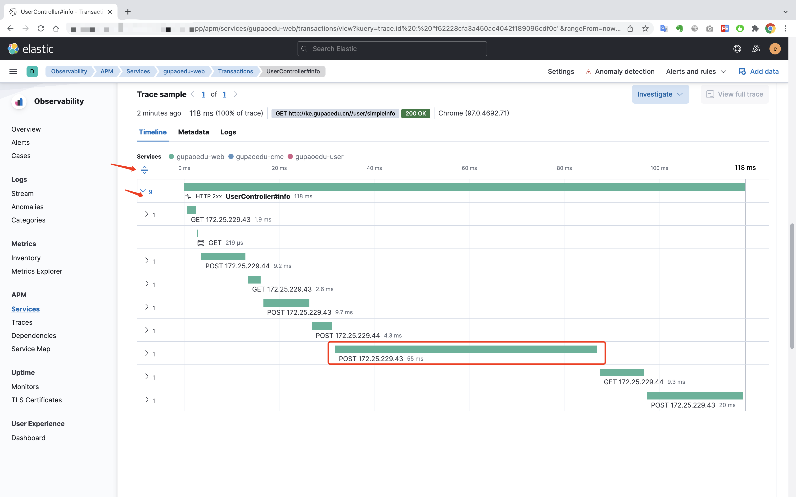
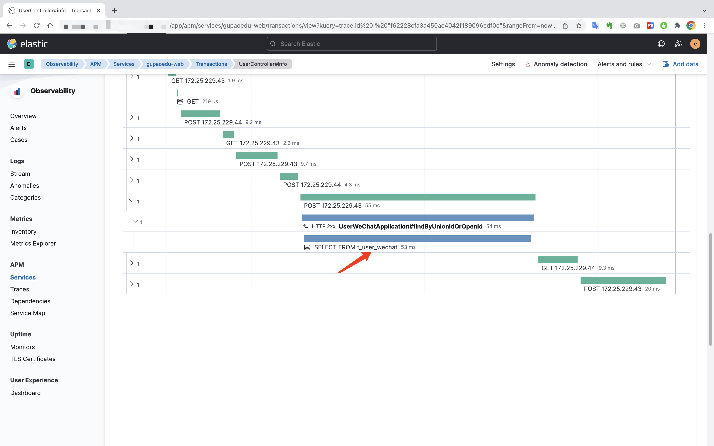
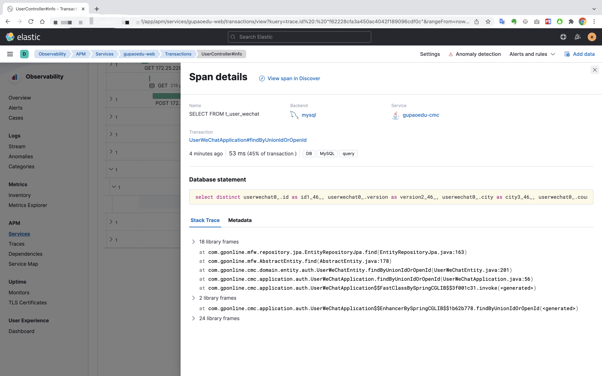
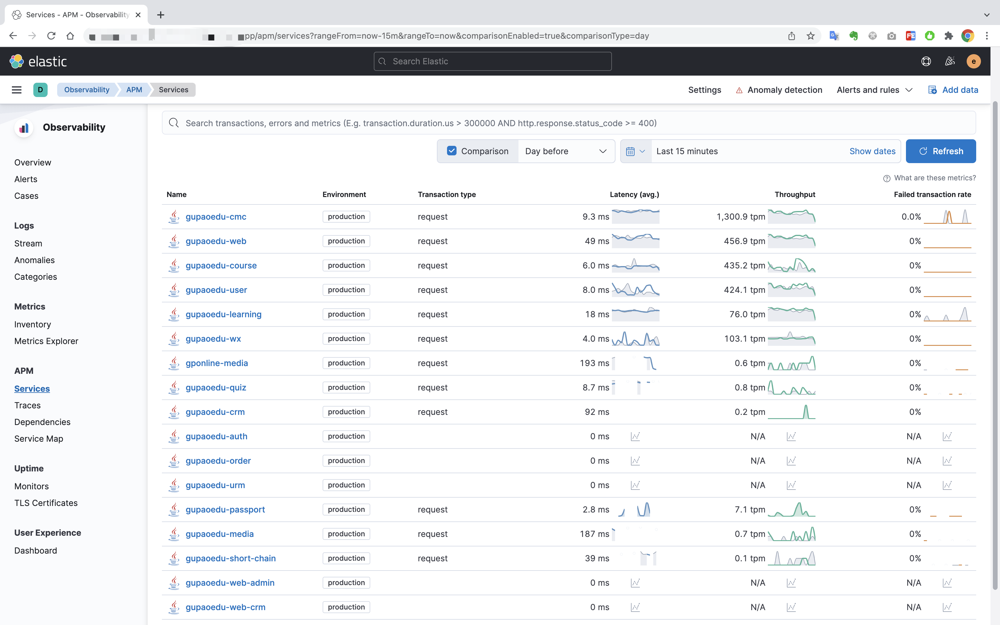

## Elastic经典-快速搭建APM-链路追踪-JAVA应用-生产记录

先看一个实际生产环境的效果图

追踪某个请求的调用情况

进入追踪记录的详情

<!-- more -->

展开某个耗时严重的调用

可以查看实际执行的SQL

微服务列表

链路追踪

依赖管理

依赖项目明细，可以对比昨天同时段的数据情况

微服务地图

查看服务地图明细

聚焦某个微服务，可以查看更为全面的是情况

