## Elastic经典-快速搭建APM-链路追踪-JAVA应用

### 一、安装APMServer

编辑`compose.yml`文件

```yaml
version: '3'

services:

  elasticsearch:
    image: elastic/elasticsearch:7.16.0
    container_name: elasticsearch
    restart: unless-stopped
    # privileged: true
    # user: root
    environment:
      - TZ=Asia/Shanghai
      - "node.name=elasticsearch"
      - "discovery.type=single-node"
      - "ES_JAVA_OPTS=-Xms512m -Xmx512m"
      - "xpack.security.enabled=true"
      - "xpack.security.authc.api_key.enabled=true"
      - "ELASTIC_PASSWORD=xxxx"
    ulimits:
      memlock:
        soft: -1
        hard: -1
    volumes:
      - ./elasticsearch/data:/usr/share/elasticsearch/data
    ports:
      - 9200:9200
    
  kibana:
    image: elastic/kibana:7.16.0
    container_name: kibana
    restart: unless-stopped
    depends_on:
      - elasticsearch
    ports:
      - 5601:5601
    environment:
      - TZ=Asia/Shanghai
      - I18N_LOCALE=zh-CN
      - ELASTICSEARCH_HOSTS=http://elasticsearch:9200
      - ELASTICSEARCH_USERNAME=elastic
      - ELASTICSEARCH_PASSWORD=xxxx

  apm-server:
    image: elastic/apm-server:7.16.0
    container_name: apm-server
    restart: unless-stopped
    depends_on:
      - elasticsearch
    ports:
      - 8200:8200
    volumes:
      - ./config/apm-server.yml:/usr/share/apm-server/apm-server.yml:ro
    environment:
      - TZ=Asia/Shanghai
      
networks:
 default:
   name: 'es-kibana-net'
```

编辑配置文件

```ruby
apm-server:
  host: "0.0.0.0:8200"
  auth:
    secret_token: "apm-xxxx"
output.elasticsearch:
  hosts: ["elasticsearch:9200"]
  username: "elastic"
  password: "xxxx"
setup.kibana:
  host: "kibana:5601"
```


启动容器

```bassh
docker-compose up -d 
```

访问`Kibana`面板	http://127.0.0.1:5601/app/home#/tutorial/apm 

检查 `APM Server` 状态

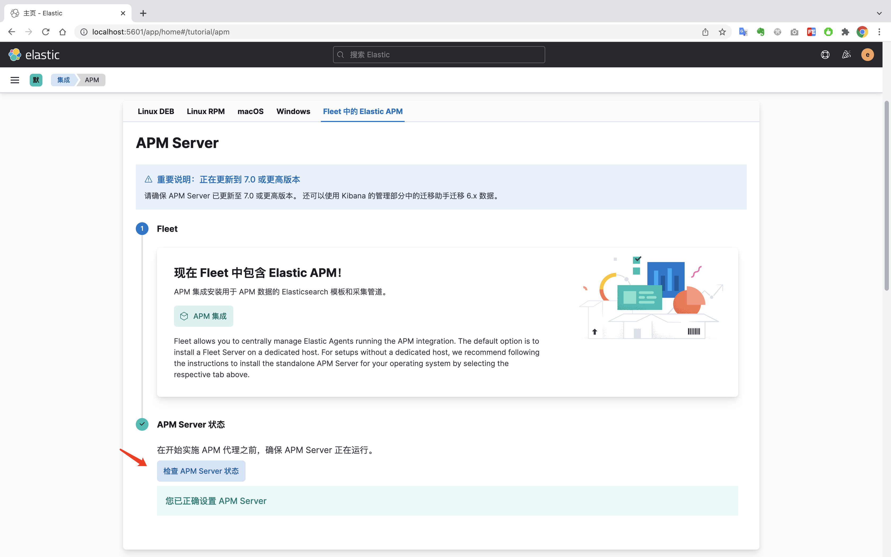

### 二、安装APM代理并启动JAVA应用

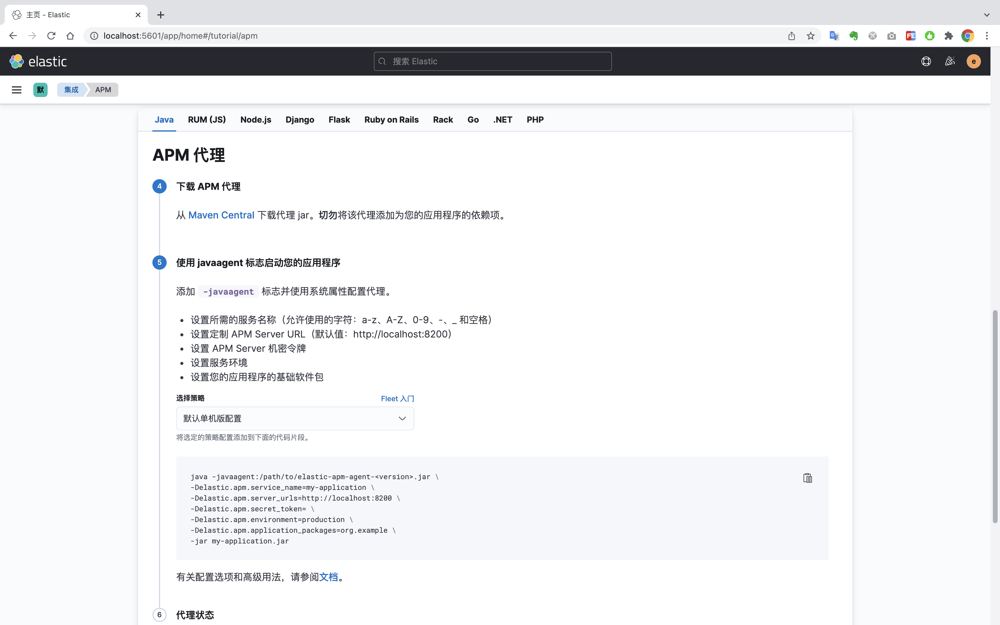

下载（elastic-apm-agent-1.28.4.jar）

下载地址：[https://repo1.maven.org/maven2/co/elastic/apm/elastic-apm-agent/1.28.4/elastic-apm-agent-1.28.4.jar](https://repo1.maven.org/maven2/co/elastic/apm/elastic-apm-agent/1.28.4/elastic-apm-agent-1.28.4.jar)


启动java示例应用

``` bash
#!/bin/bash

cd `dirname $0`
pwd

mvn clean package -Dmaven.test.skip=true \
&& java -javaagent:./elastic-apm-agent-1.28.4.jar \
   -Delastic.apm.service_name=my-application \
   -Delastic.apm.server_urls=http://127.0.0.1:8200 \
   -Delastic.apm.secret_token=apm-xxxx \
   -Delastic.apm.environment=production \
   -Delastic.apm.application_packages=cn.psoho \
   -jar target/online-check-0.0.1-SNAPSHOT.jar
```

看到以下信息表示启动成功

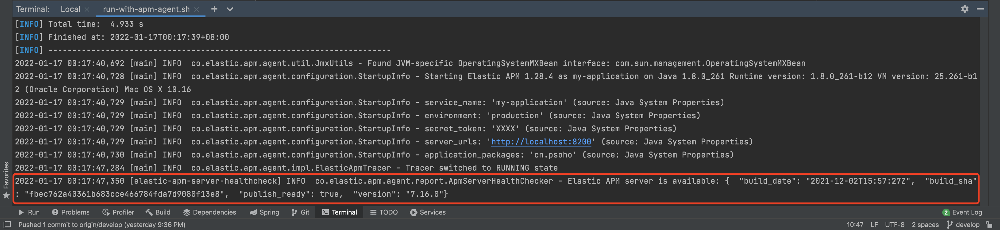

### 三、查看APM监控

此时在`APM服务`中，可以看到刚刚启动的应用

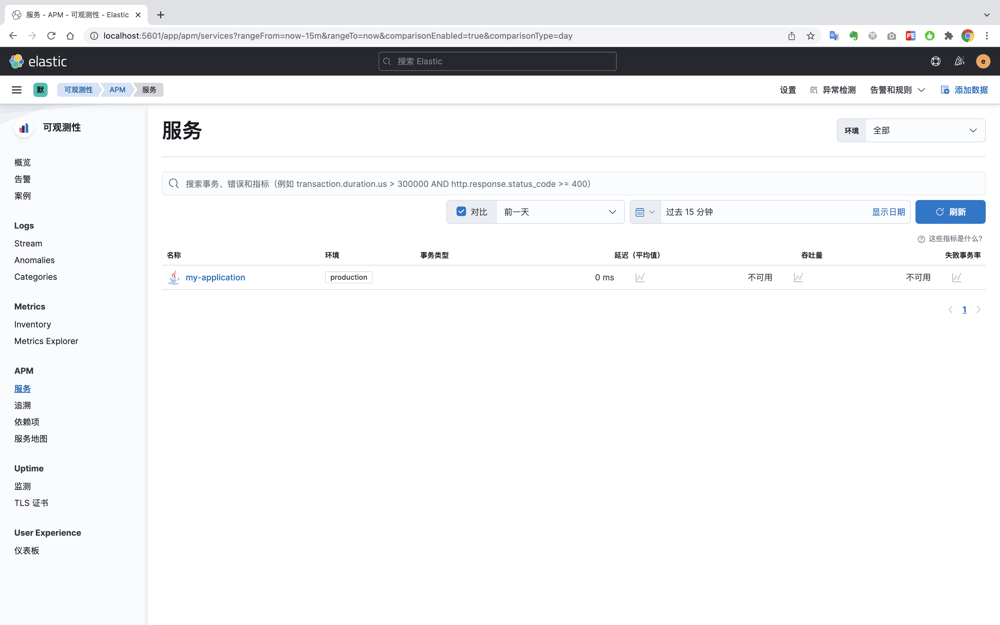

访问 http://127.0.0.1:8080/hello

进入`my-application`服务详情查看。

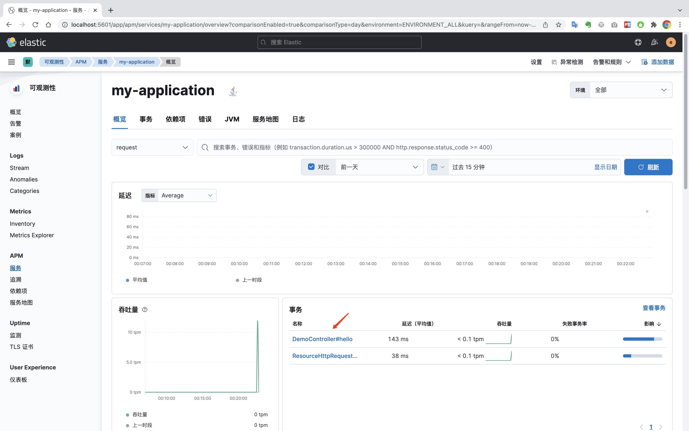

点击JVM可以查看JVM内存情况

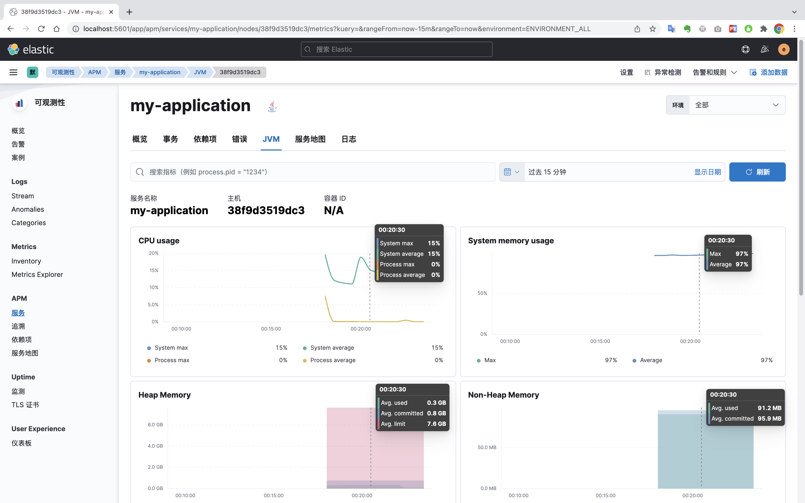

点击依赖项，可以查看依赖项的相关指标

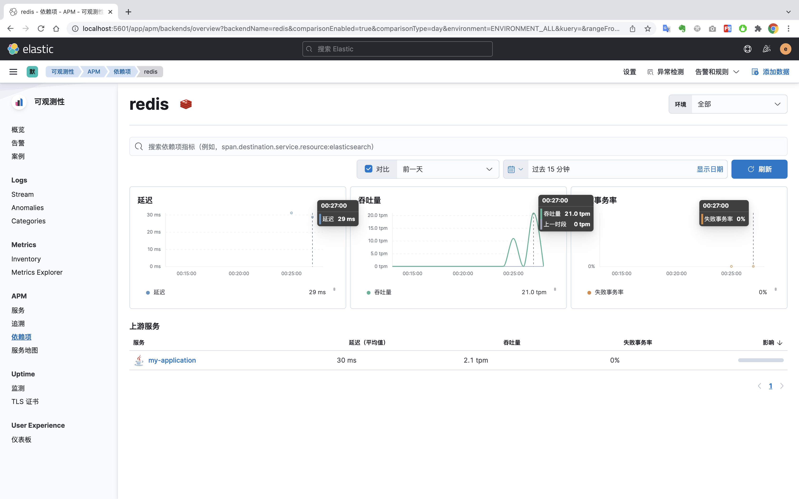

查看链路的相关详情

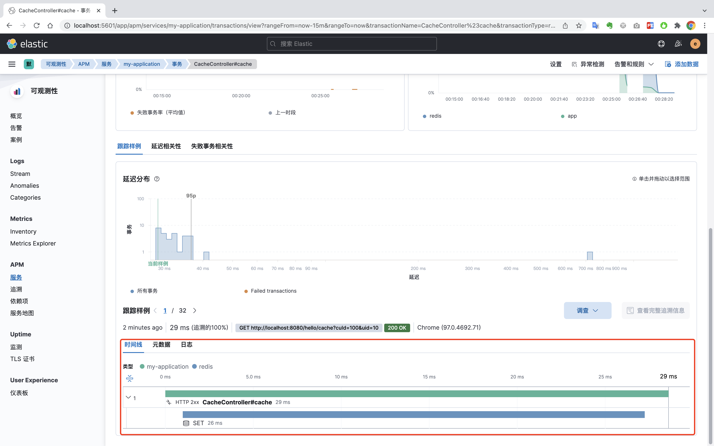

服务地图，只能试用30天，可以直观的看到微服务相关的依赖图。

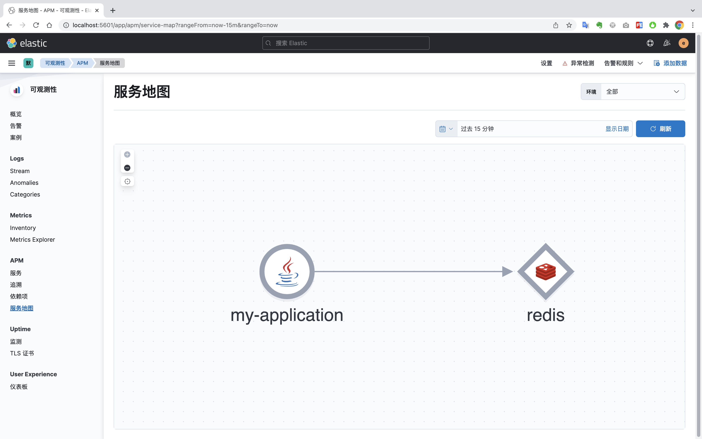

### 四、实用技能（增加 traceId ）

一、添加依赖

```xml
<dependency>
  <groupId>co.elastic.apm</groupId>
  <artifactId>apm-agent-api</artifactId>
  <version>1.28.4</version>
</dependency>
```

二、添加`ApmAdvice.java`切面

```java
package cn.psoho.advice;

import cn.psoho.dto.Result;
import co.elastic.apm.api.ElasticApm;
import lombok.extern.slf4j.Slf4j;
import org.apache.commons.lang3.StringUtils;
import org.springframework.core.MethodParameter;
import org.springframework.http.MediaType;
import org.springframework.http.converter.HttpMessageConverter;
import org.springframework.http.server.ServerHttpRequest;
import org.springframework.http.server.ServerHttpResponse;
import org.springframework.http.server.ServletServerHttpResponse;
import org.springframework.web.bind.annotation.ControllerAdvice;
import org.springframework.web.servlet.mvc.method.annotation.ResponseBodyAdvice;

/**
 * 增加 traceId 响应头，方便排查问题
 */
@Slf4j
@ControllerAdvice
public class ApmAdvice implements ResponseBodyAdvice<Object> {

    @Override
    public boolean supports(MethodParameter returnType, Class<? extends HttpMessageConverter<?>> converterType) {
        return true;
    }

    @Override
    public Object beforeBodyWrite(Object body, MethodParameter returnType, MediaType selectedContentType, Class<? extends HttpMessageConverter<?>> selectedConverterType, ServerHttpRequest request, ServerHttpResponse response) {
        String traceId = ElasticApm.currentTransaction().getTraceId();
        if (StringUtils.isNotBlank(traceId)) {
            ((ServletServerHttpResponse) response).getServletResponse().setHeader("traceId", traceId);
            if (body instanceof Result) {
                ((Result) body).setTraceId(traceId);
            }
        }
        return body;
    }

}

```

`DemoController`代码

```java
package cn.psoho.controller;

import cn.psoho.dto.Result;
import lombok.extern.slf4j.Slf4j;
import org.springframework.web.bind.annotation.GetMapping;
import org.springframework.web.bind.annotation.RestController;

import javax.servlet.http.HttpServletRequest;
import java.util.Date;

@RestController
@Slf4j
public class DemoController {

    @GetMapping("/hi")
    public Result<Date> hi() {
        log.info("hi");
        return Result.ok(new Date());
    }

    @GetMapping("/hello")
    public Object hello() {
        log.info("hello");
        return "hello";
    }

}
```

三、验证`traceId`追踪效果

分别在响应对象和响应头上都返回了`traceId`,我们可以根据这个ID，追踪每个请求的具体调用链路。

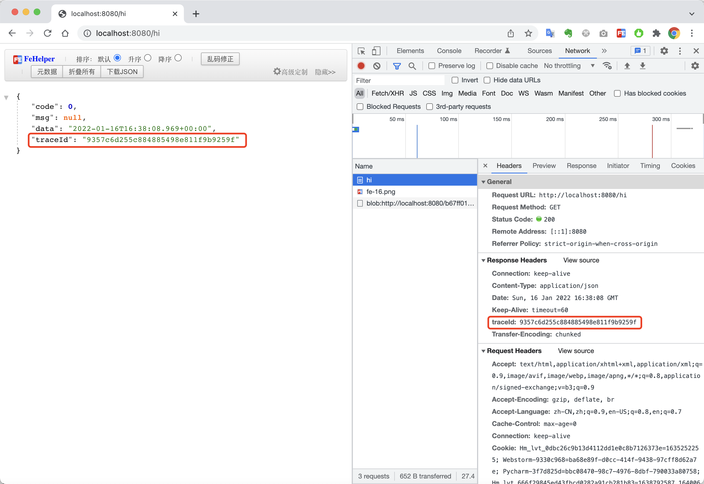

在 `追溯` 里面输入刚刚返回的`traceId`,就可以查看本次事务详情了

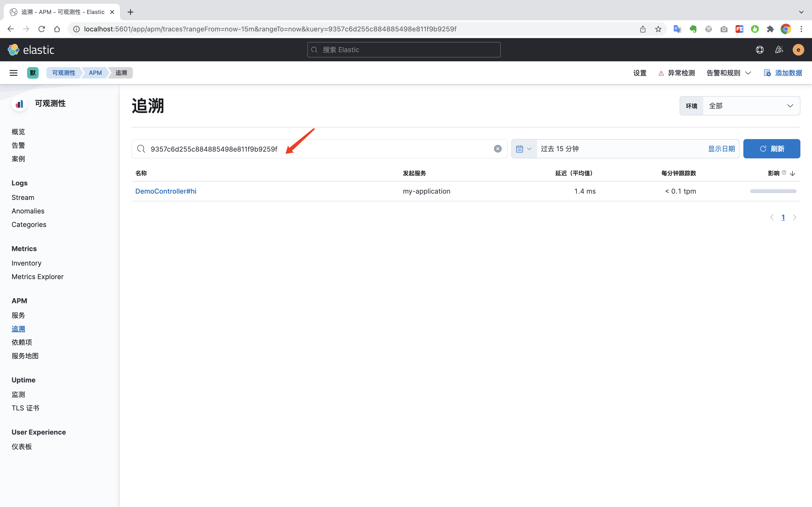

进入事务详情，方便排查和定位生产问题。

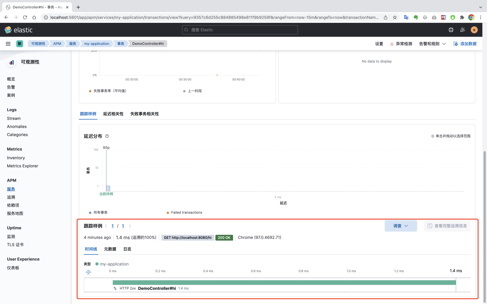
