# ES-APM链路追踪-JAVA应用-生产记录

## Elastic经典-快速搭建APM-链路追踪-JAVA应用-生产记录

先看一个实际生产环境的效果图

追踪某个请求的调用情况

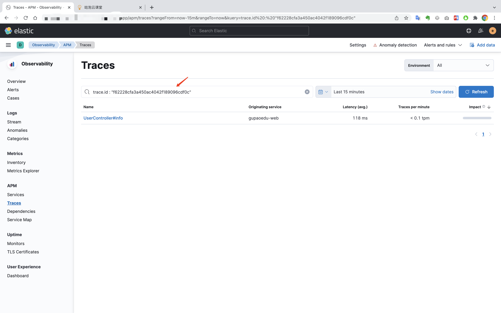

进入追踪记录的详情

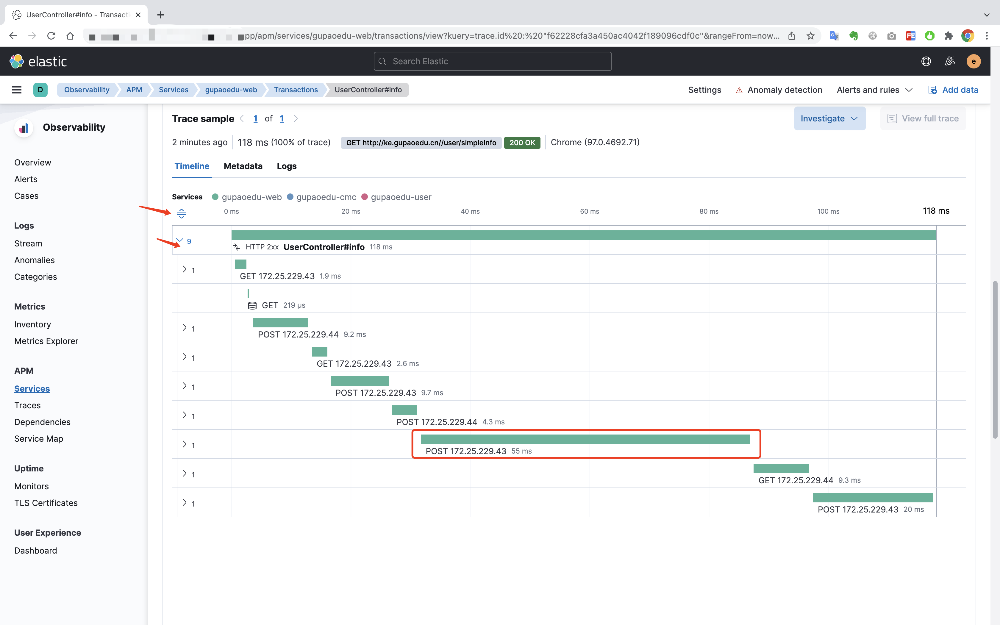

展开某个耗时严重的调用

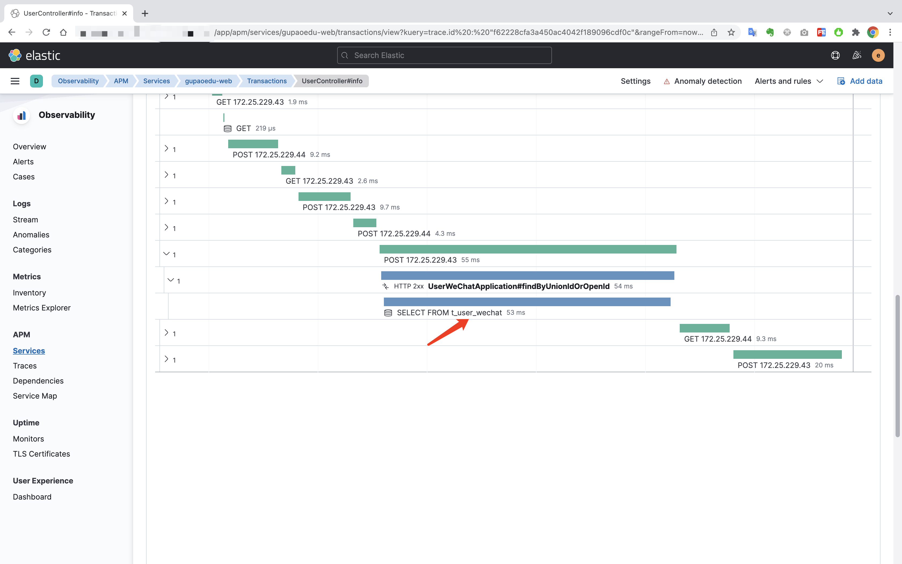

可以查看实际执行的SQL

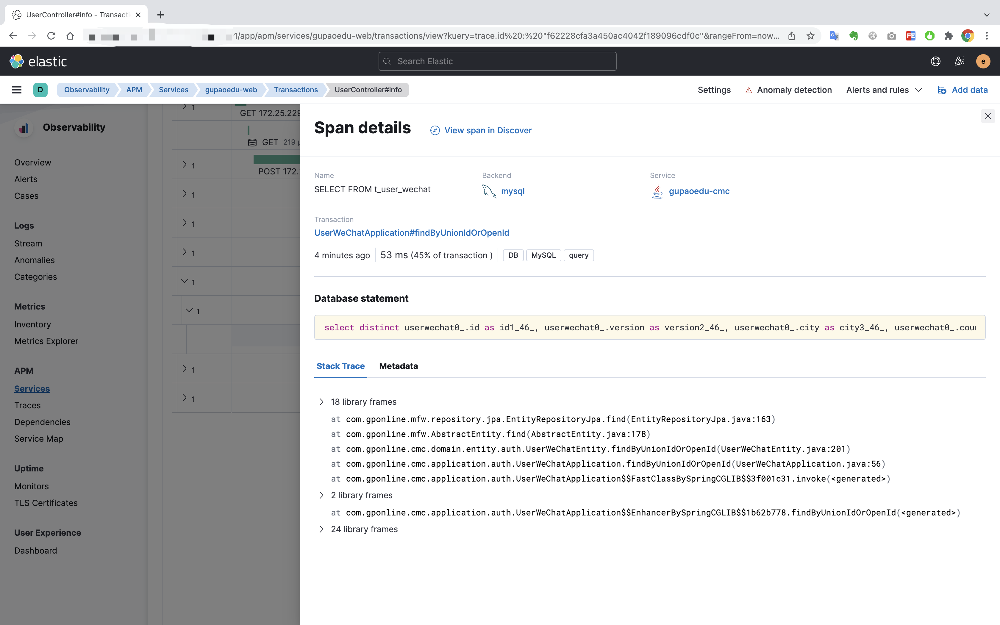

微服务列表

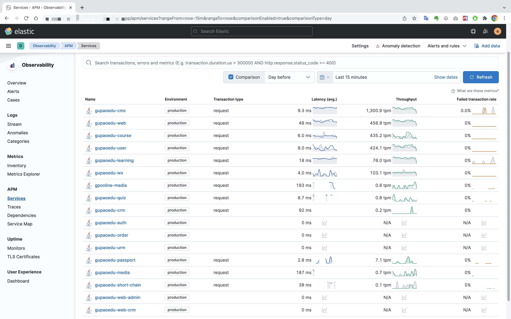

链路追踪

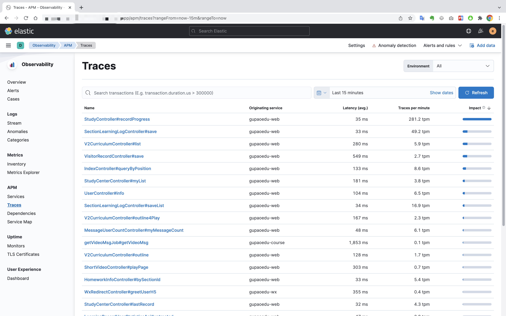

依赖管理

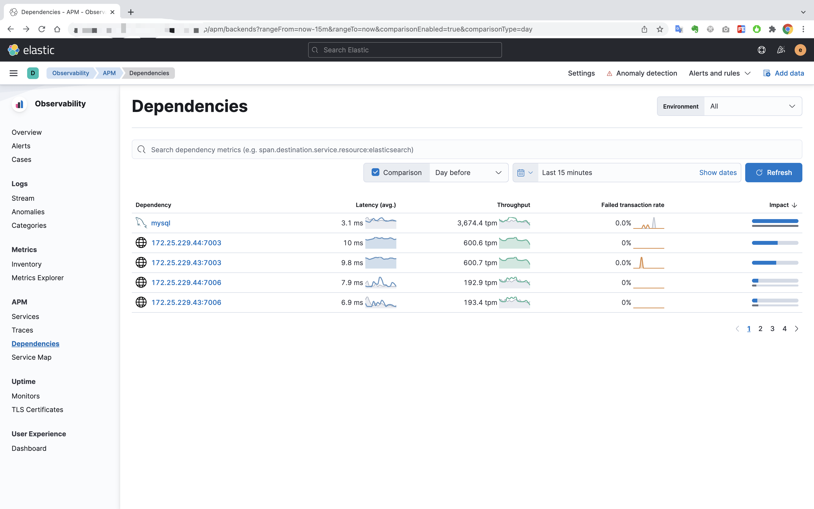

依赖项目明细，可以对比昨天同时段的数据情况

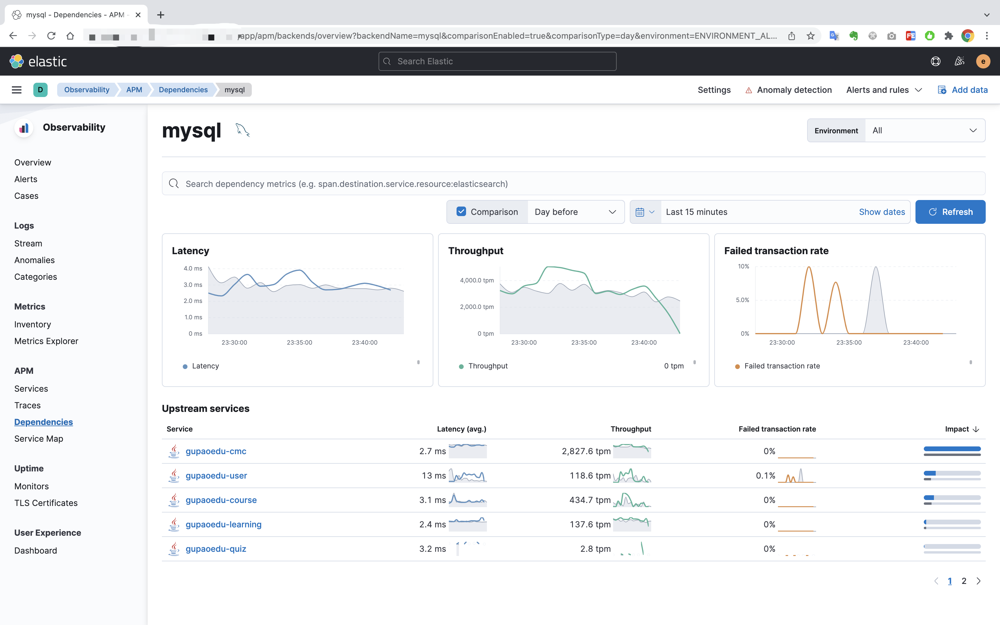

微服务地图

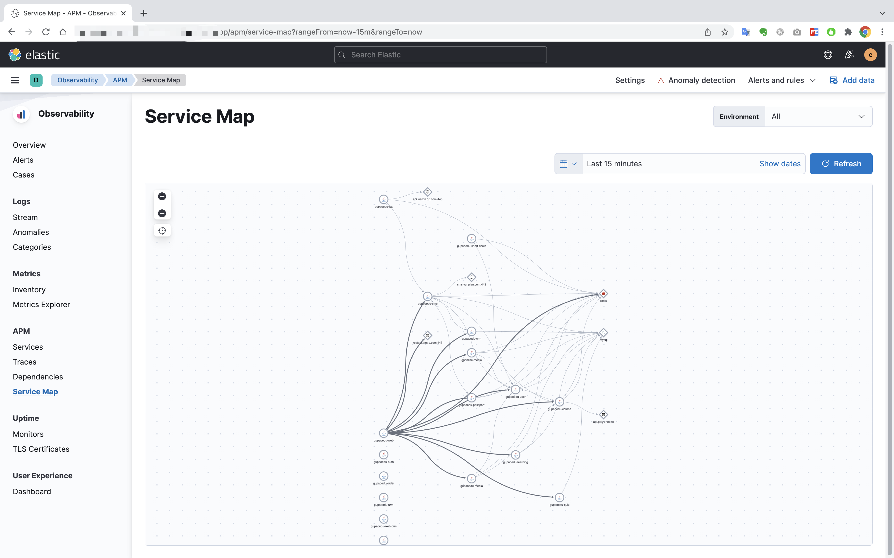

查看服务地图明细

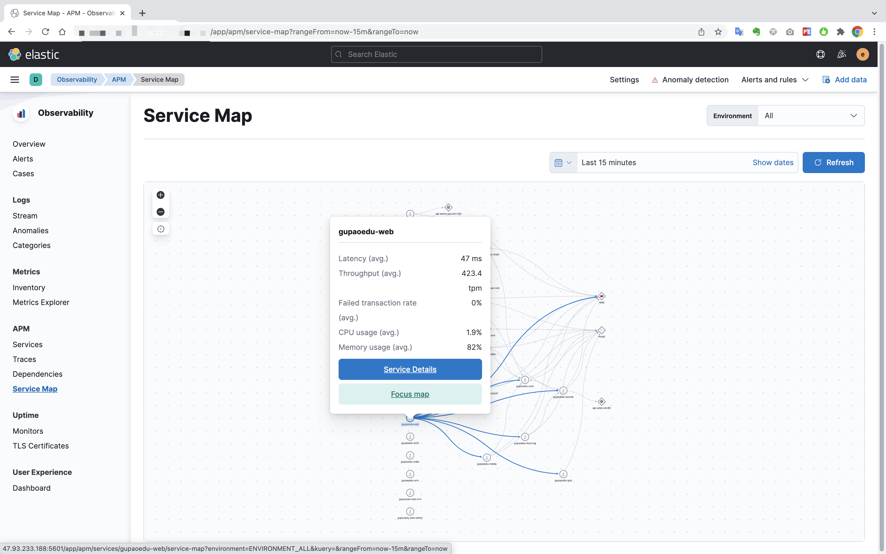

聚焦某个微服务，可以查看更为全面的是情况

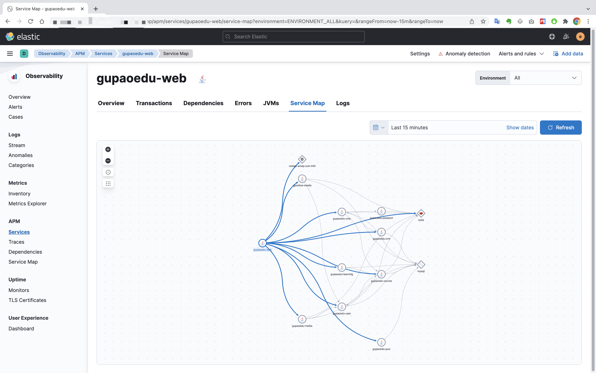

