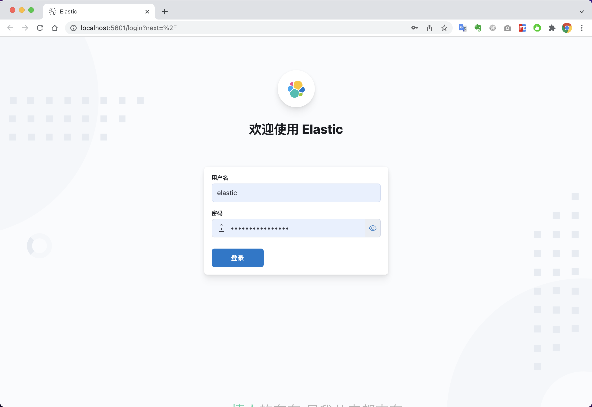

# 快速搭建ElasticSearch+Kibana

## Elastic经典-快速搭建ElasticSearch+Kibana

一、编辑 `compose.yml`文件

```yaml
version: '3'

services:

  elasticsearch:
    image: elastic/elasticsearch:7.16.0
    container_name: elasticsearch
    restart: unless-stopped
    # privileged: true
    # user: root
    environment:
      - TZ=Asia/Shanghai
      - "node.name=elasticsearch"
      - "discovery.type=single-node"
      - "ES_JAVA_OPTS=-Xms512m -Xmx512m"
      - "xpack.security.enabled=true"
      - "xpack.security.authc.api_key.enabled=true"
      - "ELASTIC_PASSWORD=xxxx"
    ulimits:
      memlock:
        soft: -1
        hard: -1
    volumes:
      - ./elasticsearch/data:/usr/share/elasticsearch/data
      # - ./elasticsearch/plugins:/usr/share/elasticsearch/plugins
      # - ./elasticsearch/logs:/usr/share/elasticsearch/logs
    ports:
      - 9200:9200
    
  kibana:
    image: elastic/kibana:7.16.0
    container_name: kibana
    restart: unless-stopped
    depends_on:
      - elasticsearch
    ports:
      - 5601:5601
    environment:
      - TZ=Asia/Shanghai
      - I18N_LOCALE=zh-CN
      - ELASTICSEARCH_HOSTS=http://elasticsearch:9200
      - ELASTICSEARCH_USERNAME=elastic
      - ELASTICSEARCH_PASSWORD=xxxx

networks:
 default:
   name: 'es-kibana-net'

```

二、启动容器

```bash
docker-compsoe up -d
```

三、访问服务

[http://127.0.0.1:5601/](http://127.0.0.1:5601/)

输入账号密码即可


登录页面




<!-- more --> 

主页


