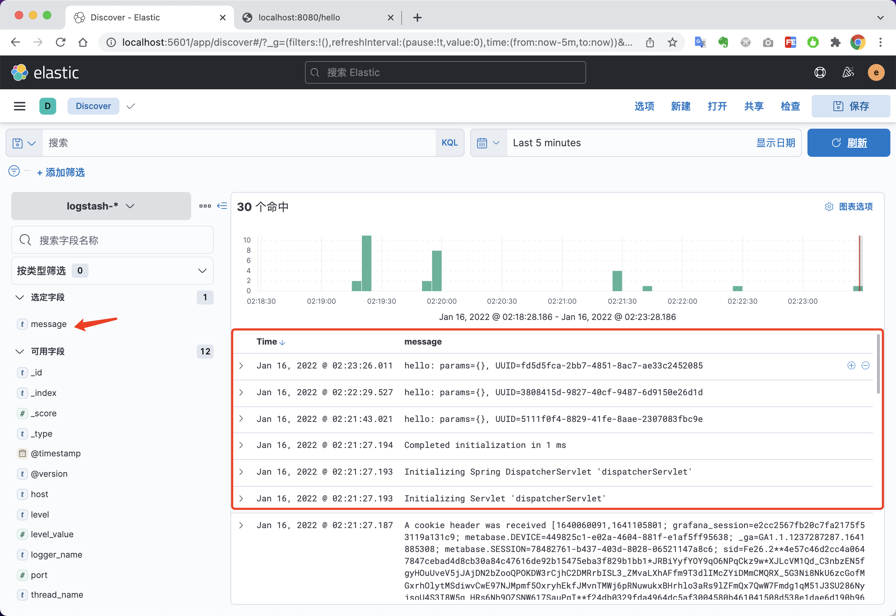

# 采集JAVA程序日志

## Elastic经典-快速搭建ELK-采集JAVA程序日志

一、添加依赖：编辑`pom.xml`文件

```xml
<dependency>
  <groupId>net.logstash.logback</groupId>
  <artifactId>logstash-logback-encoder</artifactId>
  <version>5.3</version>
</dependency>
```

二、编辑日志配置文件 `logback-spring.xml`

【注意，实际部署时，请使用 `logstash:4560`】

```xml
<?xml version="1.0" encoding="UTF-8"?>
<!DOCTYPE configuration>
<configuration>
    <include resource="org/springframework/boot/logging/logback/defaults.xml"/>
    <include resource="org/springframework/boot/logging/logback/console-appender.xml"/>
    <!--应用名称-->
    <property name="APP_NAME" value="springboot-logback-elk-demo"/>
    <!--日志文件保存路径-->
    <property name="LOG_FILE_PATH" value="${LOG_FILE:-${LOG_PATH:-${LOG_TEMP:-${java.io.tmpdir:-/tmp}}}/logs}"/>
    <contextName>${APP_NAME}</contextName>
    <!--每天记录日志到文件appender-->
    <appender name="FILE" class="ch.qos.logback.core.rolling.RollingFileAppender">
        <rollingPolicy class="ch.qos.logback.core.rolling.TimeBasedRollingPolicy">
            <fileNamePattern>${LOG_FILE_PATH}/${APP_NAME}-%d{yyyy-MM-dd}.log</fileNamePattern>
            <maxHistory>30</maxHistory>
        </rollingPolicy>
        <encoder>
            <pattern>${FILE_LOG_PATTERN}</pattern>
        </encoder>
    </appender>
    <!--输出到logstash的appender-->
    <appender name="LOGSTASH" class="net.logstash.logback.appender.LogstashTcpSocketAppender">
        <!--可以访问的logstash日志收集端口-->
        <destination>127.0.0.1:4560</destination>
        <!-- <destination>logstash:4560</destination> -->
        <encoder charset="UTF-8" class="net.logstash.logback.encoder.LogstashEncoder"/>
    </appender>
    <root level="INFO">
        <appender-ref ref="CONSOLE"/>
        <appender-ref ref="FILE"/>
        <appender-ref ref="LOGSTASH"/>
    </root>
</configuration>
```

三、启动应用并访问能打印日志的地址如：（http://127.0.0.1:8080/hello）


四、登录`kibana`查看日志情况

http://127.0.0.1:5601/app/discover



