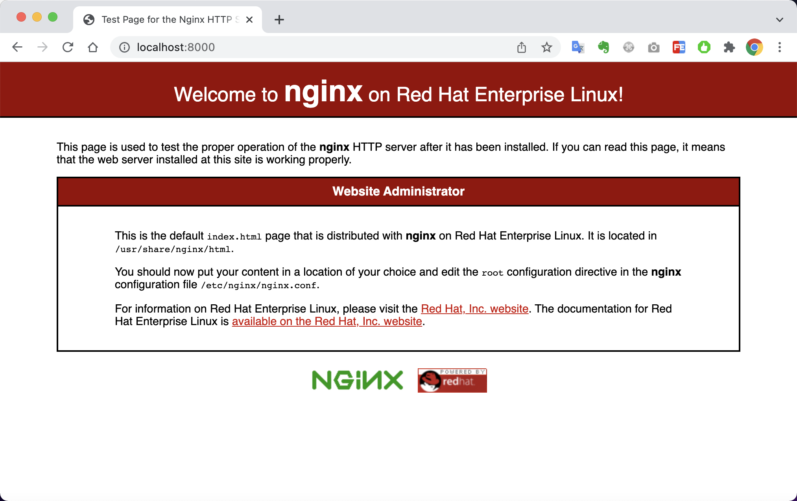
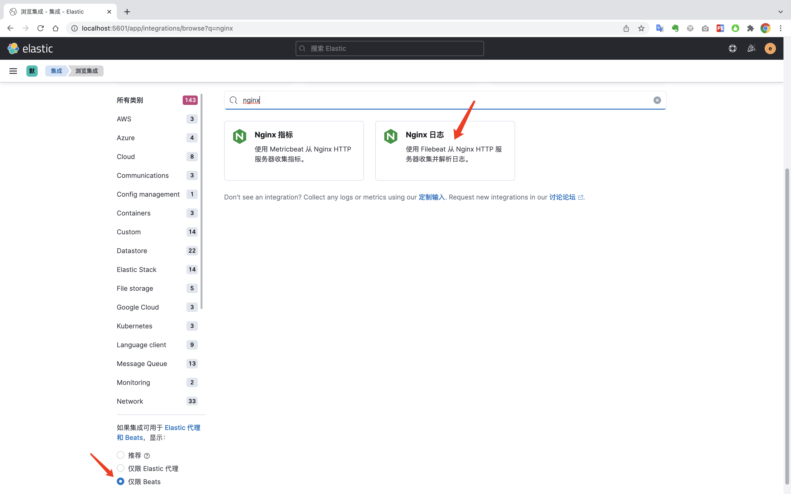
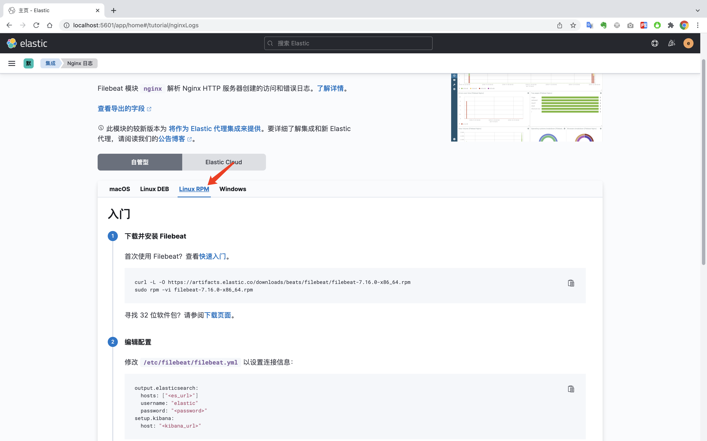
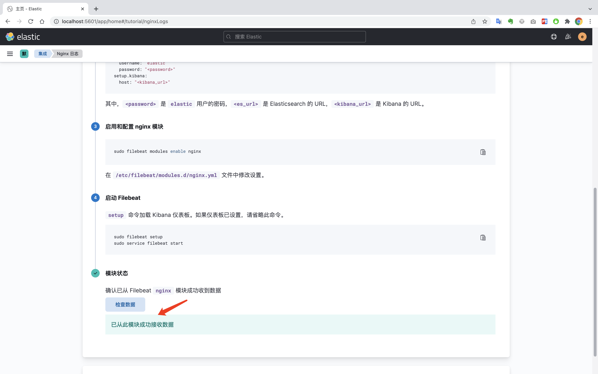
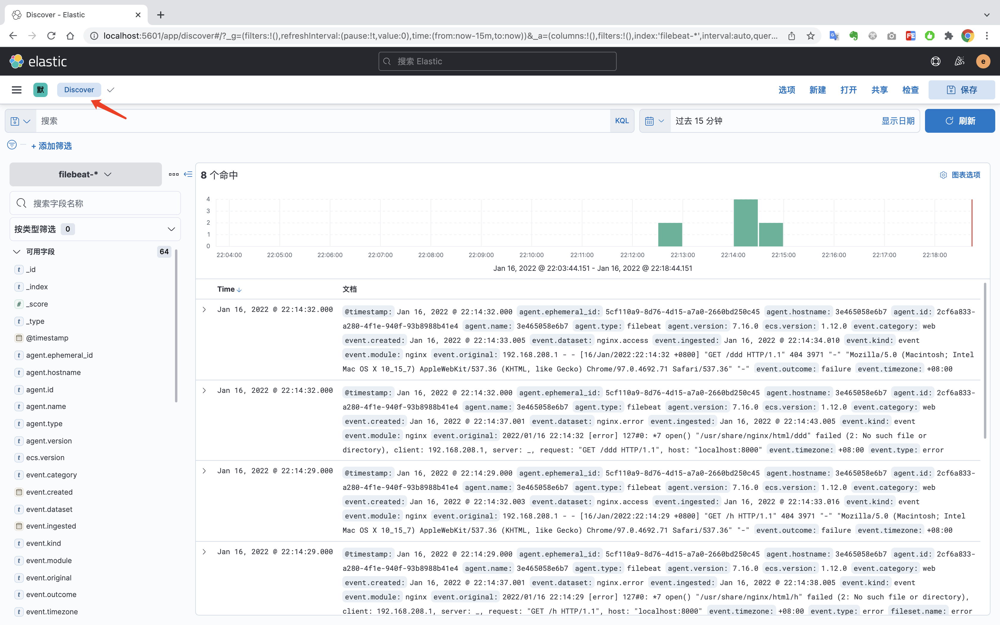
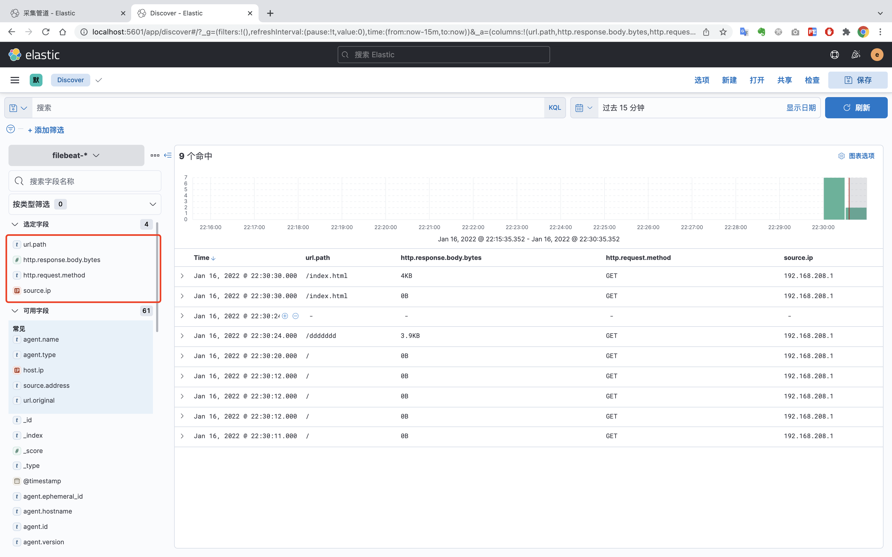
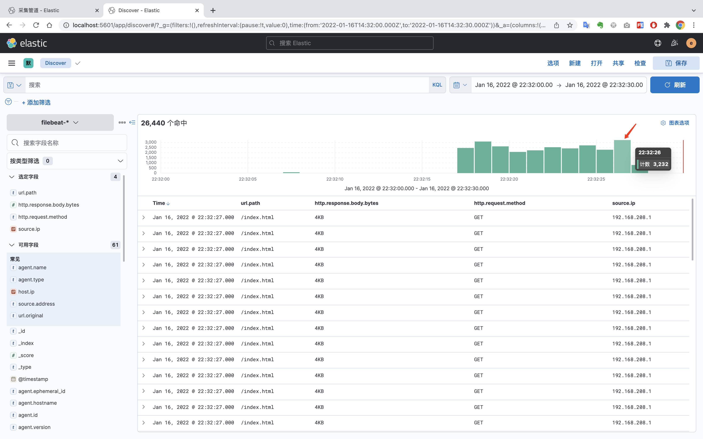
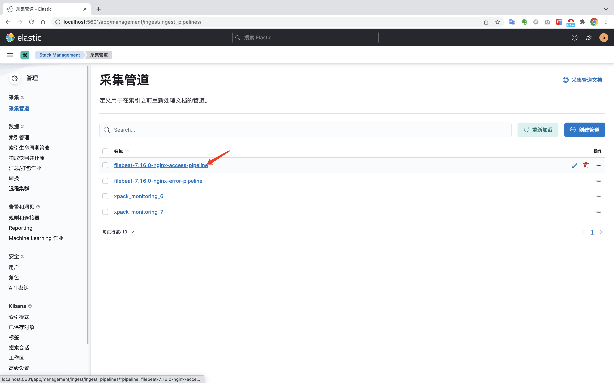
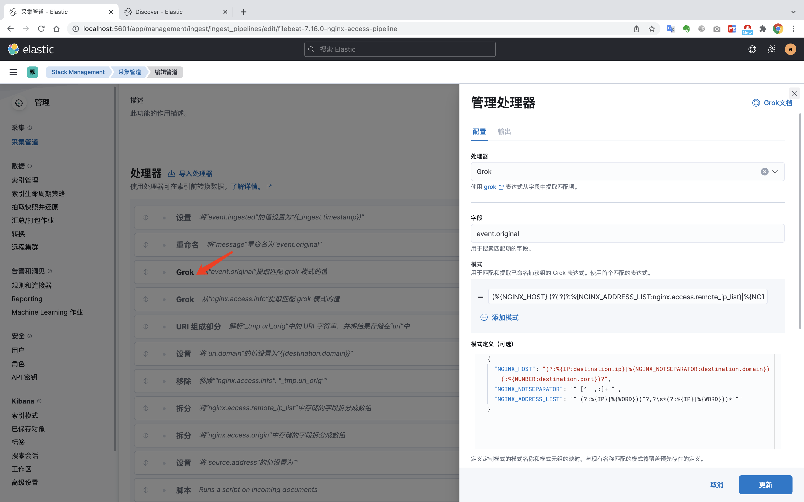
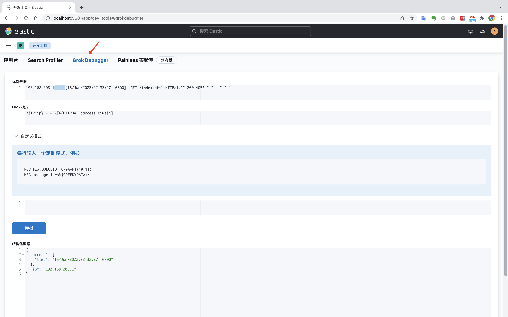

# 采集NGINX日志

## Elastic经典-快速搭建ELK-采集NGINX日志

### 一、搭建centos环境

编辑`compose-centos.yml`文件

```yaml
version: '3'

services:

  centos:
    image: centos:centos8.4.2105
    container_name: centos
    restart: unless-stopped
    ports:
      - 8000:80
    environment:
      - TZ=Asia/Shanghai
		stdin_open: true # -i interactive
    tty: true # -t tty
    privileged: true

networks:
  default:
    external:
      name: 'es-kibana-logstash-net'
```

启动容器

```bash
docker-compose -f compose-centos.yml up -d 
```

进入容器

```bash
docker exec -it centos bash 
```

### 二、安装Nginx

安装`nginx`

```bash
yum install -y nginx 
```

启动`nginx`

```bash
nginx
```

确认nginx安装成功：http://127.0.0.1:8000/



<!-- more -->

### 三、安装filebeat，上报nginx日志

打开`kibana`,选择`可观测性` > `集成` > `浏览集成`




选择`仅限Beats` 选择`nginx日志`



下载并安装Filebeat

```bash
curl -L -O https://artifacts.elastic.co/downloads/beats/filebeat/filebeat-7.16.0-x86_64.rpm
rpm -vi filebeat-7.16.0-x86_64.rpm
```

编辑配置文件`/etc/filebeat/filebeat.yml` 修改一下几个选项

```yaml
output.elasticsearch:
  hosts: ["http://elasticsearch:9200"]
  username: "elastic"
  password: "xxxx"
setup.kibana:
  host: "http://elasticsearch:5601"
```

启用nginx模块

```bash
filebeat modules enable nginx
```

加载kibana仪表盘

```bash
filebeat setup
```

启动filebeat采集任务

```bash
filebeat run
```

点击检查数据，此时说明已经安装成功了。



### 四、查看数据情况

访问几次页面后，查看日志情况



选择常用的字段



压测查看系统并发数

```bash
wrk -t 4 http://127.0.0.1:8000/index.html
```

选择时间，并查看系统的并发数



在采集管道里面，可以自定义日志格式



通过编辑处理器来自定义日志格式数据



`Kibana`还提供了`Grok调试器`，可以直接在这里调试日志管道处理器



