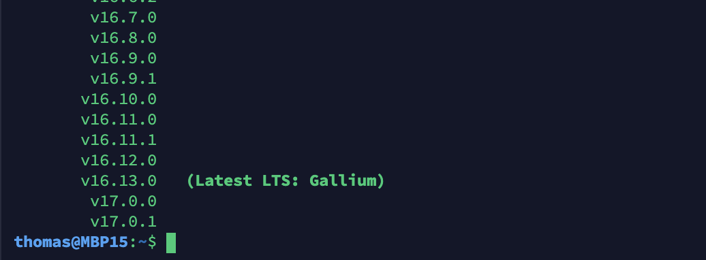
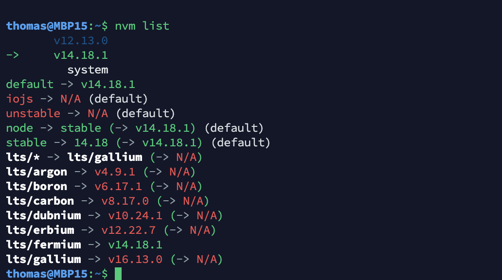

# nodejs

## nodejs多版本管理之NVM

### 安装

>  可能需要翻墙

```bash
curl -o- https://raw.githubusercontent.com/nvm-sh/nvm/v0.39.0/install.sh | bash
```

### 常用命令

查看可用的node版本

```bash
nvm ls-remote
```



安装指定版本的nodejs

```bash
nvm install v12.13.0
```

列出当前系统可用的版本

```bash
nvm list
```



切换版本

```bash
nvm use v12.13.0
# Now using node v12.13.0 (npm v6.12.0)
```

