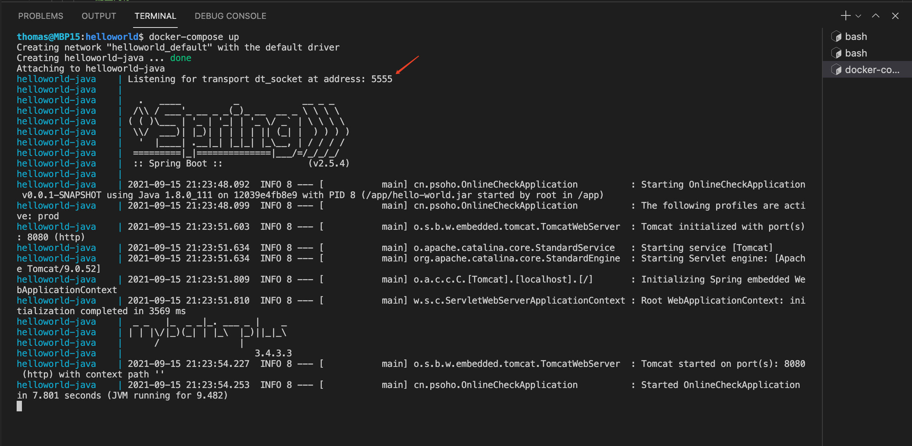
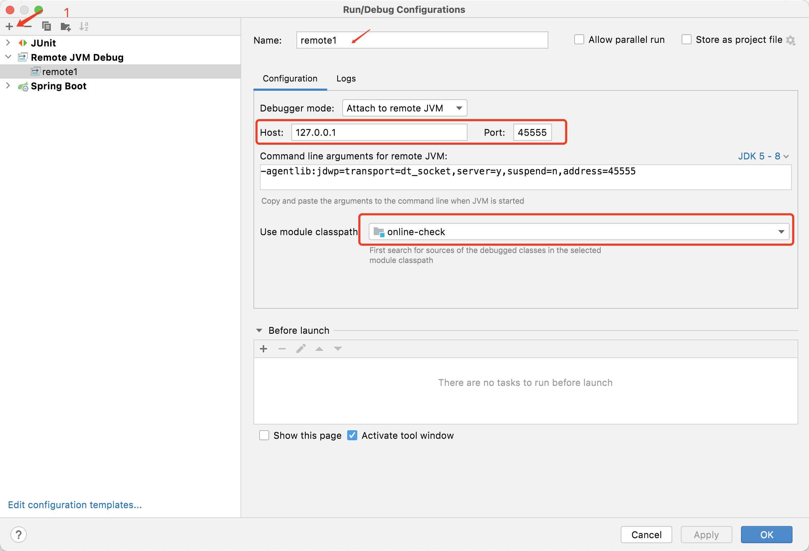
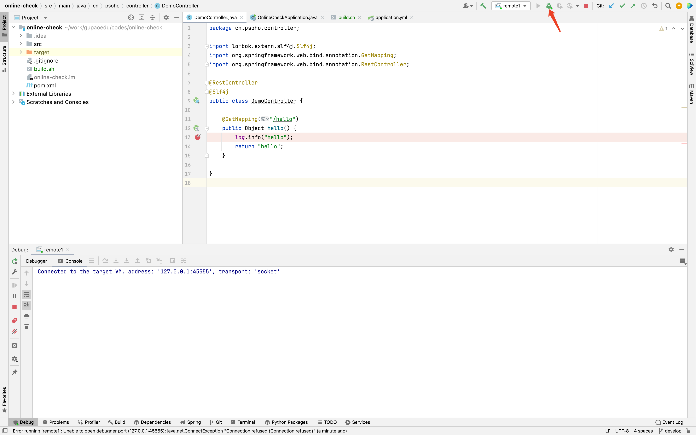
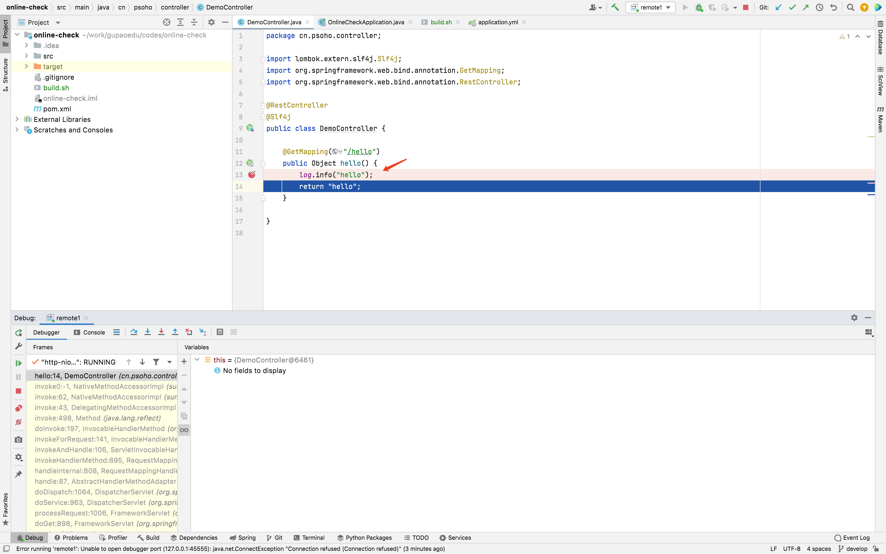

# IDEA

## IDEA远程调试运行在Docker容器中的JVM

开发过程中，会遇到很多情况，开发无法重现，需要远程调试才行。由于应用运行在 `docker` 容器中，需要进行相关配置才能开启远程调试。

### 制作带调试功能的镜像

核心配置 `-Xdebug -Xrunjdwp:transport=dt_socket,suspend=n,server=y,address=5555 `

```dockerfile
FROM java:8-jdk

LABEL maintainer="thomastangweixin@163.com"

RUN ln -sf /usr/share/zoneinfo/Asia/Shanghai /etc/localtime && echo 'Asia/Shanghai' >/etc/timezone

EXPOSE 5555

# 设置jvm内存
ENV MEM 128m
ENV PORT 5555
ENV JAR_NAME app.jar
WORKDIR /app

ENTRYPOINT java -server -Xms$MEM -Xmx$MEM -Djava.security.egd=file:/dev/./urandom -Dfile.encoding=UTF-8 -XX:+HeapDumpOnOutOfMemoryError -Xdebug -Xrunjdwp:transport=dt_socket,suspend=n,server=y,address=$PORT -jar $JAR_NAME
```

构建镜像听推送到远程仓库

```bash
#!/bin/bash

# 构建可调试的镜像
docker build -t tangweixin/java:8-jdk-debug -f Dockerfile.8-jdk-debug .

# 推送到docker仓库
docker push tangweixin/java:8-jdk-debug
```


### 更换具有调试功能的容器启动

```yaml
version: '3'

services:

  helloworld-java:
    container_name: helloworld-java
    # image: tangweixin/java:8-jdk
    image: tangweixin/java:8-jdk-debug
    ports:
      - 8080:8080
      - 45555:5555
    volumes:
      - ./app:/app
    environment:
      # 配置内存
      MEM: 32M
      JAR_NAME: hello-world.jar
      spring.profiles.active: prod
```

启动容器



### 在IDEA远程调试

新建远程任务




在代码中设置断点，并运行远程debug任务




访问断点服务

```bash
http http://127.0.0.1:8080/hello
```


已经捕捉到断点




开启你的远程调试之旅吧


### 参考

- [使用IDEA进行远程调试](https://www.jianshu.com/p/302dc10217c0)

