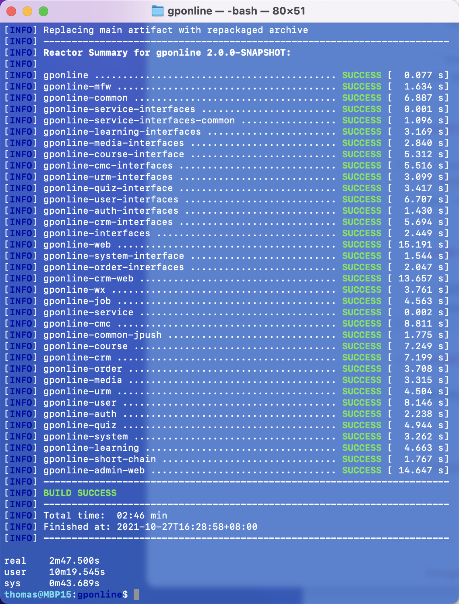
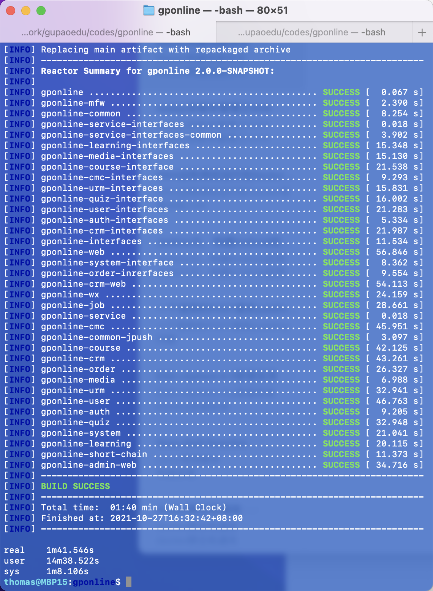
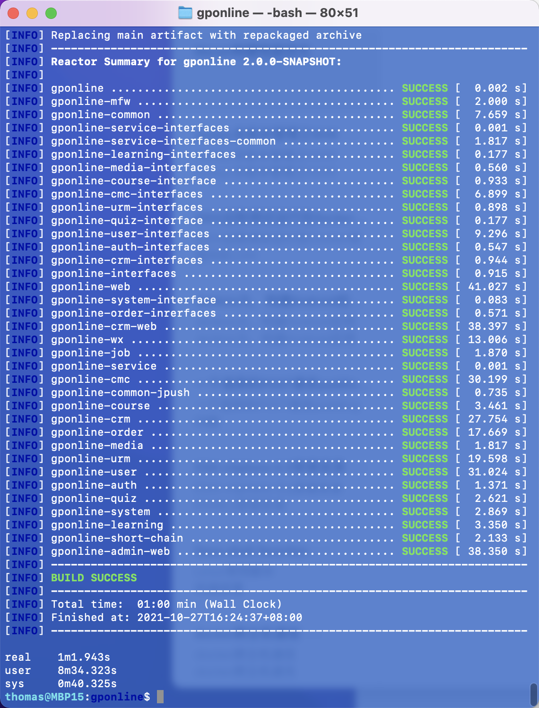

# Maven

## Maven安装第三方jar包

安装第三方jar包

```bash
mvn install:install-file \ 
  -Dfile=<path-to-file> \ 
  -DgroupId=<group-id> \ 
  -DartifactId=<artifact-id> \ 
  -Dversion=<version> \ 
  -Dpackaging=<packaging> \
  -DpomFile=<path-to-pomfile>
```

安装记录

```bash
thomas@MBP15:Desktop$ mvn install:install-file -DgroupId=cn.com.dwsoft -DartifactId=dw-authority -Dversion=3.0-SNAPSHOT -Dpackaging=jar -Dfile=dw-authority-3.0-SNAPSHOT.jar -DpomFile=dw-authority-3.0-SNAPSHOT.xml
[INFO] Scanning for projects...
[INFO] 
[INFO] ------------------< org.apache.maven:standalone-pom >-------------------
[INFO] Building Maven Stub Project (No POM) 1
[INFO] --------------------------------[ pom ]---------------------------------
[INFO] 
[INFO] --- maven-install-plugin:2.4:install-file (default-cli) @ standalone-pom ---
[INFO] Installing /Users/thomas/Desktop/dw-authority-3.0-SNAPSHOT.jar to /Users/thomas/.m2/repository-aliyun/cn/com/dwsoft/dw-authority/3.0-SNAPSHOT/dw-authority-3.0-SNAPSHOT.jar
[INFO] Installing /Users/thomas/Desktop/dw-authority-3.0-SNAPSHOT.xml to /Users/thomas/.m2/repository-aliyun/cn/com/dwsoft/dw-authority/3.0-SNAPSHOT/dw-authority-3.0-SNAPSHOT.pom
[INFO] ------------------------------------------------------------------------
[INFO] BUILD SUCCESS
[INFO] ------------------------------------------------------------------------
[INFO] Total time:  0.252 s
[INFO] Finished at: 2021-07-28T11:57:41+08:00
[INFO] ------------------------------------------------------------------------
thomas@MBP15:Desktop$ head -n 20 /Users/thomas/.m2/repository-aliyun/cn/com/dwsoft/dw-authority/3.0-SNAPSHOT/dw-authority-3.0-SNAPSHOT.pom
<project xmlns="http://maven.apache.org/POM/4.0.0" xmlns:xsi="http://www.w3.org/2001/XMLSchema-instance"
         xsi:schemaLocation="http://maven.apache.org/POM/4.0.0 http://maven.apache.org/xsd/maven-4.0.0.xsd">
    <modelVersion>4.0.0</modelVersion>
    <parent>
        <groupId>cn.com.dwsoft</groupId>
        <artifactId>dw-parent</artifactId>
        <version>3.0-SNAPSHOT</version>
    </parent>
    <artifactId>dw-authority</artifactId>
    <version>3.0-SNAPSHOT</version>
    <packaging>jar</packaging>
    <properties>
        <jjwt.version>0.10.7</jjwt.version>
    </properties>
    <dependencies>
     <!-- jwt -->
        <dependency>
            <groupId>io.jsonwebtoken</groupId>
            <artifactId>jjwt-impl</artifactId>
            <version>${jjwt.version}</version>
thomas@MBP15:Desktop$ 
```

## Maven构建性能优化

### 减少构建的工程量

只构建指定工程及其相关依赖

```bash
# -pl 工程名称
# -am 自动分析相关的依赖工程
mvn clean package -pl gponline-web -am
```

### 忽略测试

这种忽略测试的方式`-Dmaven.test.skip=true`，连测试代码都不会进行编译

```bash
mvn clean package -pl gponline-web -am -Dmaven.test.skip=true
```

### 不执行清除

> （慎用）可能会导致某些需要清理的类没被清理

```bash
mvn package -pl gponline-web -am -Dmaven.test.skip=true
```

### 并行构建

```bash
# 并行构建，充分利用CPU的核心数
mvn -T 1C clean package -pl gponline-web -am -Dmaven.test.skip=true 
```

### 参考

- [如何提高maven的编译速度](https://blog.csdn.net/liuxiao723846/article/details/111991698)
- [How to Speed up Your Maven Build](https://www.jrebel.com/blog/how-to-speed-up-your-maven-build)
- [自从用完Gradle后，有点嫌弃Maven了！速度贼快！](https://zhuanlan.zhihu.com/p/150652217)

### 实际构建案例

#### 默认构建速度

```bash
time mvn clean package -Dmaven.test.skip=true
```

耗时 `2m47.500s`



#### 通过并行构建

```bash
time mvn -T 1C clean package -Dmaven.test.skip=true
```

耗时 `1m41.546s`

并行构建，能充分利用CPU的性能。作者`6个核心`的CPU直接跑满




#### 不执行清理进行构建

```bash
time mvn -T 1C package -Dmaven.test.skip=true
```

耗时 `1m1.943s`



