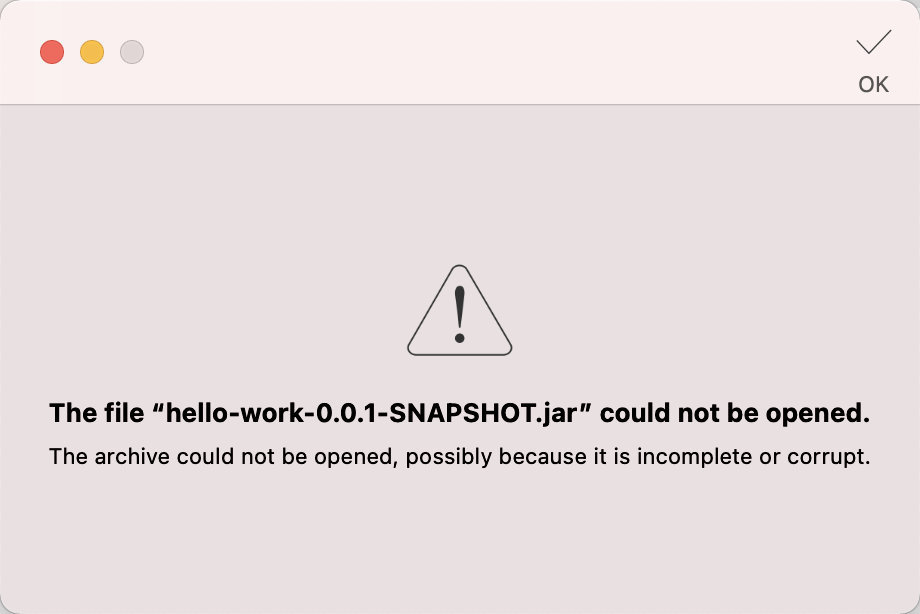
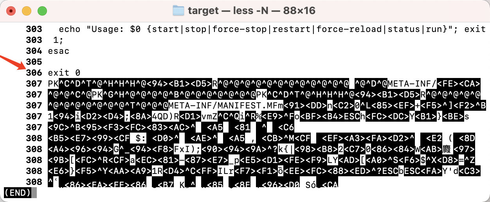

# Spring-Boot

## Spring-Boot基础

### 三板斧

* 依赖
* 配置
* 注解

### Actuator

* 监控
* 健康检查

添加依赖

```xml
<dependency>
  <groupId>org.springframework.boot</groupId>
  <artifactId>spring-boot-starter-actuator</artifactId>
</dependency>
```

添加注释

```yaml
management:
  endpoint:
    health:
      show-details: always
```

[http://127.0.0.1:8080/actuator/health](http://127.0.0.1:8080/actuator/health)

```json
{
    "status": "UP",
    "components": {
        "diskSpace": {
            "status": "UP",
            "details": {
                "total": 1000240963584,
                "free": 333556006912,
                "threshold": 10485760,
                "exists": true
            }
        },
        "ping": {
            "status": "UP"
        }
    }
}
```

`status`取值

* UP: 正常
* DOWN: 不正常
* OUT_OF_SERVICE: 资源不可用
* UNKOWN: 未知

常用端点

### 配置管理常用方式

* 配置文件`application.yml` 
* 环境变量`${SOME_ENV}`
* 外部配置文件，和`jar`包同级的`application.yml`，优先级比`jar`内部的高
* 命令行参数`java -jar app.jar --some.var=xxx`

### Profile

* 通过连字符`---`设置。

*	也可以通过文件名`application-dev.yml`，`application-prod.yml`来区分不同环境。

```yaml
# 所有环境公用
management:
  endpoint:
    health:
      show-details: always
  endpoints:
    web:
      exposure:
        include: '*'

# 设置活跃的dev
spring:
  profiles:
    active: dev

# 连字符
---
# 开发环境
spring:
  profiles: dev

---
# 生产环境
spring:
  profiles: prod

# tomcat调优
server:
  tomcat:
    max-threads: 300
    max-connections: 1000

```

## SpringBoot自带启动脚本问题

### 如何构建自带启动脚本的SpringBoot应用

通常，我们使用`java -jar xxx.jar`的方式来启动我们的`Java`应用。

也可以使用`bash xxx.jar start`的方式来启动，只需在maven插件中设置`executable`为`true`即可。

```xml
<build>
  <plugins>
    <plugin>
      <groupId>org.springframework.boot</groupId>
      <artifactId>spring-boot-maven-plugin</artifactId>
      <configuration>
        <!-- 设置executable为true，自动启动脚本 --> 
        <executable>true</executable>
      </configuration>
    </plugin>
  </plugins>
</build>
```

```bash
# 构建maven
mvn package -Dmaven.test.skip=true

# 启动项目
bash target/hello-work-0.0.1-SNAPSHOT.jar start
```

### 无法解压问题

```bash
# 无法正常解压
jar -xf target/hello-work-0.0.1-SNAPSHOT.jar
```

由于增加了启动脚本，导致通过`jar`命令和`Archiver`解压工具无法解压，提示如下



### 解决方案


由于`Mac`系统自带的sed不能用，特意给我兄弟写了一个python脚本

```python
# drop_shell_in_jar.py
import sys

def main():
    jar_name = sys.argv[1]
    print('jar_name:', jar_name)
    with open(jar_name, mode='br') as f:
        max = 300
        i = 0
        found = False
        while i < max:
            i += 1
            l = f.readline()
            if l == b'exit 0\n':
                print('found exit in line ', i)
                found = True
                break
        if found:
            out_jar_name = jar_name[:-4] + '-out.jar'
            print('out_jar_name:', out_jar_name)
            with open(out_jar_name, mode='bw') as fo:
                while True:
                    x = f.readline()
                    if not x:
                        break
                    fo.write(x)
        else:
            print('not found')

    pass


if __name__ == '__main__':
    main()
    # 用法: python drop_shell_in_jar.py xxx.jar
```

删除启动脚本即可，如果没有源码的情况下，使用`sed`工具删除

#### 第一步，先找到exit 0所在的行

```bash
head -n 309 hello-work-0.0.1-SNAPSHOT.jar | less -N
```

这里为第306行



#### 第二步，删除第一行到第306行

> 不同的spring-boot版本，构建出来的启动脚本会有差异，必须先找到结束行，不能盲目删除！

```bash
gsed -i '1,306d' hello-work-0.0.1-SNAPSHOT.jar
```

此时，再用解压工具解压即可正常解压。

```bash
# Mac下请您使用gnu-sed
brew install gnu-sed
```

### 参考

* [Installing Spring Boot Applications](https://docs.spring.io/spring-boot/docs/current/reference/html/deployment.html#deployment.installing)
* [Springboot 打包自带启动脚本](https://www.cnblogs.com/woshimrf/p/11980923.html)
* [如何使用sed命令删除文件中的行](https://os.51cto.com/art/201908/602094.htm)

### 附-启动脚本源码

> 不同springboot版本，构建出来的启动脚本会有不同（288~306行不等）

```bash
#!/bin/bash
#
#    .   ____          _            __ _ _
#   /\\ / ___'_ __ _ _(_)_ __  __ _ \ \ \ \
#  ( ( )\___ | '_ | '_| | '_ \/ _` | \ \ \ \
#   \\/  ___)| |_)| | | | | || (_| |  ) ) ) )
#    '  |____| .__|_| |_|_| |_\__, | / / / /
#   =========|_|==============|___/=/_/_/_/
#   :: Spring Boot Startup Script ::
#

### BEGIN INIT INFO
# Provides:          hello-work
# Required-Start:    $remote_fs $syslog $network
# Required-Stop:     $remote_fs $syslog $network
# Default-Start:     2 3 4 5
# Default-Stop:      0 1 6
# Short-Description: hello-work
# Description:       Demo project for Spring Boot
# chkconfig:         2345 99 01
### END INIT INFO

[[ -n "$DEBUG" ]] && set -x

# Initialize variables that cannot be provided by a .conf file
WORKING_DIR="$(pwd)"
# shellcheck disable=SC2153
[[ -n "$JARFILE" ]] && jarfile="$JARFILE"
[[ -n "$APP_NAME" ]] && identity="$APP_NAME"

# Follow symlinks to find the real jar and detect init.d script
cd "$(dirname "$0")" || exit 1
[[ -z "$jarfile" ]] && jarfile=$(pwd)/$(basename "$0")
while [[ -L "$jarfile" ]]; do
  if [[ "$jarfile" =~ init\.d ]]; then
    init_script=$(basename "$jarfile")
  else
    configfile="${jarfile%.*}.conf"
    # shellcheck source=/dev/null
    [[ -r ${configfile} ]] && source "${configfile}"
  fi
  jarfile=$(readlink "$jarfile")
  cd "$(dirname "$jarfile")" || exit 1
  jarfile=$(pwd)/$(basename "$jarfile")
done
jarfolder="$( (cd "$(dirname "$jarfile")" && pwd -P) )"
cd "$WORKING_DIR" || exit 1

# Inline script specified in build properties


# Source any config file
configfile="$(basename "${jarfile%.*}.conf")"

# Initialize CONF_FOLDER location defaulting to jarfolder
[[ -z "$CONF_FOLDER" ]] && CONF_FOLDER="${jarfolder}"
# shellcheck source=/dev/null
[[ -r "${CONF_FOLDER}/${configfile}" ]] && source "${CONF_FOLDER}/${configfile}"

# ANSI Colors
echoRed() { echo $'\e[0;31m'"$1"$'\e[0m'; }
echoGreen() { echo $'\e[0;32m'"$1"$'\e[0m'; }
echoYellow() { echo $'\e[0;33m'"$1"$'\e[0m'; }

# Initialize PID/LOG locations if they weren't provided by the config file
[[ -z "$PID_FOLDER" ]] && PID_FOLDER="/var/run"
[[ -z "$LOG_FOLDER" ]] && LOG_FOLDER="/var/log"
! [[ "$PID_FOLDER" == /* ]] && PID_FOLDER="$(dirname "$jarfile")"/"$PID_FOLDER"
! [[ "$LOG_FOLDER" == /* ]] && LOG_FOLDER="$(dirname "$jarfile")"/"$LOG_FOLDER"
! [[ -x "$PID_FOLDER" ]] && echoYellow "PID_FOLDER $PID_FOLDER does not exist. Falling back to /tmp" && PID_FOLDER="/tmp"
! [[ -x "$LOG_FOLDER" ]] && echoYellow "LOG_FOLDER $LOG_FOLDER does not exist. Falling back to /tmp" && LOG_FOLDER="/tmp"

# Set up defaults
[[ -z "$MODE" ]] && MODE="auto" # modes are "auto", "service" or "run"
[[ -z "$USE_START_STOP_DAEMON" ]] && USE_START_STOP_DAEMON="true"

# Create an identity for log/pid files
if [[ -z "$identity" ]]; then
  if [[ -n "$init_script" ]]; then
    identity="${init_script}"
  else
    identity=$(basename "${jarfile%.*}")_${jarfolder//\//}
  fi
fi

# Initialize log file name if not provided by the config file
[[ -z "$LOG_FILENAME" ]] && LOG_FILENAME="${identity}.log"

# Initialize stop wait time if not provided by the config file
[[ -z "$STOP_WAIT_TIME" ]] && STOP_WAIT_TIME="60"

# Utility functions
checkPermissions() {
  touch "$pid_file" &> /dev/null || { echoRed "Operation not permitted (cannot access pid file)"; return 4; }
  touch "$log_file" &> /dev/null || { echoRed "Operation not permitted (cannot access log file)"; return 4; }
}

isRunning() {
  ps -p "$1" &> /dev/null
}

await_file() {
  end=$(date +%s)
  let "end+=10"
  while [[ ! -s "$1" ]]
  do
    now=$(date +%s)
    if [[ $now -ge $end ]]; then
      break
    fi
    sleep 1
  done
}

# Determine the script mode
action="run"
if [[ "$MODE" == "auto" && -n "$init_script" ]] || [[ "$MODE" == "service" ]]; then
  action="$1"
  shift
fi

# Build the pid and log filenames
PID_FOLDER="$PID_FOLDER/${identity}"
pid_file="$PID_FOLDER/${identity}.pid"
log_file="$LOG_FOLDER/$LOG_FILENAME"

# Determine the user to run as if we are root
# shellcheck disable=SC2012
[[ $(id -u) == "0" ]] && run_user=$(ls -ld "$jarfile" | awk '{print $3}')

# Run as user specified in RUN_AS_USER
if [[ -n "$RUN_AS_USER" ]]; then
    if ! [[ "$action" =~ ^(status|run)$ ]]; then
        id -u "$RUN_AS_USER" || {
            echoRed "Cannot run as '$RUN_AS_USER': no such user"
            exit 2
        }
        [[ $(id -u) == 0 ]] || {
            echoRed "Cannot run as '$RUN_AS_USER': current user is not root"
            exit 4
        }
    fi
    run_user="$RUN_AS_USER"
fi

# Issue a warning if the application will run as root
[[ $(id -u ${run_user}) == "0" ]] && { echoYellow "Application is running as root (UID 0). This is considered insecure."; }

# Find Java
if [[ -n "$JAVA_HOME" ]] && [[ -x "$JAVA_HOME/bin/java" ]]; then
    javaexe="$JAVA_HOME/bin/java"
elif type -p java > /dev/null 2>&1; then
    javaexe=$(type -p java)
elif [[ -x "/usr/bin/java" ]];  then
    javaexe="/usr/bin/java"
else
    echo "Unable to find Java"
    exit 1
fi

arguments=(-Dsun.misc.URLClassPath.disableJarChecking=true $JAVA_OPTS -jar "$jarfile" $RUN_ARGS "$@")

# Action functions
start() {
  if [[ -f "$pid_file" ]]; then
    pid=$(cat "$pid_file")
    isRunning "$pid" && { echoYellow "Already running [$pid]"; return 0; }
  fi
  do_start "$@"
}

do_start() {
  working_dir=$(dirname "$jarfile")
  pushd "$working_dir" > /dev/null
  if [[ ! -e "$PID_FOLDER" ]]; then
    mkdir -p "$PID_FOLDER" &> /dev/null
    if [[ -n "$run_user" ]]; then
      chown "$run_user" "$PID_FOLDER"
    fi
  fi
  if [[ ! -e "$log_file" ]]; then
    touch "$log_file" &> /dev/null
    if [[ -n "$run_user" ]]; then
      chown "$run_user" "$log_file"
    fi
  fi
  if [[ -n "$run_user" ]]; then
    checkPermissions || return $?
    if [ $USE_START_STOP_DAEMON = true ] && type start-stop-daemon > /dev/null 2>&1; then
      start-stop-daemon --start --quiet \
        --chuid "$run_user" \
        --name "$identity" \
        --make-pidfile --pidfile "$pid_file" \
        --background --no-close \
        --startas "$javaexe" \
        --chdir "$working_dir" \
        -- "${arguments[@]}" \
        >> "$log_file" 2>&1
      await_file "$pid_file"
    else
      su -s /bin/sh -c "$javaexe $(printf "\"%s\" " "${arguments[@]}") >> \"$log_file\" 2>&1 & echo \$!" "$run_user" > "$pid_file"
    fi
    pid=$(cat "$pid_file")
  else
    checkPermissions || return $?
    "$javaexe" "${arguments[@]}" >> "$log_file" 2>&1 &
    pid=$!
    disown $pid
    echo "$pid" > "$pid_file"
  fi
  [[ -z $pid ]] && { echoRed "Failed to start"; return 1; }
  echoGreen "Started [$pid]"
}

stop() {
  working_dir=$(dirname "$jarfile")
  pushd "$working_dir" > /dev/null
  [[ -f $pid_file ]] || { echoYellow "Not running (pidfile not found)"; return 0; }
  pid=$(cat "$pid_file")
  isRunning "$pid" || { echoYellow "Not running (process ${pid}). Removing stale pid file."; rm -f "$pid_file"; return 0; }
  do_stop "$pid" "$pid_file"
}

do_stop() {
  kill "$1" &> /dev/null || { echoRed "Unable to kill process $1"; return 1; }
  for ((i = 1; i <= STOP_WAIT_TIME; i++)); do
    isRunning "$1" || { echoGreen "Stopped [$1]"; rm -f "$2"; return 0; }
    [[ $i -eq STOP_WAIT_TIME/2 ]] && kill "$1" &> /dev/null
    sleep 1
  done
  echoRed "Unable to kill process $1";
  return 1;
}

force_stop() {
  [[ -f $pid_file ]] || { echoYellow "Not running (pidfile not found)"; return 0; }
  pid=$(cat "$pid_file")
  isRunning "$pid" || { echoYellow "Not running (process ${pid}). Removing stale pid file."; rm -f "$pid_file"; return 0; }
  do_force_stop "$pid" "$pid_file"
}

do_force_stop() {
  kill -9 "$1" &> /dev/null || { echoRed "Unable to kill process $1"; return 1; }
  for ((i = 1; i <= STOP_WAIT_TIME; i++)); do
    isRunning "$1" || { echoGreen "Stopped [$1]"; rm -f "$2"; return 0; }
    [[ $i -eq STOP_WAIT_TIME/2 ]] && kill -9 "$1" &> /dev/null
    sleep 1
  done
  echoRed "Unable to kill process $1";
  return 1;
}

restart() {
  stop && start
}

force_reload() {
  working_dir=$(dirname "$jarfile")
  pushd "$working_dir" > /dev/null
  [[ -f $pid_file ]] || { echoRed "Not running (pidfile not found)"; return 7; }
  pid=$(cat "$pid_file")
  rm -f "$pid_file"
  isRunning "$pid" || { echoRed "Not running (process ${pid} not found)"; return 7; }
  do_stop "$pid" "$pid_file"
  do_start
}

status() {
  working_dir=$(dirname "$jarfile")
  pushd "$working_dir" > /dev/null
  [[ -f "$pid_file" ]] || { echoRed "Not running"; return 3; }
  pid=$(cat "$pid_file")
  isRunning "$pid" || { echoRed "Not running (process ${pid} not found)"; return 1; }
  echoGreen "Running [$pid]"
  return 0
}

run() {
  pushd "$(dirname "$jarfile")" > /dev/null
  "$javaexe" "${arguments[@]}"
  result=$?
  popd > /dev/null
  return "$result"
}

# Call the appropriate action function
case "$action" in
start)
  start "$@"; exit $?;;
stop)
  stop "$@"; exit $?;;
force-stop)
  force_stop "$@"; exit $?;;
restart)
  restart "$@"; exit $?;;
force-reload)
  force_reload "$@"; exit $?;;
status)
  status "$@"; exit $?;;
run)
  run "$@"; exit $?;;
*)
  echo "Usage: $0 {start|stop|force-stop|restart|force-reload|status|run}"; exit 1;
esac

exit 0
```

