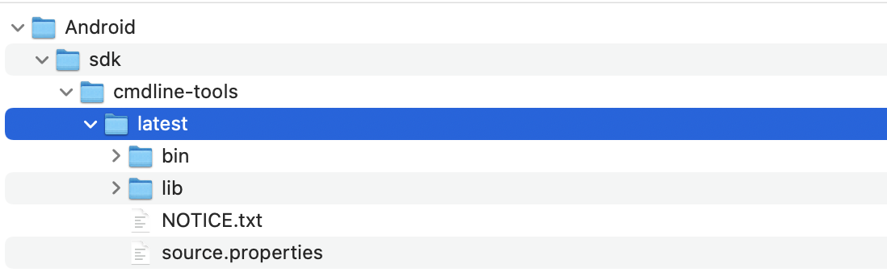
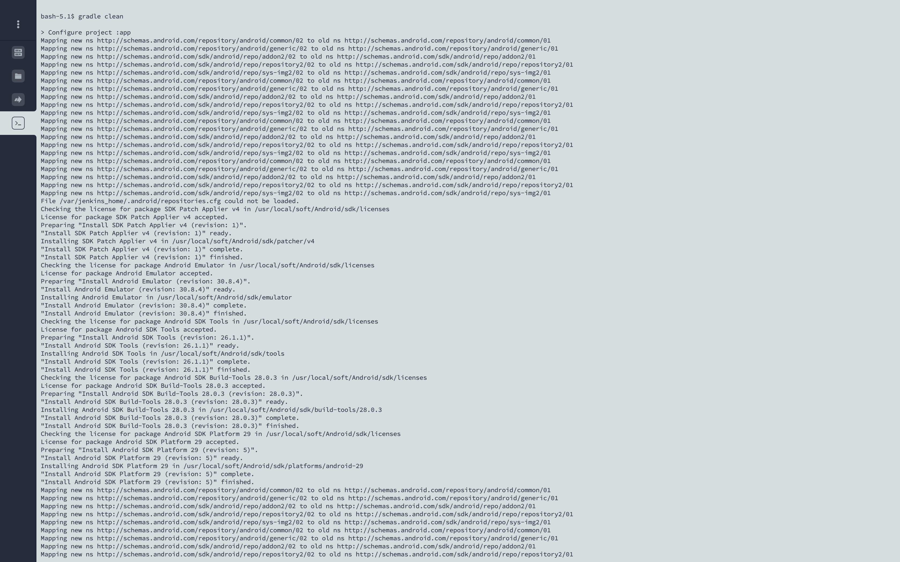
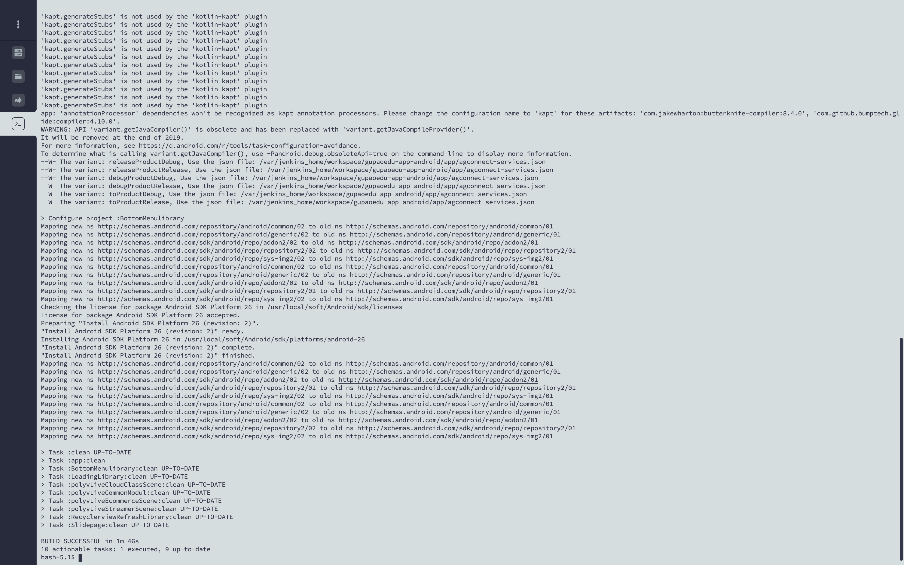

# 九、Jenkins构建Android应用

## 必备软件

### 安装 `gradle`

下载地址

[https://gradle.org/next-steps/?version=5.6.4&format=bin](https://gradle.org/next-steps/?version=5.6.4&format=bin)

```bash
# 安装gradle
export PATH=$PATH:/usr/local/soft/gradle-5.6.4/bin

# 构建
gradle clean
```

### 安装 `android/sdk`

下载地址

[https://dl.google.com/android/repository/commandlinetools-linux-7583922_latest.zip](https://dl.google.com/android/repository/commandlinetools-linux-7583922_latest.zip)

下载解压后，需要将目录设置为这种方式，否则会导致无法找到 `sdk-root` 问题



```bash
# 通过 sdkmanager 安装 android-sdk
# 配置环境变量
export ANDROID_HOME=/usr/local/soft/Android/sdk
export PATH=$PATH:$ANDROID_HOME/cmdline-tools/latest/bin

# 下载文件
sdkmanager --list
sdkmanager "platform-tools" "platforms;android-28"

# 权限问题
chown -R jenkins:jenkins /usr/local/soft/
```

## 测试构建

```bash
# 显示所有构建命令
gradle tasks

# 构建
gradle clean assembleDebug
```

构建中



构建成功



## 配置Jenkins构建脚本

1. 精准构建出对应环境的 `apk` 包
2. 上传 `apk` 包到指定服务器 `阿里云OSS`（需要下载阿里云命令行工具 `ossutil64`）
3. 生成 `apk` 包的下载二维码图片
4.  通过钉钉发送 `发版通知`

```bash
#gradle clean assembleDebug
#gradle clean assembleRelease

# 生产
# gradle app:assembleReleaseProductRelease app/build/outputs/apk/releaseProduct/release/咕泡云课堂-releaseProduct-V2.6.6.apk

# 灰度
# gradle app:assembleToProductRelease app/build/outputs/apk/toProduct/release/咕泡云课堂-toProduct-V2.6.6.apk

# 测试
# gradle app:assembleDebugProductRelease  app/build/outputs/apk/debugProduct/release/咕泡云课堂-debugProduct-V2.6.6.apk

gradle app:assembleReleaseProductRelease \
&& versionName=`grep 'versionName' app/build.gradle  | head -n 1 | awk '{print $2}' | tr -d '"'` \
&& appName="gupaoedu-app-prod-${versionName}.apk" \
&& downloadUrl="https://gp-www-cdn.oss-cn-shenzhen.aliyuncs.com/app/android/${appName}" \
&& ossutil64 cp -f app/build/outputs/apk/releaseProduct/release/咕泡云课堂-releaseProduct-V${versionName}.apk oss://gp-www-cdn/app/android/${appName} \
&& curl -s https://poster.prodapi.cn/pro/api/qr/${downloadUrl} -o ${appName}.jpg \
&& curl -s 'https://oapi.dingtalk.com/robot/send?access_token=1a6b4ce6e03fe05b2aade8195a34af30cec8d5387210d698378326a5ef54c2c7' \
 -H 'Content-Type: application/json' \
 -d "{ \"msgtype\": \"link\", \"link\": { \"text\": \"点击下载：最新Android-生产包 ${versionName}\", \"title\": \"最新Android生产包 ${versionName}\", \"picUrl\": \"https://poster.prodapi.cn/pro/api/qr/${downloadUrl}\", \"messageUrl\": \"${downloadUrl}\" } }"

```

## 参考文档

- [cmdline-tools-could-not-determine-sdk-root](https://stackoverflow.com/questions/65262340/cmdline-tools-could-not-determine-sdk-root)
- [Error: Could not determine SDK root.](https://blog.csdn.net/xuxiobo5/article/details/115469446)
- [android-studio-fails-to-install-update-error-failed-to-read-or-create-install](https://stackoverflow.com/questions/43042032/android-studio-fails-to-install-update-error-failed-to-read-or-create-install)
- [钉钉开发](https://developers.dingtalk.com/document/app#/serverapi2/qf2nxq)
- [自定义机器人接入](https://developers.dingtalk.com/document/robots/custom-robot-access)
- [阿里云OSS命令行工具](https://help.aliyun.com/document_detail/179388.html)

