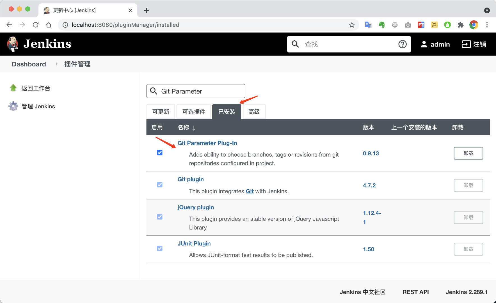

# 七、Jenkins构建SpringBoot应用之多参数构建

在实际开发中，有些场景，我们需要选择不同的`git分支`进行项目的构建。Jenkins是对这块是可以支持的，不过需要下载相关的插件。

## 安装插件

进入插件管理

点击`可选插件`，搜索`Git Parameter`插件，并选择`下载安装后重启`

<!-- more -->

勾选重启按钮

重启完成后，在插件管理中，确认插件是否安装成功。

## 创建新的构建任务

这里我们采用复制的方法来创建`多参数构建任务`

输入任务名称`hello-work-build-with-git-paramter`，并选择自由风格软件

输入想要复制的任务名称`hello-work`

## 参数化构建过程配置

选择`Git参数`

输入参数名称`branch`，选择参数类型，设置默认值为`origin/master`

> 重要，否则无法切换分支构建。

设置源码管理中的指定分支为`${branch}`，这是一个变量，需要用`${}`

点击保存。

## 执行`master`构建

点击`Build with Parameters`，选择`master`分支，点击开始构建。

查看构建详情，此时在`master`分支构建。

构建完成，进行验证。

此时，是基于`master`分支构建

## 切换分支，执行`develop`构建

点击`Build with Parameters`，选择`develop`分支，点击开始构建。

查看`Git Build Data`，确认是否从`develop`构建

再次访问验证，此时访问返回`hello work for develop`，说明是从`develop`分支构建。

至此，多参数构建，选择`git分支`构建已经演示完毕。

