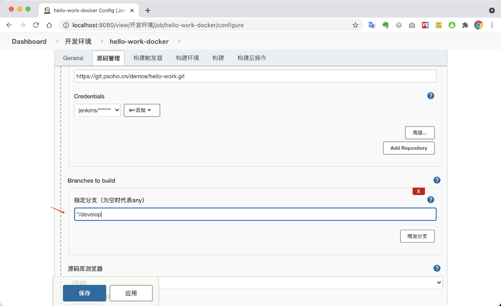
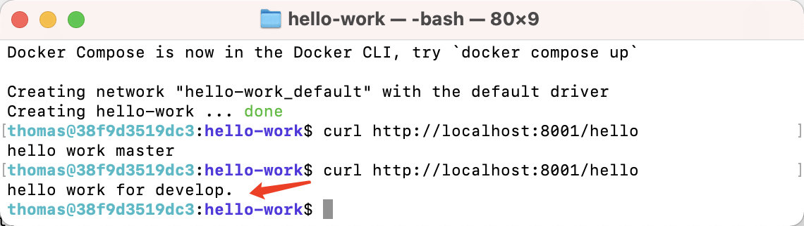

# 六、Jenkins构建SpringBoot应用并部署到Docker容器

上一篇文章演示了部署到远程服务器，今天演示一下如何部署到`docker`容器

## 运行docker容器

`docker-compose.yml`

```yaml
version: '3'

services:

  # hello-work
  hello-work:
    container_name: hello-work
    image: tangweixin/java:latest
    restart: on-failure
    ports:
      - 8001:8001
    volumes:
      - ./app:/app
    environment:
      spring.profiles.active: uat
      TZ: Asia/Shanghai
      JAR_NAME: /app/hello-work-0.0.1-SNAPSHOT.jar
      MEM: 128M
```

> 第一次启动，需要先手动拷贝把jar包到`./app`目录下，否则容器无法启动

启动容器

```bash
docker-compose up -d 
```

运行成功，访问接口


## 新建Jenkins任务


<!-- more -->

新建一个自由风格的任务


## 配置git

配置源码管理


## 配置构建

增加构建步骤`执行shell`

```bash
# 构建
mvn package -Dmaven.test.skip=true
# 拷贝到/app目录
cp target/hello-work-0.0.1-SNAPSHOT.jar /app/
# 重启docker容器
docker restart hello-work
```


## 挂载/app目录到Jenkins容器

由于之前的`Jenkins`容器没有挂载`/app`目录。需要重新挂载，步骤如下。

### 1.挂载`hello-work`的`app`目录到`jenkins`容器上

```yaml
version: "3"

services:

  jenkinsci-demo:
    container_name: jenkinsci-demo
    image: jenkinsci/blueocean:1.24.7
    restart: on-failure
    ports:
      - 8080:8080
    environment:
      TZ: Asia/Shanghai
    volumes:
      - ./jenkins-data:/var/jenkins_home
      - /var/run/docker.sock:/var/run/docker.sock
      # 挂载所需的构建软件java,maven,node等
      - ./soft:/usr/local/soft
      # 根据自己所在的目录设置
      - ../hello-work/app:/app
```

### 2.重新启动jenkins容器

```bash
docker-compose down
docker-compose up -d 
```

容器重启后，需要重新登录jenkins


## 验证效果

为了验证效果更改配置，我们切换`hello-work-docker`的构建分支为`develop`


指定分支为`*/develop`并保存




点击构建，查看构建详情，发现构建失败。

解决方案，更改`docker.sock`权限为`777`


## 更改`docker.sock`权限`777`

> 先通过root用户，进入容器

```bash
docker exec -it --user root jenkinsci-demo bash
# 进入容器后，执行如下命令
chmod 777 /var/run/docker.sock 
# 验证是否更改成功
ls -lh /var/run/docker.sock
srwxrwxrwx 1 root root 0 Jun 18 21:39 /var/run/docker.sock
```


## 再次执行构建任务

查看任务详情，已经执行到了


构建成功


## 验证构建部署效果

查看`Git Build Data`，确认为`develop`分支


重启成功，访问接口



至此，构建应用并部署到`Docker`容器演示完毕。

## 参考

- [https://askubuntu.com/questions/1194205/why-var-run-docker-sock-permissions-are-changed-every-time-i-log-out-how-can-i](https://askubuntu.com/questions/1194205/why-var-run-docker-sock-permissions-are-changed-every-time-i-log-out-how-can-i)

