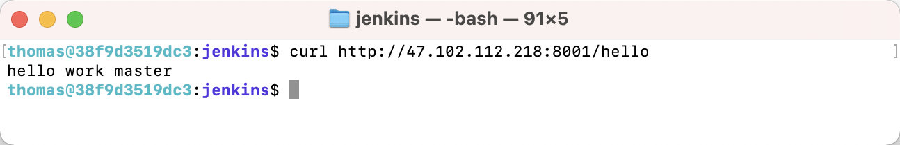

# 五、Jenkins构建SpringBoot应用并部署到远程服务器

上一篇文章已经完成了`SpringBoot`项目的构建。不过没有部署到远程服务器。现在我们来部署下。

## 准备

我们通过ssh安全证书，免密登录服务器，完成jar文件的传送和脚本的执行。

生成ssh证书

```bash
# 进入jinkens的docker容器
docker exec -it jenkinsci-demo bash 
# 切换到用户主目录（重要）
cd 
# 生成证书（一路回车）
ssh-keygen
# 查看证书公钥
cat .ssh/id_rsa.pub
```

将Jenkins证书公钥，添加到远程服务器的`authorized_keys`文件中，完成免密登录。

```bash
vim .ssh/authorized_keys 
```

验证免密登录是否成功

```bash
docker exec -it jenkinsci-demo ssh root@47.102.112.218
```

## 编写部署脚本

远程服务器脚本`deploy-jar.sh`，将脚本放置到服务器`/work/hello-work/`目录。

```bash
#!/bin/bash
# file: deploy-jar.sh
# desc: 自动部署脚本，脚本和jar包需要在一起
# 第一个参数为需要部署的jar包名称
cd `dirname $0`
pwd

JAR_NAME=$1
MEM=60M

[ -z "${JAR_NAME}" ] && echo "请指定需要部署的jar包" && exit
[ ! -f "${JAR_NAME}" ] && echo "jar包不存在: ${JAR_NAME}" && exit

echo "$(date) ==============================="
echo "$(jps -lv | grep ${JAR_NAME})"

echo "$(date) 停止旧应用"
jps -lv | grep "${JAR_NAME}" | awk '{print $1}' | xargs -I {} kill -9 {}

echo "$(date) 启动新应用"
mkdir -p logs
nohup nice java -server -Xms${MEM} -Xmx${MEM} -Dfile.encoding=UTF-8 -XX:+HeapDumpOnOutOfMemoryError -jar ${JAR_NAME} > logs/"${JAR_NAME}".log 2>&1 &
echo "$(date) 部署完成"

echo "$(jps -lv | grep ${JAR_NAME})"
echo 
```

## 配置Jenkins

进入配置页面


编写jenkins构建脚本

```bash
# 构建工程
mvn package -Dmaven.test.skip=true
# 上传到远程服务器
scp target/hello-work-0.0.1-SNAPSHOT.jar root@47.102.112.218:/work/hello-work/
# 执行部署脚本
ssh root@47.102.112.218 '/work/hello-work/deploy-jar.sh hello-work-0.0.1-SNAPSHOT.jar'
```


## 执行构建

查看任务详情，通过pid可以判断应用是否真正构建成功


## 验证部署

访问接口

```bash
curl http://47.102.112.218:8001/hello
```

运行结果满足预期



