# 四、Jenkins构建SpringBoot应用

## Java代码

```java
package com.example.hellowork;

import lombok.extern.slf4j.Slf4j;
import org.springframework.boot.SpringApplication;
import org.springframework.boot.autoconfigure.SpringBootApplication;
import org.springframework.web.bind.annotation.GetMapping;
import org.springframework.web.bind.annotation.RestController;

@Slf4j
@RestController
@SpringBootApplication
public class HelloWorkApplication {

    public static void main(String[] args) {
        SpringApplication.run(HelloWorkApplication.class, args);
    }


    @GetMapping("/hello")
    public String hello(){
        log.info("hello work");
        return "hello work master\n"; // on master branch
        // return "hello work develop\n";  // on develop branch
    }
}
```

`application.yml`配置端口

```yaml
server:
  port: 8001
```

## 创建任务

在开发视图中，创建任务

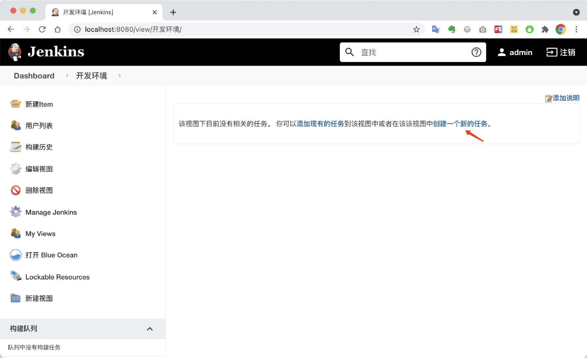

输入任务名称，选择自由风格的项目

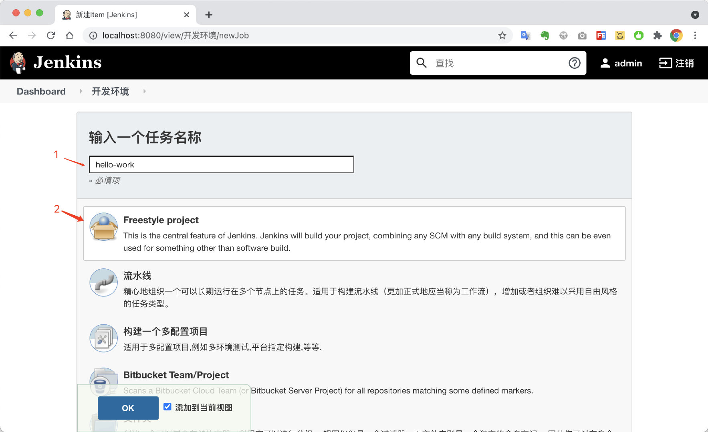

为了节省磁盘空间，建议设置合理的丢弃策略

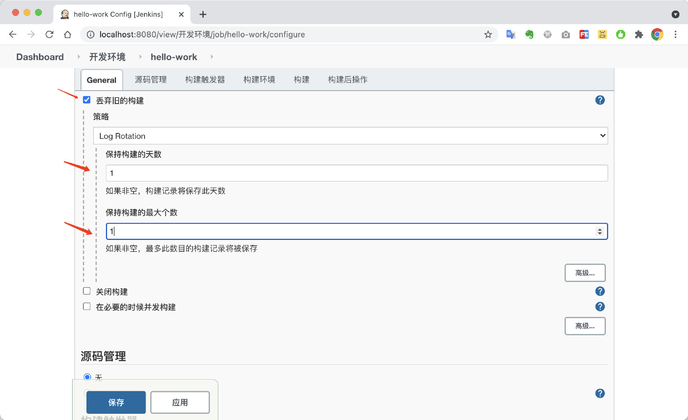

## 配置git仓库

仓库地址

```bash
https://git.psoho.cn/demos/hello-work.git
```

输入仓库地址，由于没有凭证，需要创建凭证。

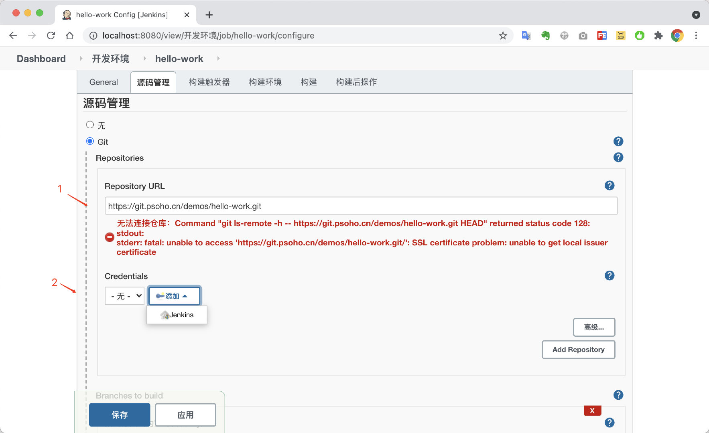

选择类型为用户名和密码，输入git账号和密码

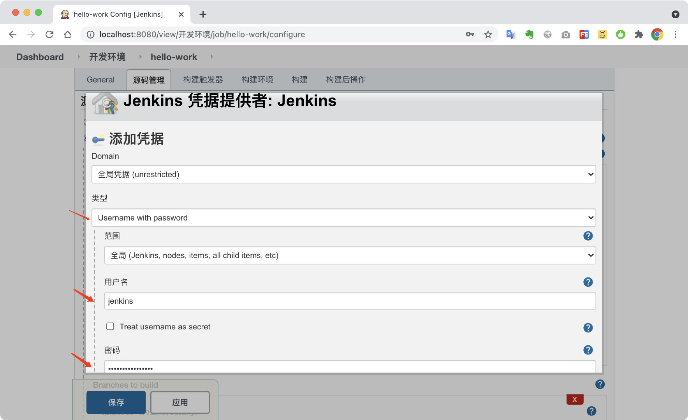

滚动到最下面，点击`添加`按钮

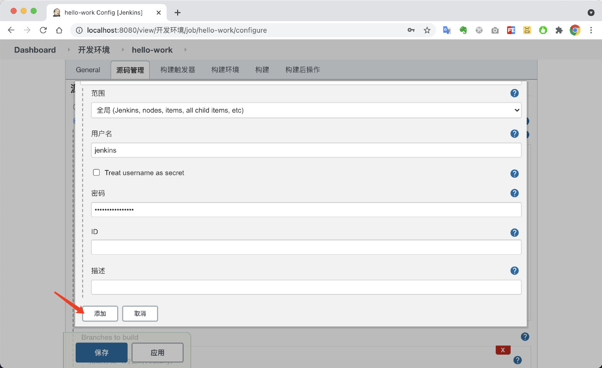

选择jenkins凭证

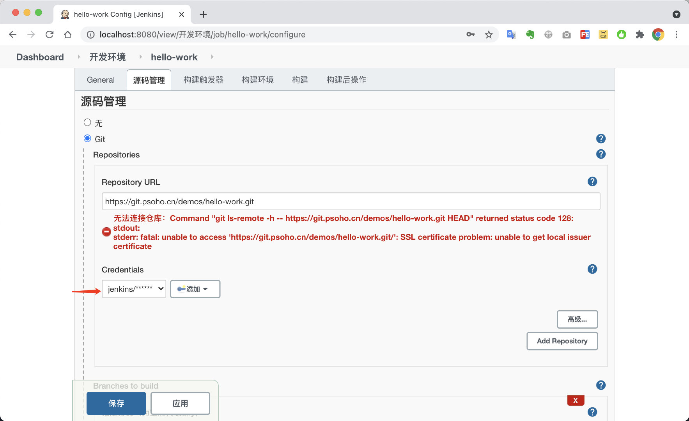

## 关闭git的SSL证书校验

依旧提示`SSL证书`问题，此时需要进入`docker`容器，关闭git的`SSL证书`校验。

参考: [https://stackoverflow.com/questions/41930608/jenkins-git-integration-how-to-disable-ssl-certificate-validation](https://stackoverflow.com/questions/41930608/jenkins-git-integration-how-to-disable-ssl-certificate-validation)

```bash
docker exec -it jenkinsci-demo git config --global http.sslVerify false
```

没有安全提示就表示OK了

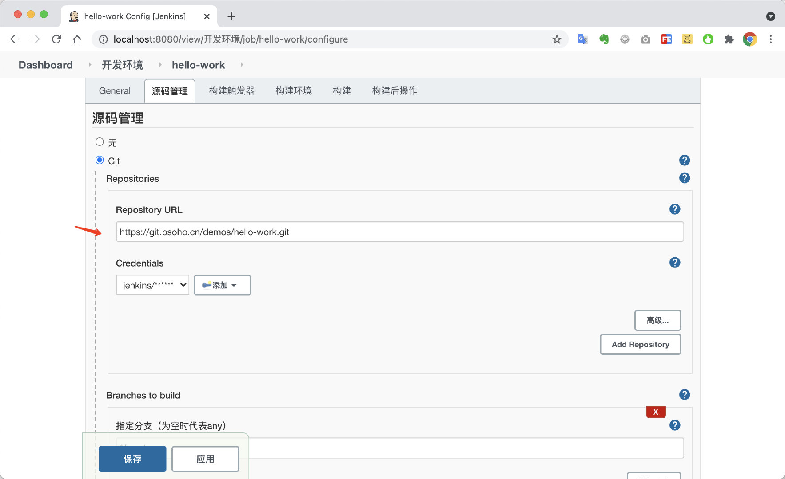

## 构建步骤设置

点击`增加构建步骤`，选择`执行shell`

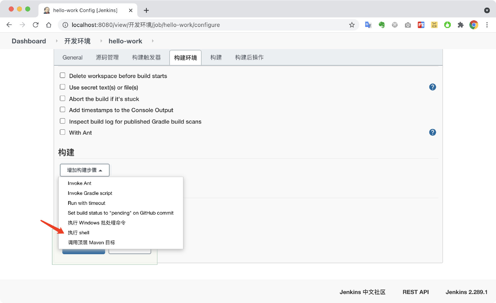

输入构建命令，并点击保存按钮

```bash
mvn package -Dmaven.test.skip=true
```

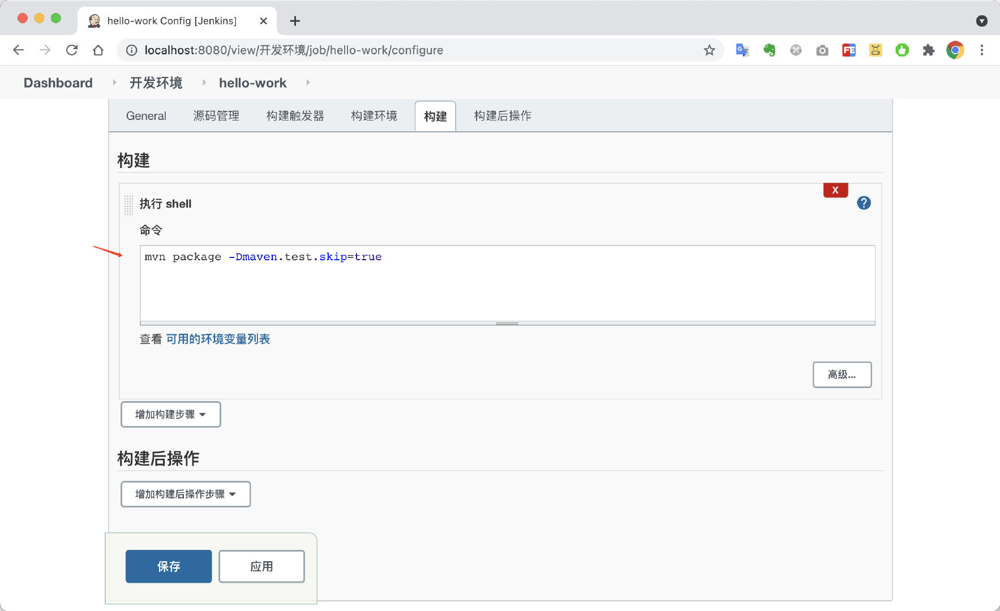

执行立即构建

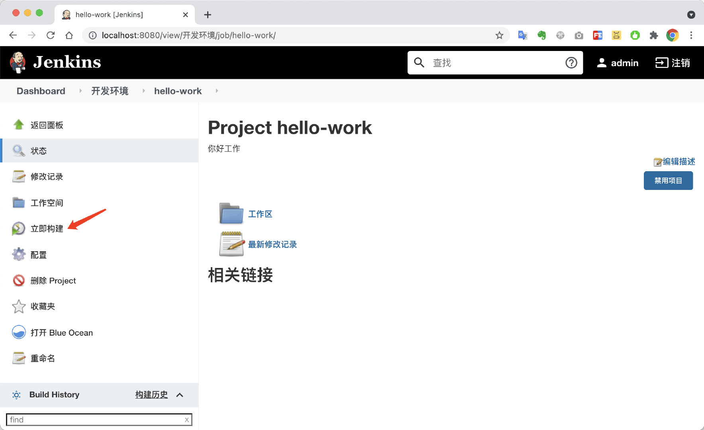

## 查看构建详情

进入控制台

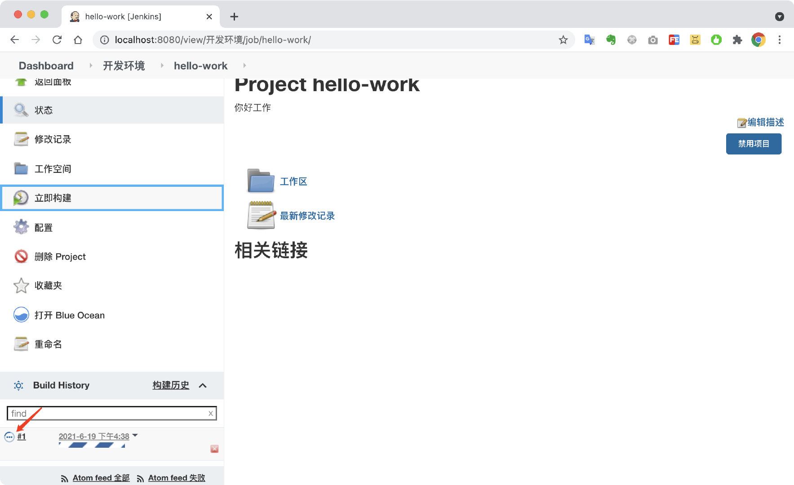

查看构建详情

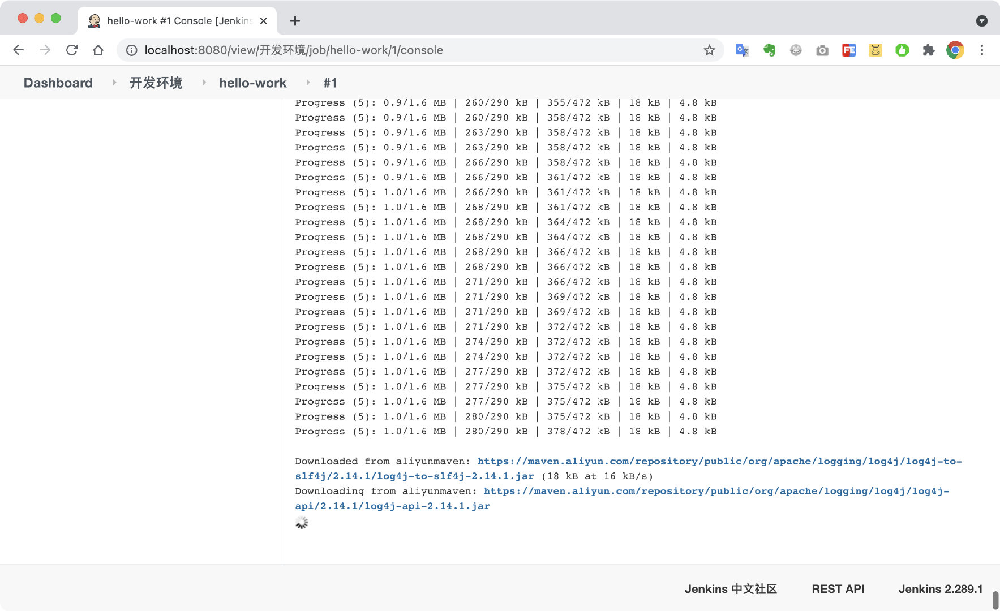

> 注意：如果需要使用阿里云maven仓库镜像加速，需要配置好`setting.xml`文件。

基本构建完成

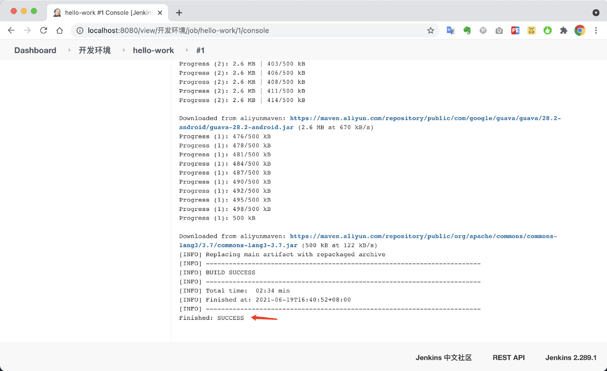

确认构建成果。对于java应用，能生成对应的Jar包说明构建成功了。

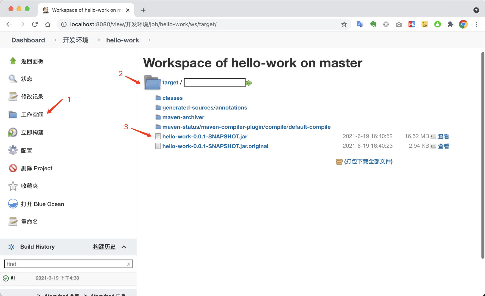

至此，构建第一个SpringBoot应用已经完成，如果需要构建完成后自动部署到其它服务器或者Docker容器。需要增加部署相关脚本。

