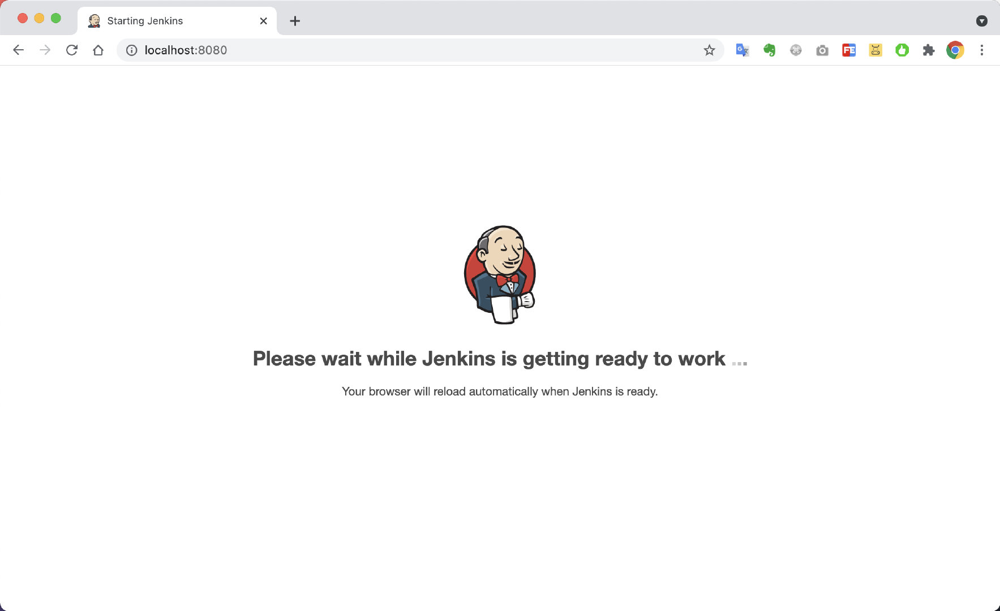
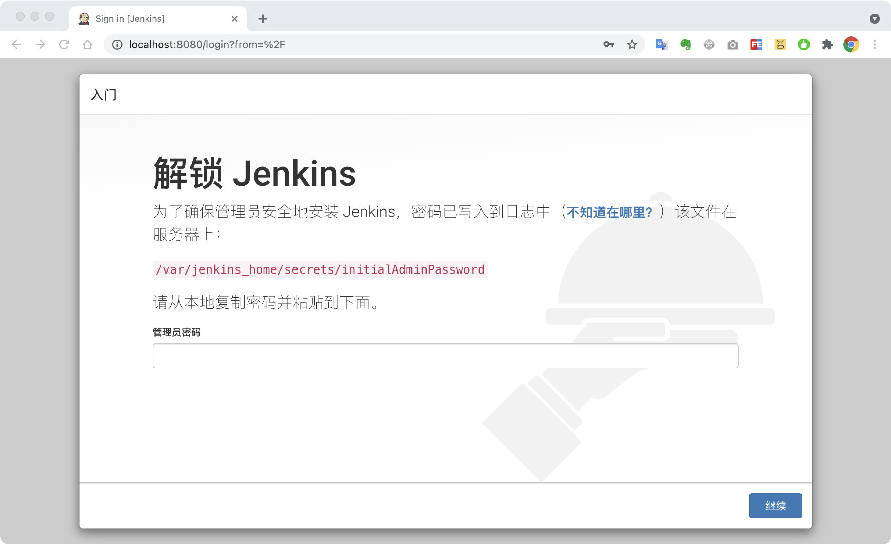
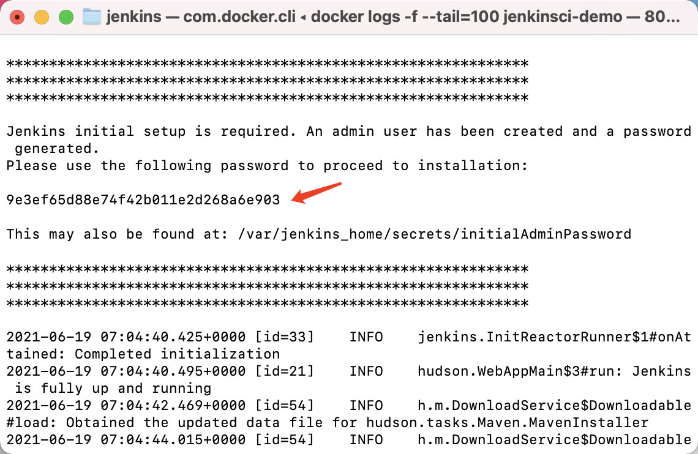
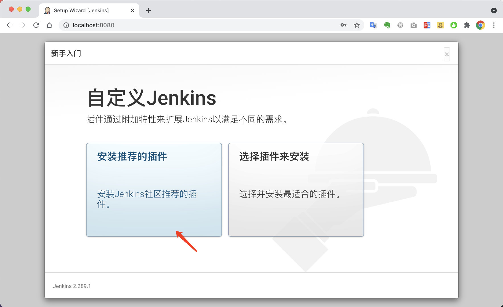
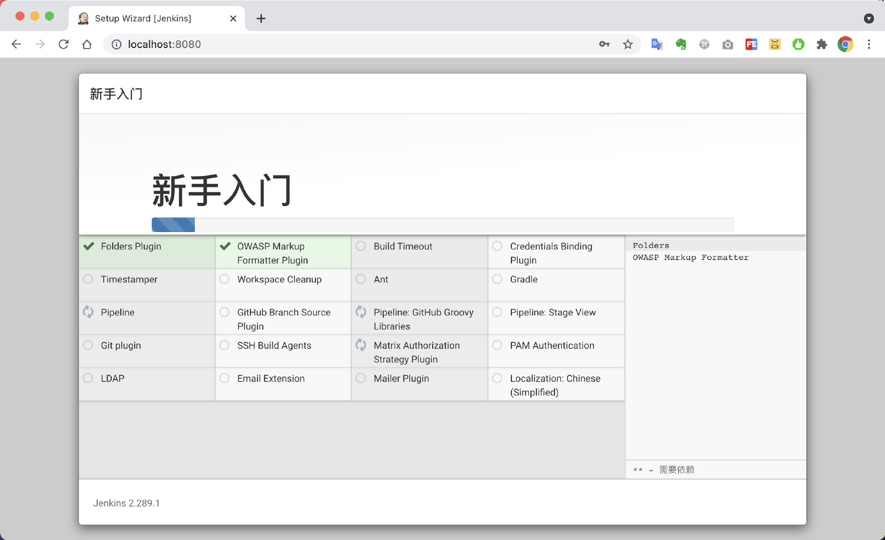
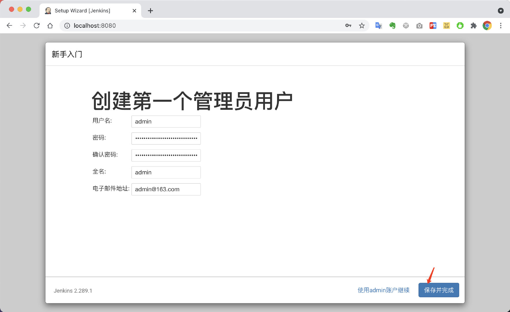
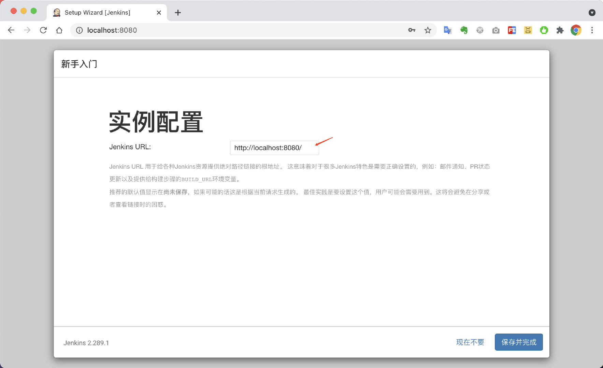
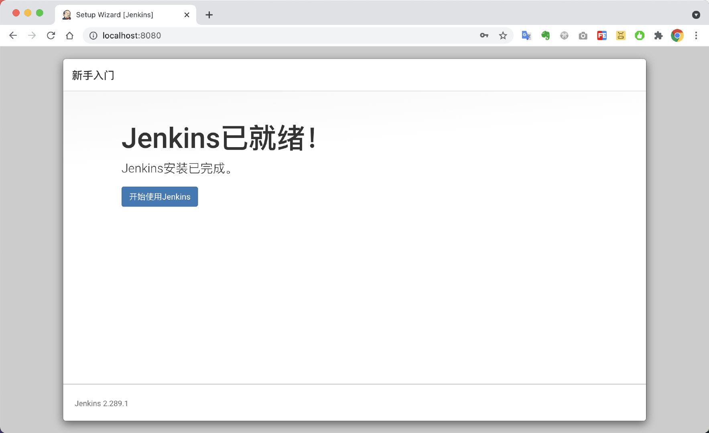
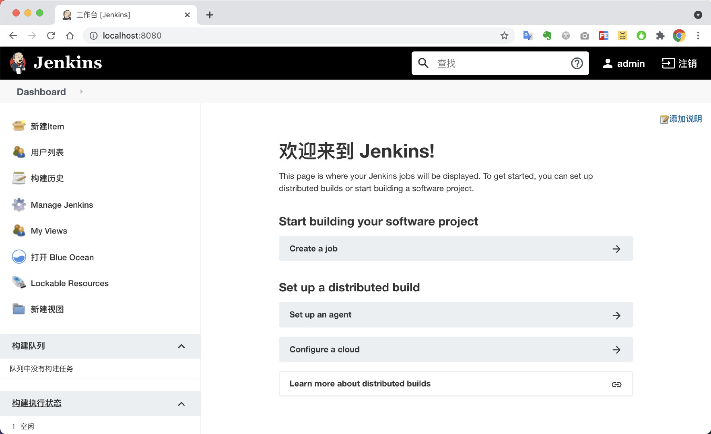

# 一、Jenkins安装

##  运行docker容器

`docker-compose.yml`

```yaml
version: "3"

services:

  jenkinsci-demo:
    container_name: jenkinsci-demo
    image: jenkinsci/blueocean:1.24.7
    restart: on-failure
    ports:
      - 8080:8080
    environment:
      TZ: Asia/Shanghai
    volumes:
      - ./jenkins-data:/var/jenkins_home
      - /var/run/docker.sock:/var/run/docker.sock
      # 挂载所需的构建软件java,maven,node等
      - ./soft:/usr/local/soft
```

```bash
docker-compose up -d 
```

> 如果启动失败，可能是权限问题。  给 jenkins-data/ 加上权限即可
>
> chmod -R 777 jenkins-data/ 

##  访问Jenkins地址

浏览器访问: [http://127.0.0.1:8080/](http://127.0.0.1:8080/)



##  输入初始密码



查看docker日志，获取初始密码。

```bash
docker logs -f --tail=100 jenkinsci-demo
```



##  插件安装

开始进入插件安装，选择`安装推荐的插件`即可。



插件安装中，是网络情况，需要几分钟时间。



##  创建管理员账号

接下来，创建第一个管理员账号


账号信息，建议保留在`docker-compose.yml`中，以免忘记。



##  访问地址配置

地址配置，如果使用域名访问，请配置成对应的域名



##  安装成功



恭喜，Jenkins安装成功。




##  参考

- [https://www.jenkins.io/zh/doc/](https://www.jenkins.io/zh/doc/)
- [https://www.jenkins.io/zh/doc/book/installing/#docker](https://www.jenkins.io/zh/doc/book/installing/#docker)
- [https://www.cnblogs.com/esofar/p/11163583.html](https://www.cnblogs.com/esofar/p/11163583.html)

