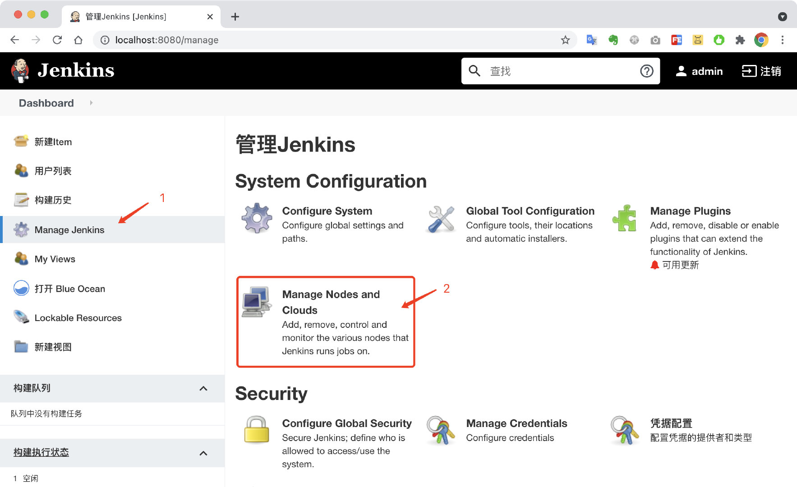
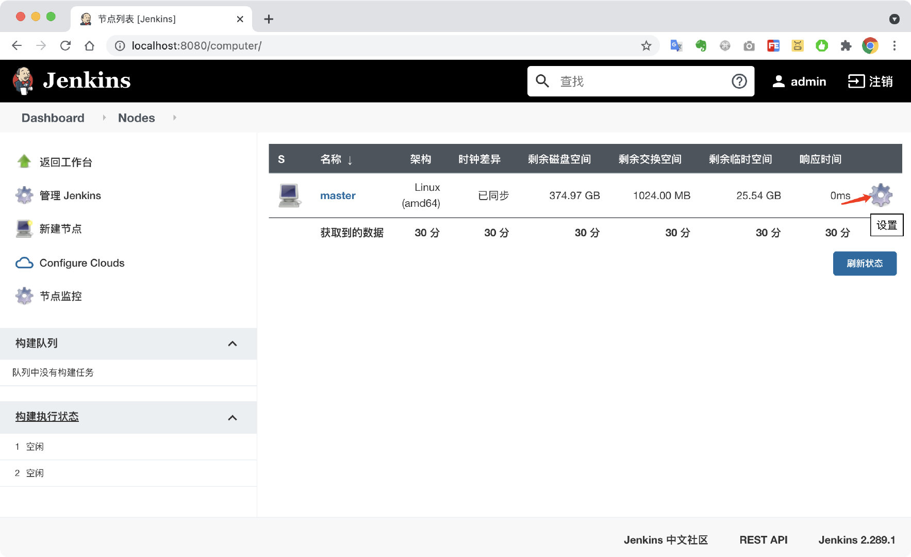
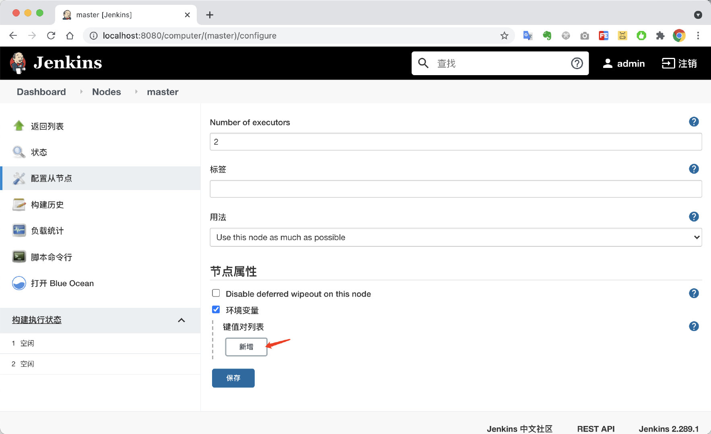
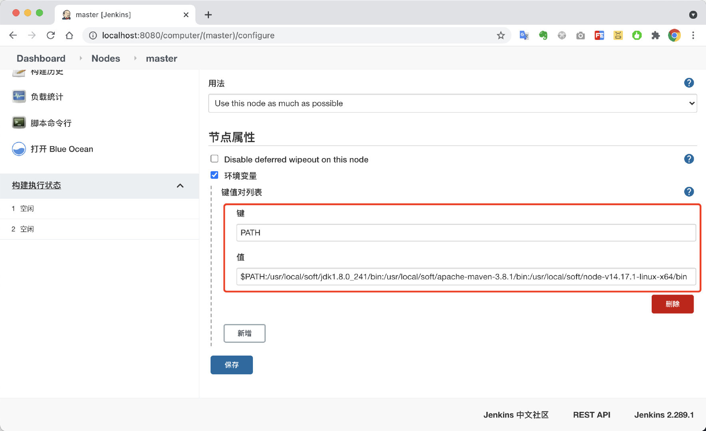

# 三、Jenkins节点管理之环境变量配置

由于构建需要依赖相关软件，如Java, Maven, NodeJS等，所以，需要将这些软件加入构建节点的环境变量中，防止构建过程中，出现找不到环境变量的问题。

具体配置如下：

## 进入节点管理



进入主节点设置



点击`环境变量` 》 点击键值对列表`新增`按钮



## 设置PATH环境变量

输入PATH环境变量

```bash
$PATH:/usr/local/soft/jdk1.8.0_241/bin:/usr/local/soft/apache-maven-3.8.1/bin:/usr/local/soft/node-v14.17.1-linux-x64/bin
```




## 使用阿里云maven仓库镜像加速

修改宿主机的`./soft/apache-maven-3.8.1/conf/settings.xml`文件，添加以下配置。

```xml
<mirror>
    <id>aliyunmaven</id>
    <!-- <mirrorOf>*</mirrorOf> -->
    <mirrorOf>central</mirrorOf>
    <name>阿里云公共仓库</name>
    <url>https://maven.aliyun.com/repository/public</url>
</mirror>
```

