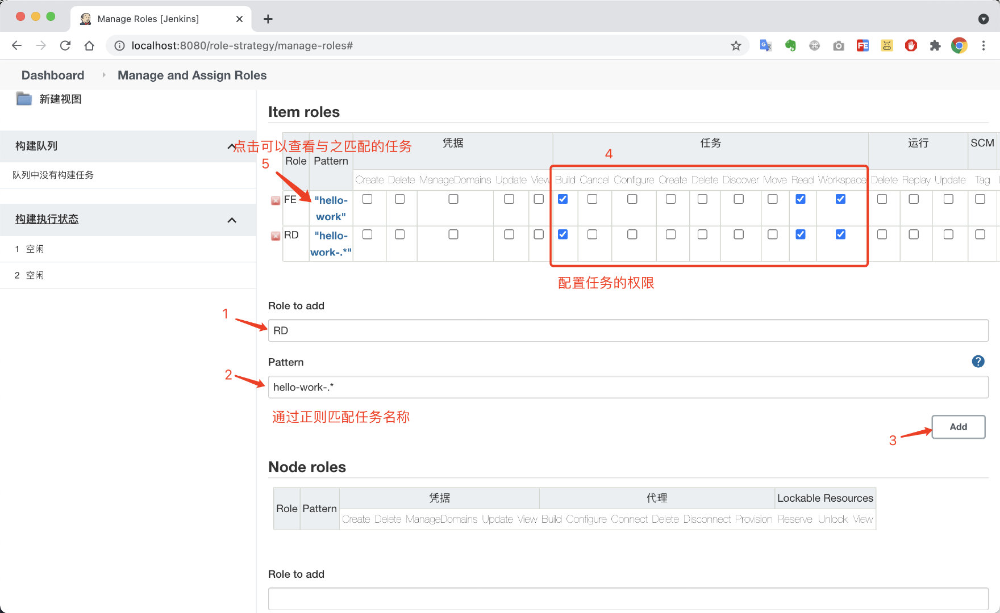

# 八、Jenkins基于角色的用户权限管理

实际开发中，如果对构建任务不加以权限控制，一方面，会造成任务过多。另一方面，可能会因为误操作导致任务被修改或者删除掉。（踩过任务被删的坑）

## 安装插件

进入插件管理

安装`Role-based Authorization Strategy`插件并重启

## 配置授权策略为`Role-Base`

进入安全设置

授权策略选择`Role-based Strategy`

进入`Manage and Assign Roles`

## 角色管理

新增全局角色（保证用户可以正常访问）

增加项目角色

> 通过正则表达式匹配任务名称
>
> 配置相关的任务权限

## 增加测试用户

进入用户管理

新建两个用户`user1`和`user2`

查看新建好的用户

## 给用户分配角色

进入角色分配页面

分配全局系统访问角色

分配项目角色（大家根据自己的实际情况来，这里只做演示）

> 我们给user1分配了前端角色，user2分配了后端角色。记得点击保存。

## 验证效果

切换到`user1`账号，此时只能查看和构建`hello-work`这个任务，符合预期。

点击构建，可以正常构建。

切换到`user2`账号

此时，能看到与之对应的两个任务。

