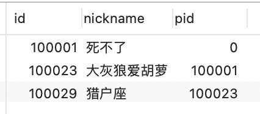

# DB小技巧

## mysql递归查询

参考: 

* [mysql递归查询](https://blog.csdn.net/weixin_35756522/article/details/81876534)


```sql
# mysql递归查询
# 查询指定ID(100029)的所有父节点
SELECT id,nickname,pid
    FROM ( 
        SELECT 
                @r AS _id, 
                (SELECT @r := pid FROM av_user WHERE id = _id) AS parent_id, 
                 @l := @l + 1 AS lvl 
        FROM 
                (SELECT @r := 100029, @l := 0) vars, 
                av_user h 
        WHERE @r <> 0) T1 
    JOIN av_user T2 
    ON T1._id = T2.id
ORDER BY id;
```



```sql
# 多条数据在一行
SELECT GROUP_CONCAT(id) pids
    FROM ( 
        SELECT 
                @r AS _id, 
                (SELECT @r := pid FROM av_user WHERE id = _id) AS parent_id, 
                 @l := @l + 1 AS lvl 
        FROM 
                (SELECT @r := 100029, @l := 0) vars, 
                av_user h 
        WHERE @r <> 0) T1 
    JOIN av_user T2 
    ON T1._id = T2.id
ORDER BY id;
```


## MySQL强制查询不使用缓存

```sql
# 添加sql_no_cache指令即可
select sql_no_cache * from dual;
```

