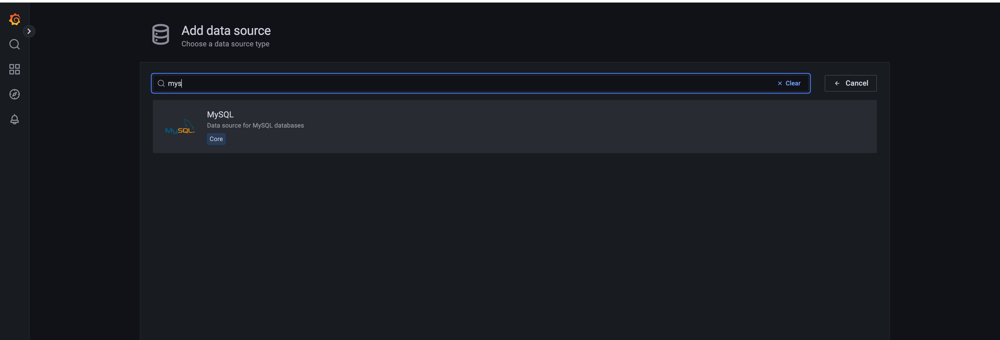
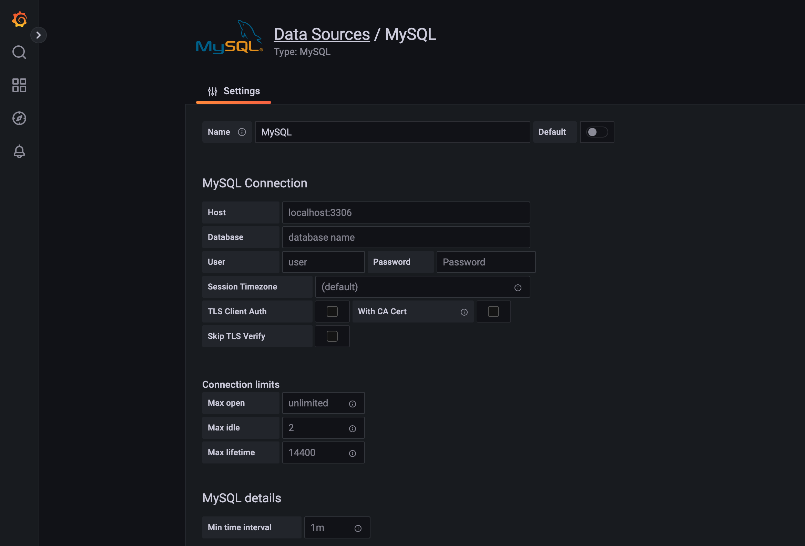
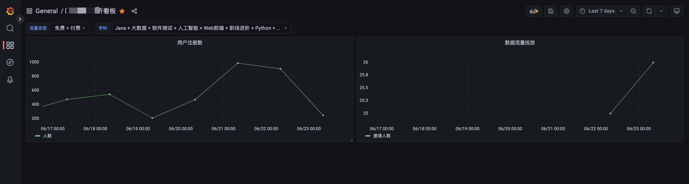

# Grafana数据报表

## Grafana数据报表-Mysql

最近公司要上一套数据报表系统，`CTO`推荐使用`Grafana`，记录一下配置笔记

### 安装

使用`docker`安装，默认密码admin/admin，首次登录后需要设置密码

```yml
version: '3'

services:

  grafana:
    image: grafana/grafana:9.0.1
    container_name: grafana
    restart: on-failure
    environment:
      - TZ=Asia/Shanghai
    # volumes:
    #   - ./elasticsearch/data:/usr/share/elasticsearch/data
    ports:
      - 43000:3000

networks:
  default:
    driver: overlay
    name: 'grafana-net'

# admin/admin
```

### 添加用户

新增用户后，可以设置权限，目前有三个`Viewer` `Editor` `Admin`，根据实际需求添加即可。

### 添加数据源

`Settings`  > `Configuratioin`  >  `Add data source` 选择`mysql`



填写数据库配置即可



## 数据看板

### 新增数据看板

`New Dashboard` > `Add Panel` 

### 设置变量

`Settings` > `Variables` > `New` 

常用的两种类型的`变量`，`用户自定义`与`查询`

Type: `Custom`，规则：`key : value`，注意中间一定要有空格。

```bash
免费 : 0, 付费 : 1
```

Type：`Query` 类似查询数据库字典

注意：`__value` 和 `__text` 分别代表查询时使用的值和下拉列表显示的值。

```sql
select id '__value', sub_name '__text' from t_subject_info
```

示例：

```sql
SELECT
  date(r.create_time) `time`,
  count(r.invitee) as '邀请人数'
FROM
  xxx_table r
WHERE r.pay_type in ($pay_type) -- 流量类型
AND $__timeFilter(r.create_time)
AND a.sub_id in (${sub_id}) -- 学科
GROUP BY date(r.create_time)
```

效果展示


