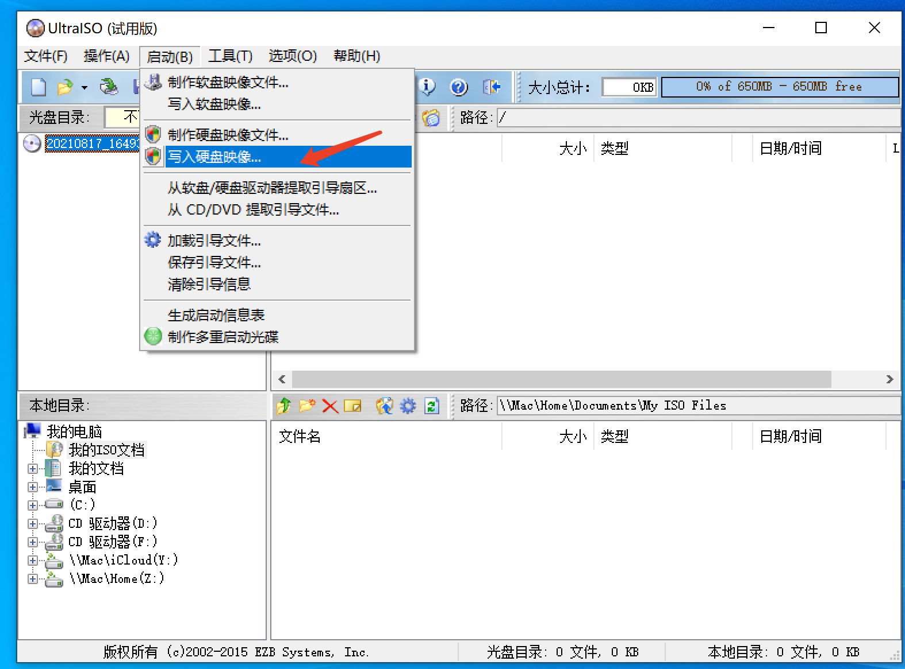
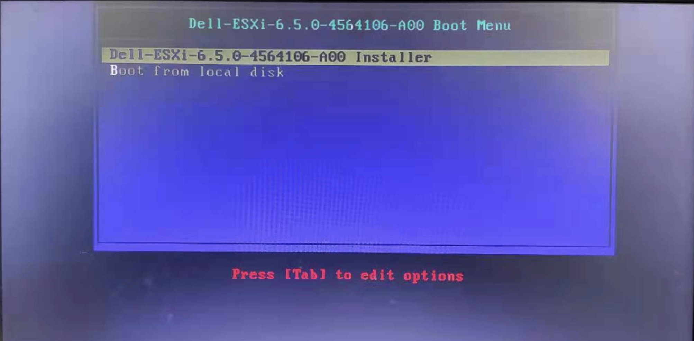
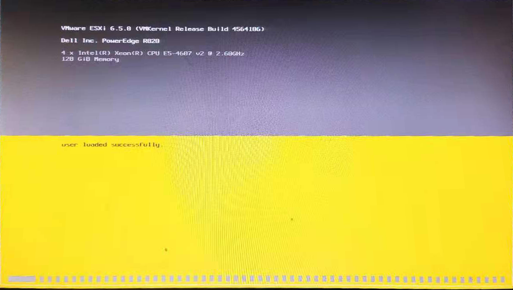
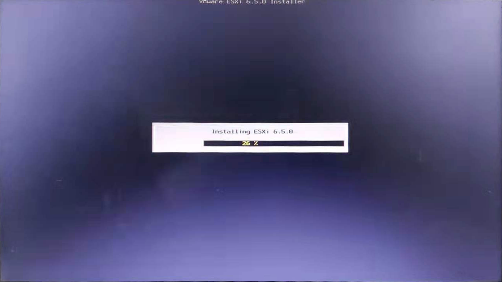
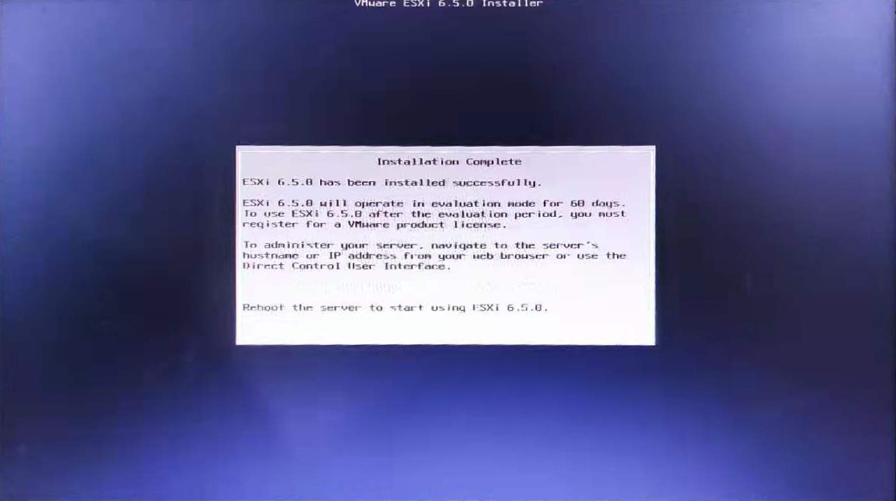
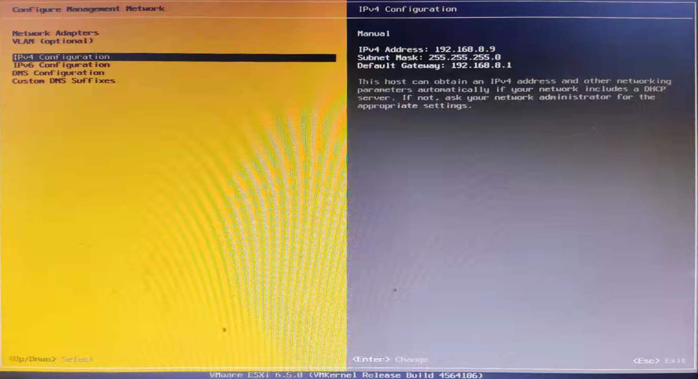
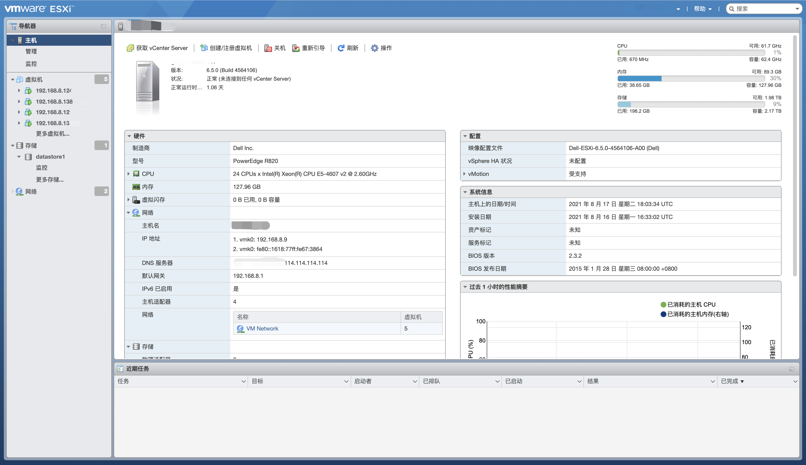
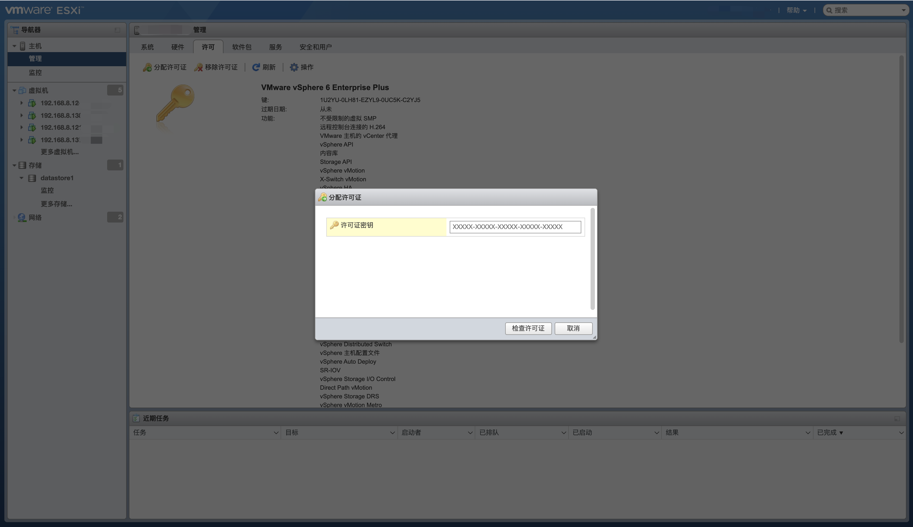

# 安装ESXi-vSphere-6.5

## ESXi6.5安装实录

### 制作ESXi启动盘

使用UltralOS，写入硬盘镜像

> 不要使用Rufus等其他软件来制作



### 开始安装

插入启动盘，重启服务器，按`F11`进入启动菜单页，选择从`U盘`启动


进入ESXi引导页面，选择安装器`Installer`



进入安装界面



进入这一步，基本就OK了，接下来只需要一步一步安装就行了


开始安装中



安装完成



接下来，重启进入配置页面，配置好静态IP和DNS就行了



### 控制台

进入控制台



替换证书

```bash
1U2YU-0LH81-EZYL9-0UC5K-C2YJ5
```


