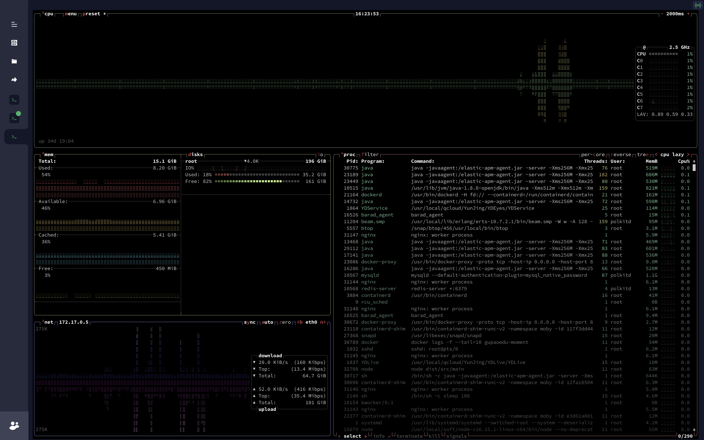
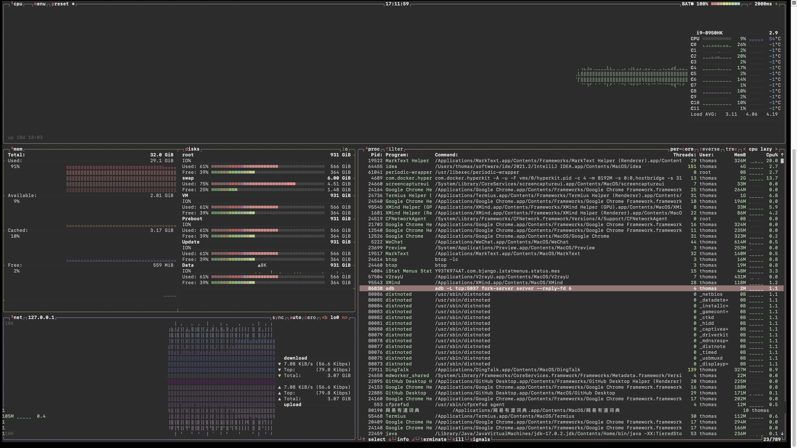

# btop

## install snap

我们通过`snap`安装`btop`，所以先安装好`snap`

### CentOS7

```bash
yum install epel-release -y && yum install snapd -y
```

配置`snap`

```bash
systemctl enable --now snapd.socket
```

建立链接

```bash
ln -s /var/lib/snapd/snap /snap
```

## Install btop

bsnap install btop

`btop`是一个强大的监控管理器

[btop/README.md at main · aristocratos/btop · GitHub](https://github.com/aristocratos/btop/blob/main/README.md#installing-the-snap)

推荐使用`snap`来进行安装

```bash
snap install btop
```

运行

```bash
btop
```

运行界面效果



## install btop on Mac

```bash
brew install btop
```

在Mac系统下，效果不好看的话，可以使用这个命令

```bash
btop -lc
```

运行效果



## 参考

- [Installing snap on CentOS | Snapcraft documentation](https://snapcraft.io/docs/installing-snap-on-centos)

- https://github.com/aristocratos/btop#installation

- https://zhuanlan.zhihu.com/p/463891848
