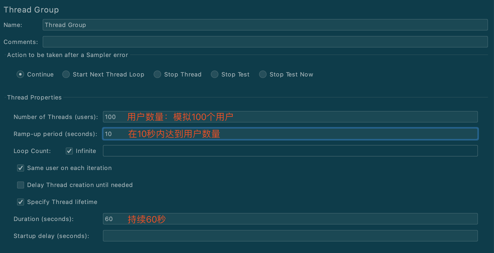
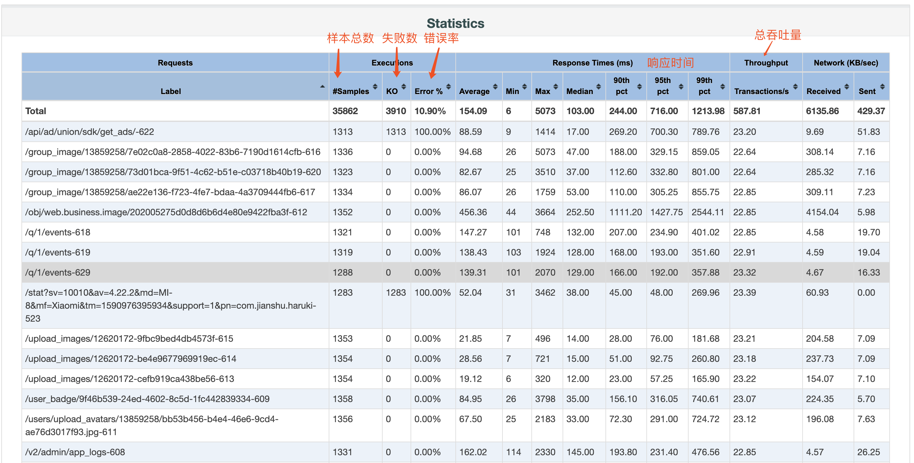

# JMeter

## 简介

* 下载jmeter [https://downloads.apache.org/jmeter/binaries/apache-jmeter-5.3.tgz](https://downloads.apache.org/jmeter/binaries/apache-jmeter-5.3.tgz)
* 配置测试计划
* 录制APP请求
* 执行压测
* 生成压测报告
* [压测示例下载](http://demo.qn.prodapi.cn/files/%E5%8E%8B%E6%B5%8B%E7%A4%BA%E4%BE%8B.zip)

## 配置测试计划

新建线程组


配置线程组



添加结果树


添加聚合报告


## 录制APP请求

### 安装根证书

如果需要录制https请求，需要在手机上先去安装https根证书。

https根证书位于jmeter安装目录的bin目录下`ApacheJMeterTemporaryRootCA.crt`

android手机，直接微信发送到自己手机端，然后点击打开就行了。

### 配置测试计划

新增HTTP测试脚本录制器


配置需要过滤的资源，支持正则表达式


新建录制控制器


启动录制代理


录制请求（以简书为例）


## 开始执行压测


查看聚合报告（重点关注总吞吐量指标）


保存压测脚本

## 生成压测报告

```bash
# 生成压测报告
jmeter -n -t JMeter压测指南-APP.jmx -l JMeter压测指南-APP.csv -e -o JMeter压测指南-APP
```

生成报告结果


部分报告截图


压测重点关注指标

* 响应时间
* 总吞吐量
* 错误率



