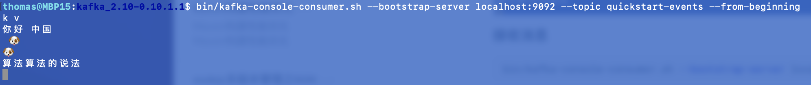

# Kafaka

## 安装

参考：

- [https://kafka.apache.org/quickstart](https://kafka.apache.org/quickstart)
- [kafka安装及配置过程](https://www.cnblogs.com/zhaoshizi/p/12154518.html)
- [Kafka系列之broker-list,bootstrap-server以及zookeeper](https://segmentfault.com/a/1190000021619905?utm_source=tag-newest)

### 下载

https://kafka.apache.org/downloads

```bash
wget https://archive.apache.org/dist/kafka/0.10.1.1/kafka_2.10-0.10.1.1.tgz
```

### 安装

```bash
# 解压即可
tar -zxf kafka_2.10-0.10.1.1.tgz
```

### 启动

```bash
bin/kafka-server-start.sh config/server.properties
```

### 验证

#### 创建`topic`

```bash
#bin/kafka-topics.sh --create --partitions 1 --replication-factor 1 --topic quickstart-events --bootstrap-server 127.0.0.1:9092
bin/kafka-topics.sh --create --zookeeper 127.0.0.1:2181 --partitions 1 --replication-factor 1 --topic quickstart-events 
```

#### 查看`topic`

```bash
bin/kafka-topics.sh --list --zookeeper 127.0.0.1:2181
```

#### 发送消息

```bash
bin/kafka-console-producer.sh --broker-list 127.0.0.1:9092 --topic quickstart-events
```


#### 接收消息

```bash
bin/kafka-console-consumer.sh --bootstrap-server 127.0.0.1:9092 --topic quickstart-events --from-beginning
```



#### 查看`topic`详情

```bash
bin/kafka-topics.sh --zookeeper 127.0.0.1:2181 --describe  --topic quickstart-events
```

#### 删除`topic`

```bash
bin/kafka-topics.sh --zookeeper 127.0.0.1:2181 --delete  --topic quickstart-events
```

