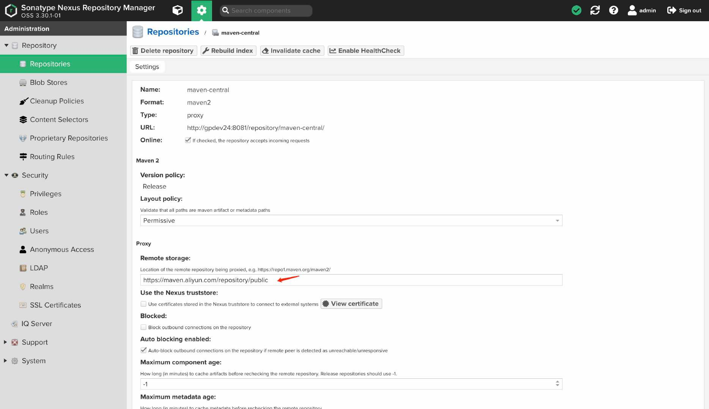
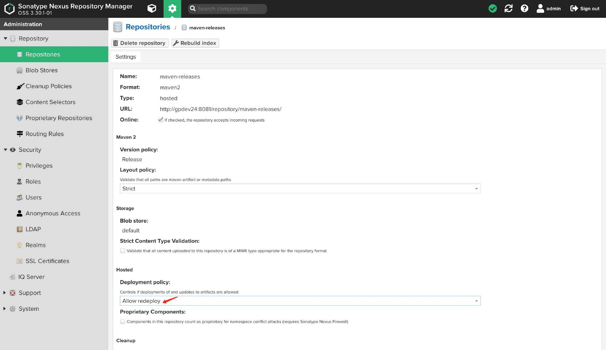

# 搭建nexus3环境

## 使用docker搭建nexus3环境(maven仓库) 

###  一、启动nexus3容器

::: code-group

```yaml [compose.yml]
version: '3'

services:

  # nexus-demo
  nexus-demo:
    container_name: nexus-demo
    image: sonatype/nexus3:3.30.1
    restart: on-failure
    ports:
      - 8081:8081
    volumes:
      - ./nexus-data:/nexus-data
    environment:
      TZ: Asia/Shanghai

# admin/7S50rQgKD9ZJWLYkGwHdVMuUsvTx6tCn
```

:::

启动容器

```bash
docker-compose up -d
```

> 注意：如果报权限错误，需要修改文件权限。chown -R 200:200 ./nexus-data

###  二、设置maven镜像加速

阿里云地址

```bash
https://maven.aliyun.com/repository/public
```



设置允许重复部署




###  三、设置maven配置文件

`~/.m2/settings.xml `

```xml
<servers>
  <server>
    <id>releases</id>
    <username>admin</username>
    <password>7S50rQgKD9ZJWLYkGwHdVMuUsvTx6tCn</password>
  </server>
  <server>
    <id>snapshots</id>
    <username>admin</username>
    <password>7S50rQgKD9ZJWLYkGwHdVMuUsvTx6tCn</password>
  </server>
</servers>

<mirrors>
  <mirror>
    <id>releases</id>
    <mirrorOf>*</mirrorOf>
    <name>releases</name>
    <url>http://192.168.8.124:8081/repository/maven-public/</url>
  </mirror>
</mirrors>
```

> 配置从私库中获取`releases`或者`snapshots`的jar包

```xml
<profiles>
  <profile>
    <id>dev</id>
    <repositories>
      <repository>
        <id>releases</id>
        <name>Nexus Release Repository</name>
        <url>http://192.168.8.124:8081/repository/maven-public/</url>
        <releases>
          <enabled>true</enabled>
        </releases>
        <snapshots>
          <enabled>true</enabled>
        </snapshots>
      </repository>
    </repositories>
  </profile>
</profiles>
<!-- 必须配置激活才能生效 --> 
<activeProfiles>
  <activeProfile>dev</activeProfile>
</activeProfiles>
```

###  四、项目设置

推送jar包到`maven`私有仓库`pom.xml`

```xml
<distributionManagement>
  <repository>
    <id>releases</id>
    <name>Nexus Release Repository</name>
    <url>http://192.168.8.124:8081/repository/maven-releases/</url>
  </repository>
  <snapshotRepository>
    <id>snapshots</id>
    <name>Nexus Snapshot Repository</name>
    <url>http://192.168.8.124:8081/repository/maven-snapshots/</url>
  </snapshotRepository>
</distributionManagement>
```

###  五、推送jar包到仓库

```bash
mvn deploy -Dmaven.test.skip=true
```

### 参考：

* [https://hub.docker.com/r/sonatype/nexus3](https://hub.docker.com/r/sonatype/nexus3)
* [https://blog.51cto.com/lookingdream/2828767?xiangguantuijian&03](https://blog.51cto.com/lookingdream/2828767?xiangguantuijian&03)
* [https://blog.csdn.net/weixin_42683408/article/details/93625819](https://blog.csdn.net/weixin_42683408/article/details/93625819)

