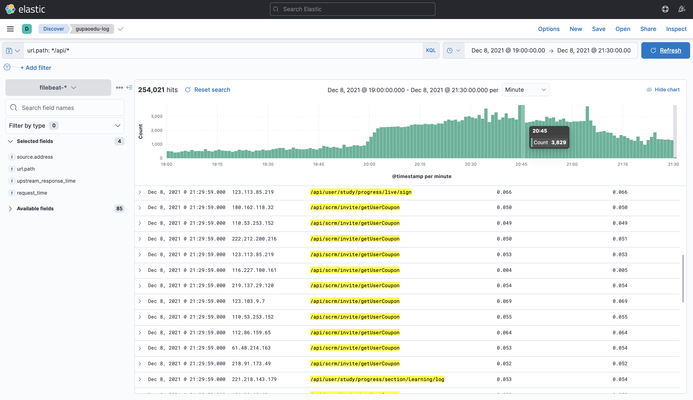

# DB跑满的生产事故复盘

## 事件描述

我们直播业务的关键时间节点。

> `20:00`公开课直播
>
> `20:30` VIP课直播

`20:00`公开课 学员收到推送后，进入直播间。`20:35`有部分学员反馈没法进入直播间，`20:40`越来越多学员反馈无法进入直播间。

## 问题排查

### 一、应用服务器负载

检查发现，没有明显负载偏高的服务器。`CPU`占用`30%`左右，属于正常范畴。

### 二、检查DB负载

打开`RDS`监控页面，`CPU`占用飙升到`94%`。


#### 慢SQL

第一反应，检查`慢SQL`，发现没有任何数据。遂检查DB配置，发现慢SQL已经关闭，并且时间设置为100秒。

> 这里有个`RDS`的bug，通过阿里云界面看到的`slow_query_log`开关已经打开，但通过sql查询发现仍然是关闭的，重新设置一下就行了。

```sql
-- 查看慢sql开关
show variables like '%slow_query_log%';

-- 查看慢sql时间
show variables like '%long_query_time%';
```

调整慢SQL参数

```sql
-- 开启慢sql
set global slow_query_log=1;

-- 设置sql时间（单位：秒）
set global long_query_time=0.5
```

### 三、查看nginx日志

打开`Kibana`控制台，发现`ES`已经被保护了。无法查看`nginx`日志。


```text
index [.async-search] blocked by: [TOO_MANY_REQUESTS/12/disk usage exceeded flood-stage watermark, index has read-only-allow-delete block];
```

> 临时解决`ES`保护

```http
PUT http://127.0.0.1:9200/_all/_settings
{
  "index.blocks.read_only_allow_delete": null
}
```

nginx日志请求情况，很明显接口【`/api/scrm/invite/getUserCoupon`】调用次数偏多



<!-- more -->

进一步确定接口【`/api/scrm/invite/getUserCoupon`】调用次数，询问同事发现，这个接口每隔`5s`就会调用一次。


## 解决方案

### 一、临时解决

- 在`nacos`控制台，将相关服务器下线，发现DB压力依旧没降
- 将`mysql`耗时进程关闭，DB压力依旧
- 停止三个核心业务服务，DB压力依旧
- 没办法，只能重启DB

### 二、完善解决

- `业务调整`：直播间接口，增加缓存和压测。

- `使用异步通知框架`：使用`websocket`方案解决需要频繁访问的场景。

- `关于问题排查`：发现DB压力高，又没办法定位哪个服务出问题时，应从源头`nginx`定位问题。

  - ```bash
    # 查看当前并发数量
    ss -ant | grep 'ESTAB' | wc -l 
    
    # 有无异常IP（并发数占用特别多的）
    ss -ant | grep 'ESTAB' | awk '{print $5}' | awk -F ':' '{print $1}' | sort | uniq -c  | sort -nr | head
    ```

- `关闭流量输入`：先把流量临时关闭，把拒绝请求或者请求快速失败。防止请求堆积、压力传导到`应用服务器`、`DB`

  - ```bash
    # 重启nginx
    service nginx restart
    
    # 关闭链接
    yum -y install dsniff
    tcpkill -i eth0 -9 port 443
    ```


## 后记

慢日志打开后，可以在RDS控制台直接查看相关慢日志


第二天监控，DB压力正常，不过还有优化空间。


> 查看之前的监控发现，其实系统每天`20:00`压力都很大


> 2021-12-12 DB压力情况


> 2021-12-15  DB压力情况，更改了发送程序，异步发送


问题又复现了


