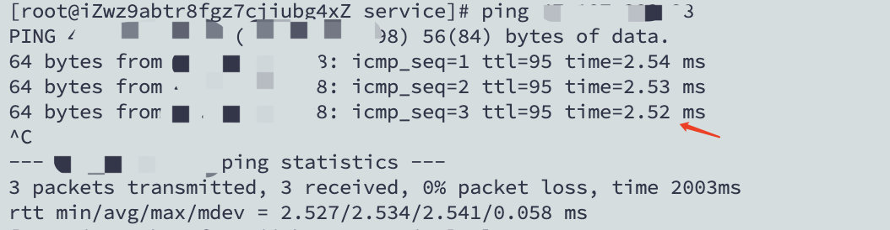

# 线上问题记录

## 服务迁移过程中响应时间过长的问题

应公司业务发展，需要将`GPer社区服务`迁移到同一地域的不同可用区。在迁移过程中，发现许多接口的响应是时间都延长到`2秒`以上。

### 现象

请求的响应时间非常慢，2秒以上，不能接受。


### DB延迟

循着`HTTP`请求，跟踪了一下代码，发现有不少循环调用`DB`的代码。由于数据库连接改成了通过外网访问。怀疑是访问延迟有所增加。

通过内网访问RDS延迟为：`0.15`毫秒


新机器通过外网访问延迟为`2.5`毫秒



基本差别不是很高，为了排除该问题，在当前机器上，重新安装和迁移了`DB`。重启发现，请求的响应时间基本一致。遂排除是`DB`延迟问题。

### 深入调查

<!-- more --> 

跟着请求，继续查找源码，随着代码的深入追踪，然而没有任何头绪。因为代码和`旧环境`的代码是一致的。且服务器负载也不高（应该说是没有任何负载），所以估计还是和环境有关系。

### 在线诊断

想起了N年前解决线上问题的用到的在线诊断工具[greys](https://github.com/oldmanpushcart/greys-anatomy)。发现代码停更在了`2019年`。抱着试试的心态，下载使用。使用过程中，发现确实不太好用。一些命令甚至无法执行`watch`，只能放弃了。


后来发现，原来是被阿里巴巴给收入麾下了，取名叫做[arthas](https://github.com/alibaba/arthas)。版本很新，文档也全面。

>  一键安装

```bash
curl -L https://arthas.aliyun.com/install.sh | sh
```

> 快速排查

```bash
./as.sh pid 
monitor -c 10 com.gupao.web.filter.AuthFilter *
```

发现了响应确实是慢


> 进一步跟踪

```bash
trace com.gupao.web.filter.AuthFilter *
```


基本上可以确定，瓶颈就在这个`verify`方法上了。跟踪发先原来是一个`http`远程调用，且服务不可用，只能等到`timeout`才有响应。

> 解决方案

改成调用本地端口即可。


延迟`500毫秒`，勉强接受吧。

