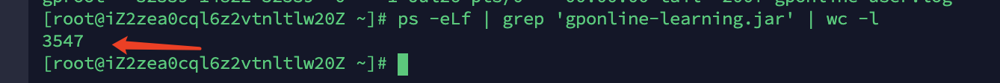

# 线上问题

## 线上线程数过-导致ssh无法登陆问题

### 问题

同事反馈，线上服务器无法登陆，提示如下。

```bash
Server refused to start a shell/command
```

用root登陆，发现可以正常登陆。切换到对应的账户，发现不能执行命令，提示如下：

```bash
bash: fork: Resource temporarily unavailable
```

### 排查

常规操作`ulimit -a`查看打开的文件数，发现已经调整到了`65535`

```bash
[root@iZ2zea0cql6z2vtnltlw20Z ~]# ulimit -a 
core file size          (blocks, -c) 0
data seg size           (kbytes, -d) unlimited
scheduling priority             (-e) 0
file size               (blocks, -f) unlimited
pending signals                 (-i) 62381
max locked memory       (kbytes, -l) 64
max memory size         (kbytes, -m) unlimited
open files                      (-n) 65535
pipe size            (512 bytes, -p) 8
POSIX message queues     (bytes, -q) 819200
real-time priority              (-r) 0
stack size              (kbytes, -s) 8192
cpu time               (seconds, -t) unlimited
max user processes              (-u) 62381
virtual memory          (kbytes, -v) unlimited
file locks                      (-x) unlimited
[root@iZ2zea0cql6z2vtnltlw20Z ~]# 
```

直觉感觉是新上的程序，多线程在跑任务。于是查看一下

```bash
ps -eLf | wc -l
```

进一步查看开启的线程数量，达到了`3547`，明显很不正常。



### 解决方案

`kill `掉新的jar任务，一切恢复正常。

